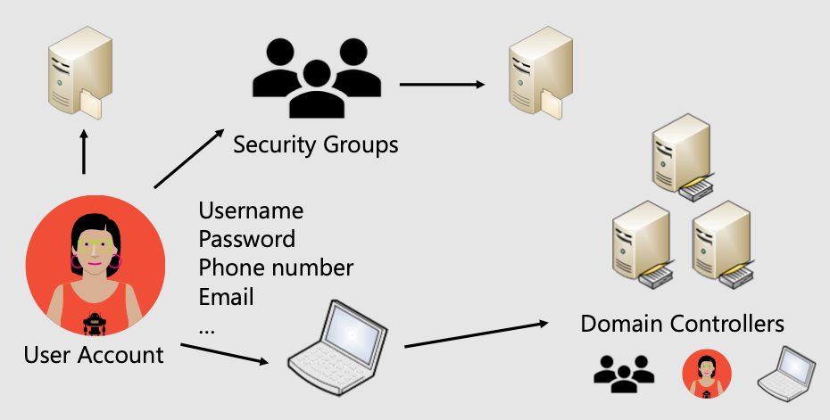
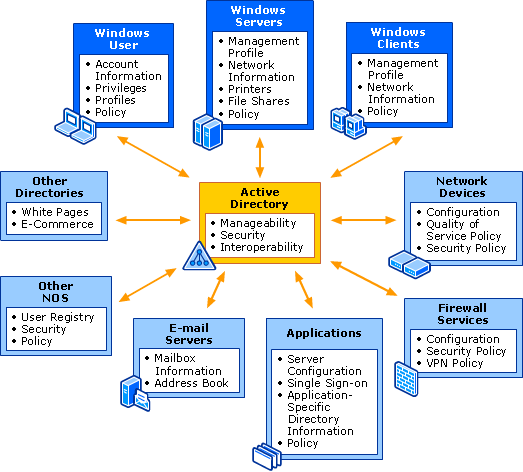
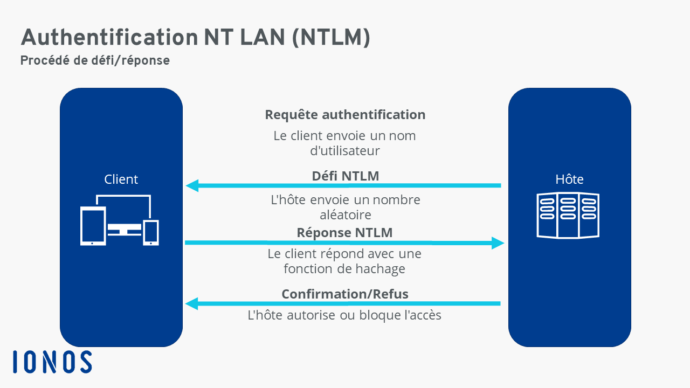
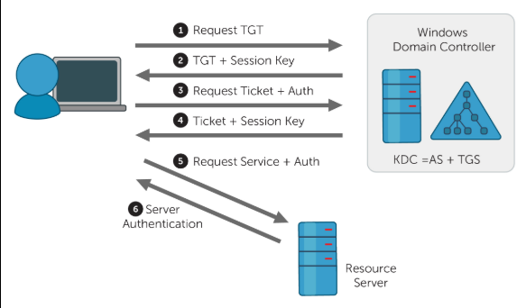
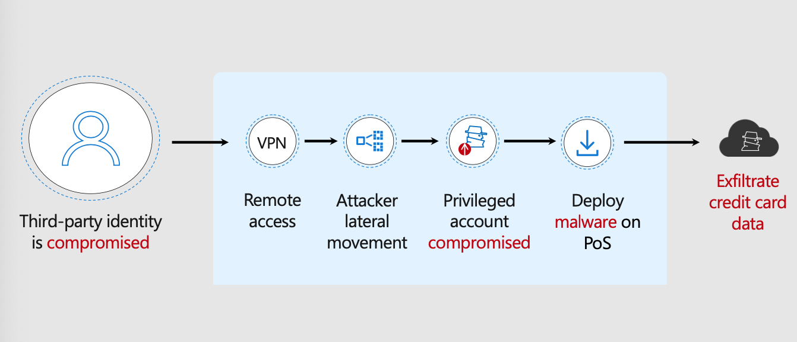
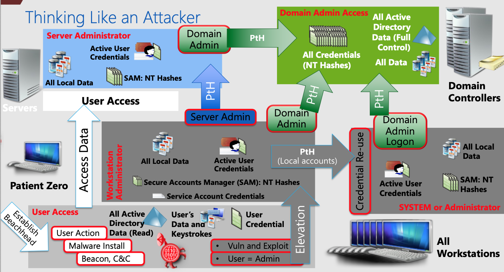
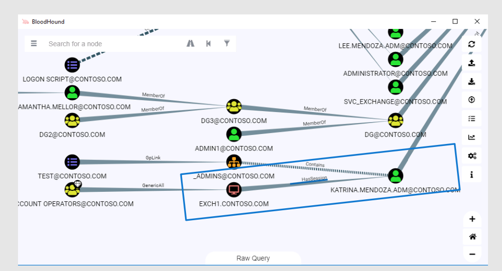
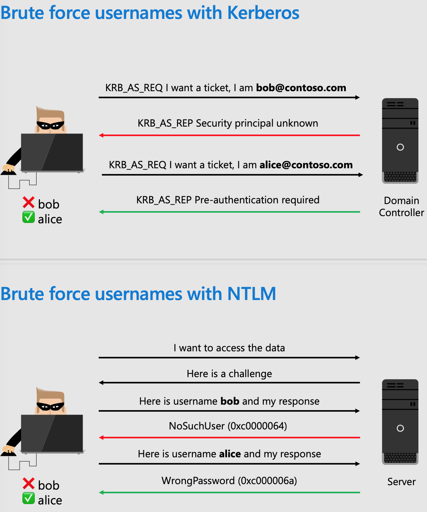
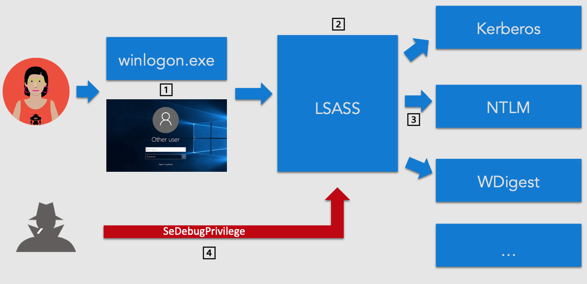

# Note introductive - Active Directory

Suite à l'extrème incompétence, une fois de plus, de la part de l'administration, ici se trouve un cours concernant les services d'Active Directory, et non un cours sur l'Administration et la Sécurité Windows. Le cours suivi pendant 8h sur cette matière se trouve sur [cette page](https://iefrei.fr/courses/md_sync_s8/Cours/Securite%20Windows/Cours.html), mais ne sera plus mis à jour suite à ce changement.

# Présentation

## Active Directory

*L'`Active Directory` est un service de répertoire développé par Microsoft, utilisé principalement dans les environnements Windows pour centraliser et gérer les informations réseau et les ressources. Il joue un rôle clé dans la gestion des identités et l'accès aux ressources dans un réseau d'entreprise. - ChatGPT*

- **Service de répertoire**: Stocke les informations sur les objets du réseau.
- **Gestion des utilisateurs**: Permet de créer et de gérer des comptes d'utilisateurs.
- **Gestion des groupes**: Facilite la gestion des droits d'accès par des groupes.
- **Authentification et autorisation**: Contrôle l'accès aux ressources du réseau.
- **Politiques de sécurité**: Applique des règles de sécurité sur les ordinateurs et utilisateurs.
- **Services d'intégration**: Compatible avec divers services comme `DNS`, `LDAP`.
- **Facilité de gestion**: Interface graphique pour une gestion simplifiée.
- **Évolutivité**: Conçu pour les grandes comme les petites organisations.
- **Interopérabilité**: Supporte la gestion d'objets non-Windows via des extensions.



# Principaux composants

## Domain Services

> *Les `Domain Services` dans l'`Active Directory` sont au cœur de la fonctionnalité du service de répertoire. Ils fournissent les mécanismes essentiels pour la gestion des identités et des relations dans un réseau d'entreprise. - ChatGPT*

- **Gestion des identités**: Centralise les comptes d'utilisateurs, groupes et ordinateurs.
- **Authentification**: Processus de vérification des identifiants des utilisateurs.
- **Stockage de données**: Conserve des informations sur les objets du réseau.
- **Sécurité**: Contrôle l'accès aux ressources et applique des politiques de sécurité.
- **Services de répertoire**: Permet la recherche et l'accès aux informations des objets du réseau.
- **Intégration avec d'autres services**: Comme `DNS`, pour la résolution de noms dans le réseau.

## Domain controller

> *Un `Domain Controller` dans `Active Directory` est un serveur qui répond aux demandes d'authentification et stocke les données d'annuaire de l'organisation. Il joue un rôle central dans la gestion des politiques de sécurité et des accès aux ressources du réseau. - ChatGPT*

- **Authentification**: Gère les demandes de connexion des utilisateurs.
- **Base de données d'annuaire**: Stocke les informations des comptes utilisateurs, groupes, et autres objets.
- **Réplication**: Assure la cohérence des données entre plusieurs contrôleurs de domaine.
- **Politique de groupe**: Applique et gère les politiques de sécurité sur les ordinateurs et utilisateurs du domaine.
- **Services intégrés**: Comprend souvent des services comme `DNS` pour résoudre les noms dans le réseau.
- **Redondance**: Plusieurs contrôleurs de domaine peuvent être utilisés pour la haute disponibilité.
- **Rôles FSMO**: Gère des rôles spéciaux pour le fonctionnement correct du domaine.
- **Sécurité**: Joue un rôle crucial dans la sécurisation de l'environnement de réseau.



## Domains

> *Les `Domains` dans l'`Active Directory` représentent la structure de base de l'organisation dans le réseau, définissant le cadre pour la gestion des identités et des politiques. - ChatGPT*

- **Unité administrative**: Un domaine est une unité administrative logique.
- **Gestion centralisée**: Permet la gestion centralisée des utilisateurs, groupes et ressources.
- **Sécurité et politique**: Applique des politiques de sécurité au niveau du domaine.
- **Réplication**: Partage les informations entre les contrôleurs de domaine dans le même domaine.
- **Hiérarchie et structure**: Peut être structuré hiérarchiquement en arbres et forêts pour organiser les ressources.

## Trusts

> *Les `Trusts` dans l'`Active Directory` sont des liens de confiance établis entre différents domaines ou forêts pour permettre aux utilisateurs d'un domaine d'accéder aux ressources d'un autre. - ChatGPT*
>

- **Accès inter-domaines**: Facilite l'accès aux ressources entre différents domaines.
- **Types de trusts**: Peuvent être unidirectionnels ou bidirectionnels.
- **Sécurité**: Assure que les politiques de sécurité sont respectées même dans des environnements multi-domaines.
- **Simplification de la gestion**: Réduit la complexité de gestion dans les grands réseaux.
- **Interopérabilité**: Permet l'intégration avec des domaines d'autres forêts.


### Types

1. **Forest Trust** :
   - Un trust de forêt (Forest Trust) permet d'établir une relation de confiance entre deux forêts Active Directory distinctes.
   - Il est utile lorsque des entreprises ou des organisations distinctes ont besoin de partager des ressources ou des informations entre leurs environnements Active Directory.
2. **Shortcut Trust** :
   - Un trust Shortcut (ou trust raccourci) est un type de trust qui est spécifiquement utilisé pour simplifier la communication entre deux domaines dans une même forêt.
   - Il peut réduire la complexité des chemins d'accès lorsqu'il y a plusieurs domaines intermédiaires.
3. **External Trust** :
   - Un trust externe est utilisé pour établir une relation de confiance avec des domaines situés en dehors de la forêt principale.
   - Il est couramment utilisé pour établir des liens de confiance avec des domaines dans d'autres entreprises ou organisations.
4. **Realm Trust** :
   - Les trusts de royaume (Realm Trust) sont utilisés pour établir des relations de confiance avec des systèmes non-Windows, tels que des serveurs Unix ou Linux utilisant Kerberos.
   - Ils permettent l'authentification inter-système d'exploitation.


## Identity services

> *Les `Identity Services` dans l'`Active Directory` assurent la gestion centralisée des comptes d'utilisateurs et de dispositifs, permettant une authentification et une autorisation efficaces. - ChatGPT*
>

- **Gestion centralisée des comptes**: Création et gestion des comptes utilisateurs et appareils.
- **Authentification et autorisation**: Vérification des identités et gestion des accès.
- **Intégration avec d'autres services**: Fonctionne avec des services comme `Azure Active Directory`.

### Users and groups

> *Dans l'`Active Directory`, la gestion des **utilisateurs et des groupes** est fondamentale pour structurer et contrôler l'accès aux ressources du réseau. - ChatGPT*

- **Organisation des utilisateurs**: Permet de créer et de gérer des comptes d'utilisateurs individuels.
- **Gestion des groupes**: Facilite l'assignation de droits d'accès et de politiques à des groupes d'utilisateurs.
- **Sécurité et efficacité**: Améliore la sécurité et l'efficacité de la gestion des droits d'accès.

#### SIDs

- **Identification unique** :
  - Les SID sont des identifiants uniques attribués à chaque objet de sécurité, tels que les utilisateurs, les groupes, les ordinateurs et les ressources, au sein d'un environnement Windows.
  - Ils garantissent l'unicité de chaque objet, évitant ainsi les conflits d'identité.

- **Format du SID** :
  - Les SID sont généralement représentés sous forme de chaînes de caractères numériques, comprenant une séquence de chiffres et de tirets, par exemple : `S-1-5-21-3623811015-3361044348-30300820-1013`.
  - Ces chaînes sont divisées en différentes parties contenant des informations sur l'objet.


##### SIDs connus

| SID                   | Display Name                            |
| --------------------- | --------------------------------------- |
| S-1-0-0               | Null SID                                |
| S-1-5-2               | Network                                 |
| S-1-5-11              | Authenticated Users                     |
| S-1-5-15              | This Organization                       |
| S-1-5-18              | Local System                            |
| S-1-5-19              | NT Authority\Local Service              |
| S-1-5-20              | NT Authority\Network Service            |
| S-1-5-32-544          | BUILTIN\Administrators                  |
| S-1-5-32-545          | BUILTIN\Users                           |
| S-1-5-32-544-500      | Administrator                           |
| S-1-5-32-544-501      | Guest                                   |
| S-1-5-32-544-502      | KRBTGT (Key Distribution Center)        |
| S-1-5-21-<domain>-498 | Enterprise Read-only Domain Controllers |
| S-1-5-21-<domain>-512 | Domain Admins                           |
| S-1-5-21-<domain>-513 | Domain Users                            |
| S-1-5-21-<domain>-514 | Domain Guests                           |
| S-1-5-21-<domain>-515 | Domain Computers                        |


### Authentication and Authorization

Dans l'`Active Directory`, **l'authentification et l'autorisation** sont des processus clés pour sécuriser l'accès aux ressources du réseau.

- **Authentification**: Vérification de l'identité des utilisateurs avant l'accès.
- **Autorisation**: Détermine les ressources auxquelles un utilisateur authentifié peut accéder.
- **Politiques de sécurité**: Contrôlent l'accès basé sur les rôles et les groupes d'utilisateurs.

### Certificates

> *Les `Certificates` dans l'`Active Directory` jouent un rôle crucial dans la sécurisation des communications et l'authentification des utilisateurs et des dispositifs. Ils font partie de l'infrastructure de clé publique (PKI). - ChatGPT*

- **Authentification forte**: Utilisés pour une authentification plus sécurisée.
- **Chiffrement**: Protège les communications.
- **PKI (`Public Key Infrastructure`)**: Gère la création et la distribution des certificats.

## Directory Services

> *Les `Directory Services` dans l'`Active Directory` sont essentiels pour organiser, stocker et gérer les informations sur les objets du réseau comme les utilisateurs, les groupes et les ordinateurs. - ChatGPT*

- **Stockage centralisé**: Contient des informations détaillées sur les objets du réseau.
- **Recherche et accès aux données**: Permet de trouver et d'accéder facilement aux informations.
- **`Schema`**: Définit les types d'objets et leurs attributs.
- **`Global Catalog`**: Offre une vue d'ensemble des objets de l'ensemble de la forêt `Active Directory`.
- **`LDAP` (Lightweight Directory Access Protocol)**: Protocole standard pour accéder aux services d'annuaire.

### Schema

> *Le `Schema` dans l'`Active Directory` est une composante essentielle qui définit la structure de l'annuaire, spécifiant les types d'objets et leurs attributs pouvant être stockés dans l'`Active Directory`. - ChatGPT*

- **Définition des objets**: Décrit les objets comme les utilisateurs, ordinateurs, groupes.
- **Attributs des objets**: Spécifie les caractéristiques et informations stockées pour chaque type d'objet.
- **Extensible**: Peut être modifié ou étendu pour répondre aux besoins spécifiques de l'organisation.
- **Contrôle de version**: Gère les mises à jour et modifications du schéma.

### Global Catalog

> *Le `Global Catalog` dans l'`Active Directory` est un index distribué contenant des informations essentielles sur tous les objets de la forêt `Active Directory`. Il permet des recherches rapides et efficaces à travers la forêt. - ChatGPT*

- **Recherche rapide**: Facilite la recherche d'objets dans l'ensemble de la forêt.
- **Informations essentielles**: Contient un sous-ensemble des attributs les plus utilisés des objets.
- **Réplication**: Distribue ses données à travers différents contrôleurs de domaine.
- **Authentification et localisation**: Aide à localiser les objets et à authentifier les utilisateurs dans la forêt.

**Sans global catalogue, pas d'authentification.**

### LDAP

> *LDAP (Lightweight Directory Access Protocol) est un protocole de communication standard utilisé dans le contexte d'Active Directory et d'autres annuaires pour accéder et gérer les informations stockées dans ces annuaires.- ChatGPT*

- **Protocole de communication**:

  - LDAP est un protocole réseau qui permet aux clients d'accéder et de rechercher des données dans un annuaire, tel qu'Active Directory.

  - Il utilise le modèle client-serveur, où un client LDAP envoie des requêtes au serveur LDAP pour récupérer des informations.

- **Structure d'annuaire**:

  - LDAP organise les données sous forme d'une arborescence hiérarchique, similaire à la structure d'Active Directory.

  - Chaque objet dans l'annuaire est représenté par un DN (Distinguished Name) unique qui indique son emplacement dans l'arborescence.

- **Authentification et autorisation**:

  - LDAP est utilisé pour l'authentification des utilisateurs lors de leur connexion à Active Directory.

  - Il est également utilisé pour vérifier les autorisations et les droits d'accès des utilisateurs aux ressources.

- **LDAP et Active Directory**:

  - Active Directory est basé sur LDAP et étend ses fonctionnalités pour offrir des services d'annuaire plus complets aux environnements Windows.

  - LDAP est utilisé en interne par Active Directory pour les opérations de base.

# Intégration dans l'AD

## Logon & AD

- **Authentification** :

  - Lorsqu'un utilisateur se connecte à un système Windows au moyen de son nom d'utilisateur et de son mot de passe, le système doit vérifier ces informations pour s'assurer de l'identité de l'utilisateur.

  - Active Directory joue un rôle central dans cette authentification, car il stocke les informations d'identification des utilisateurs et des ordinateurs au sein d'un domaine.

- **Accès aux ressources** :

  - Une fois qu'un utilisateur s'est authentifié avec succès auprès d'Active Directory, il obtient un jeton d'authentification qui contient des informations sur ses droits et autorisations.

  - Ce jeton d'authentification est ensuite utilisé pour déterminer quelles ressources et quelles actions l'utilisateur est autorisé à effectuer au sein du domaine.

- **Gestion des politiques de groupe (GPO)** :

  - Active Directory permet la création de politiques de groupe (GPO) qui définissent des règles de configuration et de sécurité pour les utilisateurs et les ordinateurs dans un domaine.

  - Lorsque l'utilisateur se connecte, les GPO sont appliquées en fonction de son emplacement dans l'annuaire, ce qui influence la manière dont le système est configuré et sécurisé.

- **Centralisation de l'identité et de l'authentification** :
   - Active Directory offre une gestion centralisée des identités, des groupes et des comptes d'utilisateur.
   - Cela simplifie la gestion des utilisateurs et des ordinateurs dans un environnement Windows, en permettant aux administrateurs de gérer efficacement les comptes et les droits d'accès.

# Authentification

Dans un environnement AD, deux principaux protocoles utilisés. `NTML` et `Kerberos`.

## NTLM



## Kerberos

### Fonctionnement

> *Kerberos est un protocole d'authentification réseau développé par le MIT (Massachusetts Institute of Technology) qui offre un niveau élevé de sécurité pour l'authentification des utilisateurs et le chiffrement des communications dans un environnement informatique. - ChatGPT*

1. **Pré-authentification** :
   - Lorsqu'un utilisateur souhaite accéder à un service ou se connecter à un système, il contacte un service d'authentification Kerberos, généralement appelé `Key Distribution Center` (KDC).
2. **Demande de Ticket TGT** :
   - L'utilisateur envoie une demande d'authentification au KDC en fournissant son identifiant.
   - Le KDC répond en générant un `Ticket Granting Ticket` (TGT) chiffré avec une clé secrète basée sur le mot de passe de l'utilisateur. Le TGT est également associé à un horodatage.
3. **TGT et demande de service** :
   - L'utilisateur demande un service spécifique (par exemple, un accès à un serveur de fichiers) en fournissant le TGT au service demandé.
   - Le service demandé ne peut pas déchiffrer le TGT car il ne connaît pas le mot de passe de l'utilisateur. Cependant, il sait comment le transmettre au KDC pour vérification.
4. **Authentification auprès du TGS** :
   - Le service demandé envoie le TGT au TGS (`Ticket Granting Service`) du KDC pour vérification.
   - Le TGS valide le TGT, vérifie l'identité de l'utilisateur et génère un `Service Ticket Granting Ticket` (TGS) chiffré avec une clé spécifique au service demandé.
5. **Utilisation du Ticket de Service** :
   - Le Service Ticket Granting Ticket est renvoyé à l'utilisateur, qui peut maintenant l'utiliser pour accéder au service demandé sans avoir à fournir de mot de passe supplémentaire.
   - Le service vérifie le TGS avec sa propre clé secrète pour s'assurer qu'il est légitime.
6. **Sessions sécurisées** :
   - Une fois l'utilisateur authentifié, une session sécurisée est établie entre l'utilisateur et le service.
   - Les communications sont chiffrées pour garantir la confidentialité des données échangées.



### Trust & Kerberos


### Delegation, ou Kerberos Forwarding

> *La délégation Kerberos, souvent appelée "Kerberos Forwarding" ou "Kerberos Constrained Delegation", est une fonctionnalité de sécurité d'Active Directory qui permet à un service ou à un serveur de transmettre l'authentification de l'utilisateur à un autre service ou serveur, tout en garantissant la sécurité de l'opération. Cette fonctionnalité est utilisée pour permettre à un service de demander des services supplémentaires au nom de l'utilisateur sans avoir à stocker les informations d'identification de l'utilisateur ou à les transmettre explicitement. - ChatGPT*

#### Fonctionnement

Il existe deux types de délégation Kerberos :

1. **Délégation simple (Unconstrained Delegation)** : Dans ce type de délégation, le service intermédiaire peut demander un TGS pour n'importe quel service au nom de l'utilisateur. Il nécessite un niveau de confiance élevé, ce qui peut présenter des risques de sécurité si mal configuré.

2. **Délégation contrainte (Constrained Delegation)** : Ce type de délégation est plus sécurisé car il permet au service intermédiaire de demander un TGS uniquement pour un service spécifique, limitant ainsi les risques potentiels.

# Security

## Stratégie

> *La stratégie de défense dans le cadre de la sécurité informatique adopte une approche multicouche. - ChatGPT*

- **Sécurité physique**: Première ligne de défense. Contrôle de l'accès physique au matériel informatique.
- **Identité et accès**: Contrôle d'accès aux infrastructures, utilisation de l'authentification unique (`single sign-on`) et de l'authentification multifactorielle. Audit des événements et changements.
- **Périmètre**: Protection contre les attaques par déni de service distribué (`DDoS`), utilisation de pare-feu pour détecter et alerter sur les attaques malveillantes.
- **Réseau**: Limitation de la communication entre ressources par segmentation et contrôles d'accès, politique de refus par défaut, restriction de l'accès Internet entrant et limitation de l'accès sortant.
- **Calcul/Compute**: Sécurisation de l'accès aux machines virtuelles
- **Application**:
  - Assurer la sécurité des applications, les rendre exemptes de vulnérabilités.
  - Stocker les secrets d'application sensibles dans un support de stockage sécurisé.
  - Intégrer la sécurité comme exigence de conception dans le développement d'applications.
- **Données**:
  - Stockage des données dans des bases de données.
  - Conservation des données sur disque dans des machines virtuelles.
  - Utilisation d'applications SaaS pour le stockage des données, comme `Office 365`.
  - Stockage des données dans des solutions de stockage cloud

## Initial Breach



> *Le concept de la "première brèche" (`Initial Breach`) fait référence à l'étape initiale d'une attaque informatique, où un attaquant réussit à pénétrer dans un système ou un réseau. Cette étape est cruciale car elle constitue le point de départ de l'attaque et peut définir la trajectoire et l'impact de l'ensemble de l'incident de sécurité. - ChatGPT*

- **Importance de l'identité** : Dans le contexte actuel, l'identité devient le nouveau périmètre de sécurité. La compromission de l'identité d'un utilisateur ou d'un administrateur peut être le point d'entrée pour un attaquant.
- **Accès aux données sensibles** : L'objectif principal de l'attaquant, dans la plupart des cas, est d'accéder à des données sensibles.
- **Méthodes d'attaque** : Les attaquants peuvent utiliser différentes méthodes pour réaliser une première brèche, comme le brute force sur des comptes ou l'utilisation de justificatifs d'identité volés. Les protocoles comme RDP (Remote Desktop Protocol) et SSH (Secure Shell) sont souvent exploités pour obtenir un accès initial.

### Attaques

> *La perspective de l'attaquant se concentre sur la compréhension de la manière dont un attaquant perçoit et exploite un système ou réseau. - ChatGPT*

- **Réflexion stratégique** : L'attaquant évalue quels nœuds contiennent des justificatifs d'identité privilégiés exploitables et quels nœuds peuvent être accessibles avec ces justificatifs.
- **Analyse des coûts** : Évaluation du coût pour atteindre un nœud spécifique dans le réseau ou le système.
- **Outils utilisés** :
  - `Bloodhound` : Outil open-source utilisé pour visualiser les chemins de contrôle menant aux cibles identifiées, utilisant une base de données graphique (Neo4j). Il montre le chemin de contrôle pour `AD DS` (Active Directory Domain Services) et `Azure AD`.
  - `Stormspotter` : Outil open-source développé par les équipes de sécurité de Microsoft pour visualiser les chemins de contrôle.



### MITRES

> *MITRE ATT&CK et MITRE DEFEND frameworks, importants pour la compréhension des tactiques, techniques et procédures (TTP) utilisées par les attaquants et pour la défense. - ChatGPT*

**MITRE ATT&CK**:
- **Définition**: Un cadre de connaissance global utilisé pour décrire et classer les comportements des attaquants et les attaques basées sur des observations réelles.
- **Objectif**: Aider les professionnels de la sécurité à comprendre et à anticiper les actions des attaquants, en identifiant leurs tactiques, techniques et procédures (TTP).
- **Utilisation**:
  - **Détection et réponse aux incidents**: Permet aux équipes de sécurité d'identifier rapidement les menaces potentielles.
  - **Formation et sensibilisation**: Sert de base pour la formation en sécurité.
  - **Évaluation des risques**: Aide à évaluer et à prioriser les risques de sécurité.

**MITRE DEFEND**:
- **Définition**: Un cadre complémentaire à ATT&CK, concentré sur les stratégies de défense.
- **Objectif**: Fournir des conseils sur les moyens de prévenir, de détecter et de répondre aux menaces.
- **Utilisation**:
  - Amélioration des contrôles de sécurité
  - Planification de la défense
  - Formation défensive

## LDAP

### Usefull Queries

Les requêtes LDAP utiles peuvent inclure :

- **Liste des membres de groupe** : Pour identifier les membres des groupes privilégiés.
- **Groupes privilégiés** : Cibler des groupes spécifiques avec des droits élevés.
- **Objets protégés** : Identifier les objets ayant des permissions spéciales.
- **Paramètres de sécurité des utilisateurs** : Comprendre les configurations de sécurité appliquées aux utilisateurs, telles que les dates de changement de mot de passe et les options utilisateur.
- **Liste des Unités d'Organisation (OU) et GPO liés** : Comprendre la structure organisationnelle et les politiques appliquées.

### SAM-R

> *L'interface de protocole `Security Account Manager Remote` (SAM-R) permet la gestion à distance des utilisateurs, des groupes et d'autres principes de sécurité. - ChatGPT*

- **Usage par les attaquants** : Les attaquants peuvent exploiter SAM-R pour énumérer les comptes et les groupes sur un serveur, une station de travail ou un contrôleur de domaine.
- **Restrictions d'accès** : Seuls les membres du groupe d'administrateurs locaux peuvent utiliser SAM-R. Avant Windows Server 2016/Windows 10, tout utilisateur authentifié pouvait l'utiliser.
- **Paramètres de sécurité** : 
  - **Accès réseau**: Restriction des clients autorisés à effectuer des appels distants vers SAM.
  - **Compatibilité rétroactive** : Disponible sur Windows Server 2008 R2/Windows 7 et versions ultérieures.
- **Recommandation** : Il est conseillé de restreindre l'accès à SAM-R pour toutes les versions de Windows sur les serveurs membres.
- **Énumération anonyme** : Par défaut, l'énumération anonyme de comptes SAM est désactivée et est également régie par les paramètres de sécurité【46†source】.

### Attaque par DNS

> *La cartographie réseau utilisant le `Domain Name System` (DNS) dans le cadre de la reconnaissance réseau. - ChatGPT*

- **DNS** : Protocole omniprésent ne nécessitant pas d'authentification, juste une connectivité réseau UDP/TCP sur le port 53.
- **Brute forcing DNS** : Méthode consistant à essayer de nombreuses requêtes DNS pour découvrir des noms et services.
- **Liste des contrôleurs de domaine** : Énumération en listant les enregistrements SRV utilisés pour le processus de localisation des contrôleurs de domaine (DC).
- **Transferts de zone** :
  - Parfois mal configurés, ils ne sont pas requis pour répliquer les données DNS lorsque la zone est intégrée dans `AD DS`.
  - Peuvent être réalisés avec des outils comme `nslookup`.
  - Devraient être désactivés ou restreints à des serveurs spécifiques pour éviter l'abus.
- **Zones intégrées** : Permettent de transformer le DNS en un modèle multi-maître et autorisent les mises à jour dynamiques authentifiées. Les enregistrements sont stockés dans la base de données `AD DS`.

### Attaque par SMB

> *Cartographie des utilisateurs et des machines via l'énumération SMB (`Server Message Block`). - ChatGPT*

- **Énumération de sessions SMB** : Permet aux attaquants de détecter d'où les utilisateurs sont connectés.
- **Intérêt des attaquants pour SMB** : 
  - L'énumération SMB est une méthode efficace pour comprendre la disposition et l'utilisation des ressources au sein d'un réseau.
  - Peut révéler des informations sur les postes de travail et les serveurs, y compris les utilisateurs connectés et leurs rôles.
  - Il n'est pas toujours supervisé.
- **Protection contre l'énumération SMB dans `Active Directory`** : 
  - Mettre en place des mesures pour restreindre ou surveiller l'énumération SMB afin de protéger le réseau contre l'exploitation par des attaquants.



Exemple d'une commande permettant de faire de l'énumération de sessions `SMB` avec `nmap`.

```shell
nmap.exe -p 445 --script smb-enum-sessions.nse --script-args
smbuser=nomraluser,smbpass=password DC01
```

## Attaques sur les mots de passe

### **Brute Force Password Attacks**:

- Utilisation de techniques de brute force pour **deviner** les mots de passe.
- Implique des **tentatives répétées** avec différentes combinaisons de mots de passe.
- Nécessite des mesures de sécurité comme des **limites de tentatives** de connexion et des **alertes de sécurité**.
- Plusieurs protocoles possibles



### **Password Spray Attacks on Passwords**:

- Emploi de **mots de passe courants** sur plusieurs comptes.
- **Difficile à détecter** car il s'agit de tentatives moins fréquentes par compte.
- La défense nécessite une surveillance accrue et des **politiques de mot de passe** robustes.

### **Kerberos Roasting Attacks**:

- Cible les tickets de service Kerberos pour obtenir des mots de passe **faiblement chiffrés**.
- Exploite les faiblesses dans le chiffrement des tickets de service.
- La défense implique l'utilisation de **mots de passe forts** pour les comptes de services.

### **Abuse of User Consent in Azure AD**:

- Détournement des processus d'autorisation dans **Azure AD**.
- Exploitation des applications autorisées pour accéder à des données sensibles.
- Nécessite une surveillance et une **gestion rigoureuses des consentements**.

### **Phishing Attack with Device Code**:

- Utilisation de **faux flux de code** de périphérique pour tromper les utilisateurs.
- Les utilisateurs sont amenés à **entrer des codes sur des sites Web malveillants**.

## Lateral Movement

> *Le "Lateral Movement" désigne les techniques utilisées par les attaquants pour se **déplacer à travers un réseau** après avoir initialement compromis un système ou un compte. Cette phase est cruciale dans une attaque car elle permet aux attaquants d'accéder à des ressources supplémentaires et d'étendre leur empreinte au sein du réseau compromis. Les méthodes de mouvement latéral incluent souvent **l'exploitation des protocoles de réseau**, **le vol d'identifiants, et l'utilisation de sessions existantes.** - ChatGPT*



### Abus du protocole WDigest 

WDigest est un **protocole d'authentification utilisé par Windows** qui stocke les mots de passe en clair dans la mémoire du système. Les attaquants peuvent extraire ces mots de passe en clair **à partir de la mémoire** et les utiliser pour se connecter à d'autres systèmes.

### Attaques Pass-the-Hash (PtH) 

Lorsqu'un attaquant obtient un hachage du mot de passe d'un utilisateur ou d'un administrateur, il peut utiliser ce hachage pour se connecter à d'autres systèmes sans avoir besoin du mot de passe réel. Cela permet à l'attaquant de se déplacer latéralement en utilisant les informations d'authentification volées.

### Abus du protocole NTLM 

NTLM est un protocole **d'authentification Windows** vulnérable à diverses attaques. Les attaquants peuvent intercepter les informations d'authentification NTLM et les réutiliser pour accéder à d'autres systèmes.

### Attaques Pass-The-Ticket 

Les tickets **Kerberos** sont utilisés pour l'authentification dans les environnements Windows. Les attaquants peuvent voler ces tickets et les réutiliser pour accéder à d'autres systèmes **sans avoir besoin de se connecter à nouveau**.

### Vol de session RDP 

L'attaquant peut prendre le contrôle d'une session RDP déjà active sur un système compromis pour se déplacer latéralement vers d'autres systèmes accessibles via RDP.

### Attaques de jetons Azure AD 

Dans les environnements utilisant **Azure Active Directory**, les attaquants peuvent compromettre des **jetons d'authentification** Azure AD pour accéder à d'autres ressources cloud ou locales.

### Pivot de l'administrateur vers l'administrateur AD 

Les attaquants peuvent utiliser une position privilégiée dans un environnement de virtualisation pour cibler et compromettre des comptes d'administrateur Active Directory.

### Détail de Pass-The-Hash

1. **Obtention du hachage de mot de passe** : L'attaquant commence généralement par compromettre un système cible. Une fois qu'il a un accès administratif ou suffisamment élevé sur ce système, il peut extraire les hachages de mots de passe des comptes d'utilisateurs ou d'administrateurs stockés localement sur ce système ou dans la mémoire, généralement via des outils spécifiques tels que Mimikatz.
2. **Utilisation du hachage** : L'attaquant peut ensuite utiliser ces hachages de mots de passe pour se connecter à d'autres systèmes dans le réseau sans connaître les mots de passe réels associés aux comptes cibles. Cela lui permet d'imiter l'utilisateur ciblé et d'accéder à des ressources réseau ou à des systèmes distants.
3. **Déplacement latéral** : Une fois que l'attaquant a réussi à se connecter à un autre système en utilisant le hachage de mot de passe, il peut répéter le processus de vol de hachage de mots de passe sur le nouveau système cible.

Il est possible de faire de même avec d'autres protocoles, comme `NTLM` par exemple.
