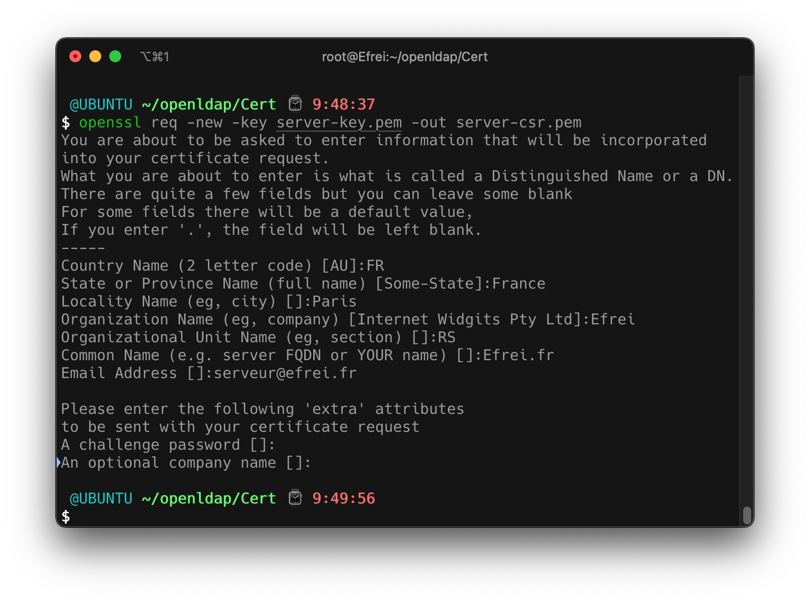

# Architectures sécurisées d'entreprise

Notes de cours de `Thomas PEUGNET`.

Ce cours présente comment faire un speedrun des TPs 1 et 2.

# TP01

## Création de l'utilisateur Pierre


```shell
$ adduser pierre
$ usermod -aG sudo pierre

# Changement du hostname
$ hostnamectl hostname Efrei.fr 
```

## Installation

```shell
$ apt install slapd ldap-utils

# Création de la configuration de base
$ dpkg-reconfigure slapd
```

Durant cette étape, choisir les options suivantes : 

- Omit OpenLDAP server configuration ? `No`
- DNS Domain Name : `Efrei.fr`
- Org. Name: `Efrei`
- Do you want the database to be removed when `slapd` is purged ? : `Yes`

Vérifier que le service fonctionne correctement : `systemctl status slapd` doit posséder le statut `active`.

Vérifier le port d'écoute du service : `netstat -laptun | grep slapd`

## Première connexion

```shell
$ ldapsearch -x -H ldap://127.0.0.1 -D "cn=admin,dc=Efrei,dc=fr" -W
```


Modification du fichier `/etc/hosts` :


Dans le fichier `/etc/ldap/ldap.conf`, modifier les lignes `BASE` et `URI` suivantes :
```shell
BASE	  dc=Efrei,dc=fr
URI	    ldap://Efrei.fr
```

Ce qui donne le fichier suivant :

```conf
#
# LDAP Defaults
#

# See ldap.conf(5) for details
# This file should be world readable but not world writable.

BASE	dc=Efrei,dc=fr
URI	ldap://Efrei.fr

#SIZELIMIT	12
#TIMELIMIT	15
#DEREF		never

# TLS certificates (needed for GnuTLS)
TLS_CACERT	/etc/ssl/certs/ca-certificates.crt
```

Vérification du fonctionnement avec la commande suivante :

```shell
$ ldapsearch -x
```


Pour vérifier le bon fonctionnement du serveur LDAP, à tout moment utiliser :

```shell
$ slapcat
```


## Remplissage de l'annuaire

### Organization Units

Créer un fichier `org_unit.ldif` et le remplir avec le contenu suivant:

```ldif
dn: ou=users,dc=Efrei,dc=fr
objectClass: organizationalUnit

dn: ou=groups,dc=Efrei,dc=fr
objectClass: organizationalUnit
```

Appliquer le contenu présent dans ce fichier à notre serveur LDAP par la commande suivante :

```shell
$ ldapadd -W -D "cn=admin,dc=Efrei,dc=fr" -x -f org_unit.ldif
```


### Groups

Créer un fichier `groups.ldif` et le remplir avec le contenu suivant:

```ldif
dn: cn=teachers,ou=groups,dc=Efrei,dc=fr
objectClass: posixGroup
objectClass: top
gidNumber: 6001
cn: teachers

dn: cn=students,ou=groups,dc=Efrei,dc=fr
objectClass: posixGroup
objectClass: top
gidNumber: 6002
cn: students
```

Appliquer le contenu présent dans ce fichier à notre serveur LDAP par la commande suivante :

```shell
$ ldapadd -W -D "cn=admin,dc=Efrei,dc=fr" -x -f groups.ldif
```


### Création de l'utilisateur Pierre et Souheib

Créer un fichier `pierre.ldif` et le remplir avec le contenu suivant:

```ldif
dn: cn=teachers,ou=groups,dc=Efrei,dc=fr
objectClass: posixGroup
objectClass: top
gidNumber: 6001
cn: teachers

dn: uid=pierre.dupont,ou=users,dc=Efrei,dc=fr
objectClass: posixGroup
objectClass: top
objectClass: organizationalPerson
objectClass: inetOrgPerson
objectClass: posixAccount
uidNumber: 6002
gidNumber: 6002
homeDirectory: /home/pierre
loginShell: /bin/bash
uid: pierre.dupont
sn: dupont
cn: pierre dupont
mail: pierre.dupont@efrei.fr
userPassword: pierre
```

Appliquer le contenu présent dans ce fichier à notre serveur LDAP par la commande suivante :

```shell
$ ldapadd -W -D "cn=admin,dc=Efrei,dc=fr" -x -f pierre.ldif
```

Créer un fichier `souheib.ldif` et le remplir avec le contenu suivant:

```ldif
dn: uid=souheib.yousfi,ou=users,dc=Efrei,dc=fr
objectClass: person
objectClass: top
objectClass: organizationalPerson
objectClass: inetOrgPerson
objectClass: posixAccount
uidNumber: 6001
gidNumber: 6001
homeDirectory: /home/souheib
loginShell: /bin/bash
uid: souheib.yousfi
sn: yousfi
cn: souheib yousfi
mail: souheib.yousfi@efrei.fr
userPassword: souheib
```

Appliquer le contenu présent dans ce fichier à notre serveur LDAP par la commande suivante :

```shell
$ ldapadd -W -D "cn=admin,dc=Efrei,dc=fr" -x -f souheib.ldif
```


On met à jour le mot de passe à l'aide la commande suivante :

```shell
$ ldappasswd -H ldap://127.0.0.1 -x -D "cn=admin,dc=Efrei,dc=fr" -W -S "uid=souheib.yousfi,ou=users,dc=Efrei,dc=fr"
```

## Vérification et ajout d'un email

On effectue une requête pour vérifier l'utilisateur à l'aide de la commande suivante :

```shell
$ ldapsearch -x -b "dc=Efrei,dc=fr" -LLL uid=souheib.yousfi cn mail
```


On crée un nouvel email pour l'utilisateur au sein du fichier `add_email.ldif` :

```
dn: uid=souheib.yousfi,ou=users,dc=Efrei,dc=fr
changetype: modify
add: mail
mail:souheib.yousfi@efrei.net
```

On ajoute  un email à l'utilisateur à l'aide de la commande suivante :

```shell
$ ldapmodify -D cn=admin,dc=Efrei,dc=fr -W -f add_email.ldif
```


# TP02

## Création des certificats

Création d'un certificat à l'aide de la commande suivante :

```shell
$ openssl genpkey -algorithm RSA -out server-key.pem
$ openssl req -new -key server-key.pem -out server-csr.pem
```



```shell
$ openssl x509 -req -in server-csr.pem -signkey server-key.pem -out server-cert.pem
```


Changer l'appartenance et les permissions avec les commandes suivantes : 

```shell
$ chown openldap:openldap server-cert.pem
$ chown openldap:openldap server-key.pem
$ chmod 400 server-key.pem
```

## Configuration du certificat avec `slapd`

Créer un fichier `cert.ldif` avec le contenu suivant :

