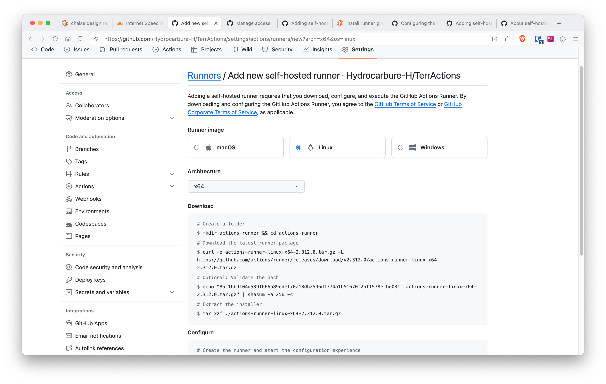
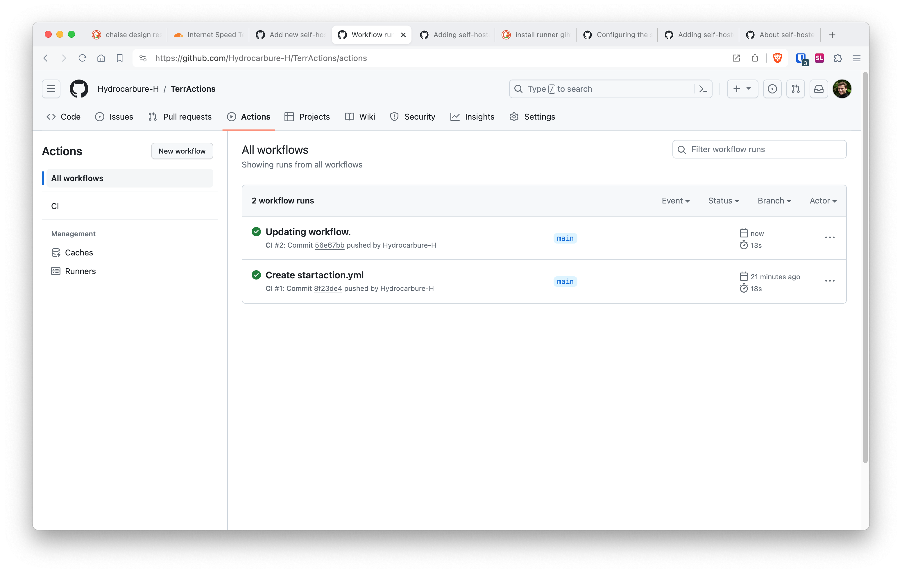

# Projet DevOps - Github Actions

# Github Runner

## Introduction

Nous avons choisi d'essayer d'instancier un runner Github, bien que la possibilité de les self-hoster ne soit encore très jeune. 

D'après nos recherches, la documentation semble très bien faite, et nous décidons donc de tenter l'expérience.

Nous ajoutons donc un nouveau runner depuis le repository `TerrActions`.




## Création du runner

Démarrage de l'instance EC2 qui servira pour notre `runner` Github.


## Configuration de notre runner

D'après la documentation de Github, nous créons le runner de la façon suivante:

```bash
$ mkdir actions-runner && cd actions-runner 

# Download the latest runner package
$ curl -o actions-runner-linux-x64-2.312.0.tar.gz -L https://github.com/actions/runner/releases/download/v2.312.0/actions-runner-linux-x64-2.312.0.tar.gz 

# Optional: Validate the hash
$ echo "85c1bbd104d539f666a89edef70a18db2596df374a1b51670f2af1578ecbe031  actions-runner-linux-x64-2.312.0.tar.gz" | shasum -a 256 -c

# Extract the installer
$ tar xzf ./actions-runner-linux-x64-2.312.0.tar.gz

# Create the runner and start the configuration experience
$ ./config.sh --url https://github.com/Hydrocarbure-H/TerrActions --token AXJ2G7EPNSCQTD2HGXKKWSDFXTZZI

# Last step, run it!
$ ./run.sh
```

Puis, on met à jour notre workflow, ici nommé `startaction.yaml` pour vérifier le fonctionnement de notre runner.

```yaml
# Use this YAML in your workflow file for each job
runs-on: self-hosted
```


Voici le code de notre `startaction.yaml` maintenant mis à jour pour être exécuté sur le runner de notre instance EC2 :

```yaml
# This is a basic workflow to help you get started with Actions

name: CI

# Controls when the workflow will run
on:
  # Triggers the workflow on push or pull request events but only for the "main" branch
  push:
    branches: [ "main" ]
  pull_request:
    branches: [ "main" ]

  # Allows you to run this workflow manually from the Actions tab
  workflow_dispatch:

# A workflow run is made up of one or more jobs that can run sequentially or in parallel
jobs:
  # This workflow contains a single job called "build"
  build:
    # The UPDATED LINE for self-hosted runner
    runs-on: self-hosted

    # Steps represent a sequence of tasks that will be executed as part of the job
    steps:
      # Checks-out your repository under $GITHUB_WORKSPACE, so your job can access it
      - uses: actions/checkout@v3

      # Runs a single command using the runners shell
      - name: Run a one-line script
        run: echo Hello, world!

      # Runs a set of commands using the runners shell
      - name: Run a multi-line script
        run: |
          echo Add other actions to build,
          echo test, and deploy your project.
```

Nous avons commit notre modification sur la ligne `runs-on: self-hosted`, et avons vu que notre instance a bien exécuté notre Action.


Par ailleurs, nous avons pu constater que c'est également le cas sur l'interface graphique de Github.



# Pipeline de Build Applicatif

Nous avons maintenant l'Action suivante, pour créer notre AMI à l'aide du code Packer précédemment écrit dans un TP.

A noter que notre script fait appel à des `secrets`, champs spéciaux dans les Github Actions permettant de cacher des identifiants et autres données sensibles.

Par ailleurs, les deux paramètres pour le port d'écoute de notre projet est stocké dans la variable `HTTPD_PORT` et le nom du projet pour la construction de l'AMI est stocké dans `PROJECT_NAME`.

Nous avons notre repository qui possède l'architecture suivante:

```
├── .github
│   └── workflows
│       ├── app-build.yml
│       └── startaction.yml
├── .gitignore
├── LICENSE
├── README.md
├── apache-packer.pkr.hcl
└── play.yml
```

```yaml
name: Build Apache AMI

on:
  push:
    branches:
      - main

jobs:
  build:
    runs-on: self-hosted

    steps:
    - uses: actions/checkout@v2

    - name: Clone Packer template repository
      run: git clone https://github.com/Hydrocarbure-H/TerrActions ./repo

    - name: Setup Packer
      uses: hashicorp/setup-packer@latest
      with:
        packer-version: '1.7.0'

    - name: Validate Packer Template
      run: packer validate ./repo/apache-packer.pkr.hcl

    - name: Build AMI with Packer
      env:
        AWS_ACCESS_KEY_ID: ${{ secrets.AWS_ACCESS_KEY_ID }}
        AWS_SECRET_ACCESS_KEY: ${{ secrets.AWS_SECRET_ACCESS_KEY }}
        APP_NAME: 'TerrAction'
        HTTPD_PORT: '8080'
      run: packer build -var 'app_name=${{ env.APP_NAME }}' -var 'httpd_port=${{ env.HTTPD_PORT }}' ./repo/apache-packer.pkr.hcl
```

Le code du fichier Packer est le suivant:

```hcl
packer {
  required_plugins {
    amazon = {
      version = "~> 1.3"
      source  = "github.com/hashicorp/amazon"
    }
    ansible = {
      version = "~> 1.1"
      source  = "github.com/hashicorp/ansible"
    }
  }
}

variable "associate_public_ip_address" {
  type    = string
  default = "true"
}
variable "base_ami" {
  type    = string
  default = "ami-007855ac798b5175e"
}
variable "instance_type" {
  type    = string
  default = "t2.micro"
}
variable "region" {
  type    = string
  default = "us-east-1"
}
variable "app_name" {
  type    = string
  default = "WebApp"
}
variable "ssh_username" {
  type    = string
  default = "ubuntu"
}

locals {
  timestamp = formatdate("DD_MM_YYYY-hh_mm", timestamp())
}

source "amazon-ebs" "static-web-ami" {
  ami_name                    = "${var.app_name}-${local.timestamp}"
  associate_public_ip_address = "${var.associate_public_ip_address}"
  instance_type               = "${var.instance_type}"
  region                      = "${var.region}"
  source_ami                  = "${var.base_ami}"
  ssh_username                = "${var.ssh_username}"

  iam_instance_profile        = "LabInstanceProfile"

  tags = {
    Name = "${var.app_name}"
  }
}

variable "httpd_port" {
  type    = string
  default = "80" # Port par défaut pour HTTPD, remplacez-le par le port souhaité
}

build {
  sources = ["source.amazon-ebs.static-web-ami"]
  provisioner "ansible" {
    playbook_file = "./repo/play.yml" # Assurez-vous que le chemin est correct
    extra_arguments = ["-e", "httpd_port=${var.httpd_port}"]
    use_proxy = false
  }
}
```

Le playbook ansible `play.yml` est le suivant.

```yml
- name: Configure HTTPD to listen on specified port
  hosts: all
  become: yes
  tasks:
    - name: Update httpd.conf to listen on specified port
      lineinfile:
        path: /etc/httpd/conf/httpd.conf
        regexp: '^Listen'
        line: "Listen {{ httpd_port }}"
```

