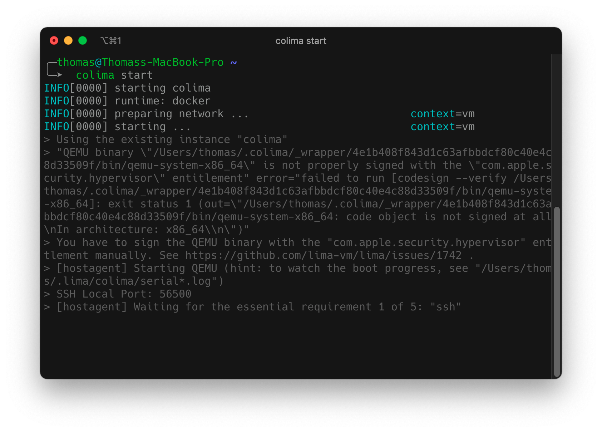
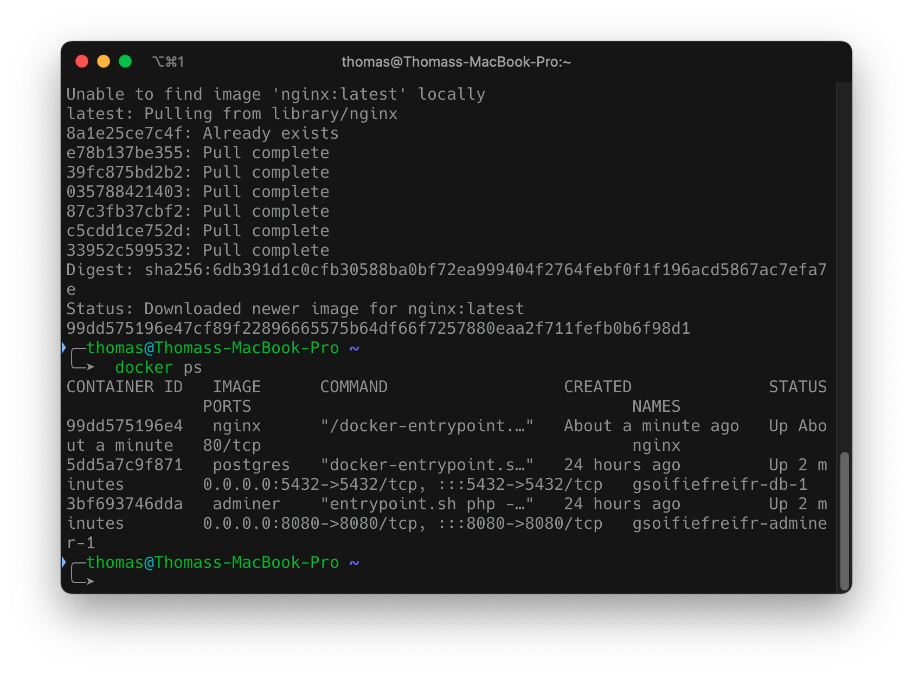

# Orchestration et Conteneurs

Notes de cours par `Thomas PEUGNET`.

# Rappels

#### **Introduction à la Virtualisation**

**Virtualisation**: Technique d'abstraction qui permet de séparer les ressources matérielles d'un ordinateur en plusieurs environnements distincts, via des hyperviseurs. Elle optimise l'utilisation des ressources, facilite la gestion des infrastructures, et réduit les coûts opérationnels.

#### **Principes de la Conteneurisation**

**Conteneurisation**: Méthodologie de packaging du code d'une application et de toutes ses dépendances dans un conteneur autonome. Offre portabilité, isolation, et efficacité dans le déploiement des applications sur différents environnements informatiques.

#### **Docker: Plateforme de Conteneurisation**

**Architecture Docker**: Système qui permet la création, le déploiement et la gestion de conteneurs. Utilise des images Docker pour construire des conteneurs, facilitant ainsi la distribution et la standardisation des environnements d'exécution.

#### **Registre de Conteneurs (Container Registry)**

**Registry**: Service de stockage et de distribution d'images de conteneurs. Centralise le stockage des images, gère les versions, et assure la sécurité et la haute disponibilité des images de conteneurs.

#### **Création et Gestion d'Images Docker**

**Images Docker**: Modèles immuables utilisés pour créer des conteneurs. Composées de couches superposées qui facilitent le partage et la réutilisation des composants, réduisant l'espace de stockage et les coûts de transfert.

#### **Persistance des Données dans les Conteneurs**

**Volumes et Bind Mounts**: Méthodes permettant de persister et de gérer des données dans les conteneurs Docker. Les volumes sont gérés par Docker, tandis que les bind mounts permettent de monter directement des répertoires de l'hôte dans le conteneur.

#### **Communication et Orchestration des Conteneurs**

**Réseaux Docker et Docker Compose**: Outils qui facilitent la communication entre conteneurs et la gestion d'applications multi-conteneurs. Docker Compose utilise des fichiers YAML pour configurer les services et gérer l'ensemble de l'application.

#### **Sécurité et Gestion des Conteneurs**

**Scanning des Images**: Pratique essentielle pour assurer la sécurité des conteneurs en identifiant et en corrigeant les vulnérabilités dans les images Docker.

#### **Avantages et Limites de la Conteneurisation**

La conteneurisation offre de nombreux avantages tels que la rapidité de déploiement, la portabilité, l'isolation, et une utilisation efficace des ressources. Cependant, elle présente des défis en termes de gestion des ressources, de sécurité, de complexité de l'infrastructure, et de surcharge réseau.

# Rendus des TP

# TP01

TP Réalisé par `Thomas PEUGNET` et `Vincent LAGOGUÉ`.

## Installation de Docker sur macOS

Pour utiliser Docker sur macOS, pour des soucis de performances, nous utiliserons Colima qui est une alternative à Docker Desktop en CLI. Docker Desktop demande beaucoup de performances pour tourner sur un mac de 2014..!

Nous installons donc Colima de la façon suivante:

```shell
$ brew install colima
```

Puis, nous le démarrons à l'aide de la commande suivante:

```shell
$ colima start
```



Puis, nous vérifions le bon fonctionnement de Docker sur notre appareil par les commandes suivantes:

```shell
$ docker pull hello-world

$ docker run hello-world
```


Puis, nous lançons un conteneur `nginx` en arrière plan, pour vérifier son bon lancement par les 2 commandes suivantes:

```shell
$ docker run --name nginx -d nginx

$ docker ps
```



**Note: ** Nginx n'étant pas le seul conteneur déjà en cours d'exécution.

Nous stoppons le conteneur par la commande suivante:

```shell
$ docker stop 99dd575196e4
```


Nous pouvons voir les différentes images présentes sur notre appareil par la commande suivante:

```shell
$ docker images
```


# Orchestration des Conteneurs

**Définition:** L'orchestration des conteneurs est une méthode automatisée et évolutive pour gérer et déployer des conteneurs. Elle facilite la gestion efficace des applications conteneurisées, offrant un équilibrage des charges, une gestion de stockage, une mise à l'échelle des applications, et des mises à jour.

### Kubernetes

- **Origine:** Développé par Google en 2014, Kubernetes est une plateforme open-source pour l'orchestration de conteneurs.
- **Architecture:** Comprend un ensemble de binaires compilés statiquement, écrits en Go, permettant une conteneurisation et un déploiement faciles sans dépendance d'OS.

#### Composants Principaux

- **ETCD:** Base de données distribuée clé/valeur stockant l'état du cluster.
- **KUBE-APISERVER:** Interface de gestion centrale, interagissant via REST API ou `kubectl`.
- **KUBE-SCHEDULER:** Attribue des ressources basées sur des règles de planification.
- **KUBE-PROXY:** Gère la publication des services et le routage des paquets vers les conteneurs.
- **KUBE-CONTROLLER-MANAGER:** Boucle de contrôle surveillant et ajustant l'état du cluster.
- **KUBELET:** Interface entre le serveur d'API et le runtime des conteneurs sur les nodes.

### Technologies Complémentaires

- **CRI-O:** Runtime de conteneurs permettant l'orchestration sans dépendance à Docker.
- **CLOUD-CONTROLLER:** Intègre Kubernetes avec les fournisseurs de services cloud.

### Ressources Kubernetes

- **Namespaces:** Isolent des groupes de ressources au sein d'un cluster.
- **Pods:** Plus petite unité de déploiement contenant un ou plusieurs conteneurs.
- **Deployments:** Gèrent le déploiement et la mise à jour des applications.
- **StatefulSets:** Déploient des applications nécessitant un stockage persistant.
- **Jobs & CronJobs:** Gèrent l'exécution de tâches une fois ou selon un calendrier.

### Réseau et Sécurité

- **Network Plugins (CNI):** Assurent la connectivité réseau entre les pods.
- **Ingress:** Expose des services HTTP/S à l'extérieur du cluster via des règles de routage.
- **Service Mesh:** Gère la communication entre microservices avec des fonctionnalités avancées.
- **Volumes:** Unités de stockage de données pour les pods.
- **Security:** Gestion des accès via RBAC, secrets pour stocker des données sensibles.

### Supervision et Log

- Importance de la collecte des métriques, visualisation via des outils comme Grafana, configuration d'alertes, et analyse des logs pour un monitoring efficace.

## Pods : Unités Fondamentales d'Exécution

Un **Pod** est la plus petite unité déployable créée et gérée par Kubernetes. Chaque Pod est conçu pour exécuter un ensemble spécifique de conteneurs.

#### Exemple de Définition de Pod

```yaml
apiVersion: v1
kind: Pod
metadata:
  name: mon-pod
spec:
  containers:
  - name: mon-container
    image: nginx:1.17
    ports:
    - containerPort: 80
```

Cet exemple définit un Pod nommé `mon-pod`, contenant un conteneur basé sur l'image `nginx:1.17`, exposant le port `80`.

### Réseau : Communication et Exposition

Kubernetes utilise des **Services** et des **Ingress** pour gérer l'accès aux applications dans les Pods.

#### Service

Un **Service** définit une politique d'accès abstraite pour accéder aux Pods, permettant la communication interne et externe.

##### Exemple de Service

```yaml
apiVersion: v1
kind: Service
metadata:
  name: mon-service
spec:
  selector:
    app: mon-app
  ports:
    - protocol: TCP
      port: 80
      targetPort: 9376
```

Ce Service expose les Pods marqués avec `app: mon-app` sur le port `80`, redirigeant le trafic vers le `targetPort` `9376` des Pods.

#### Ingress

**Ingress** gère l'accès externe au cluster, fournissant des règles de routage HTTP/S.

##### Exemple de Configuration Ingress

```yaml
yamlCopy code
apiVersion: networking.k8s.io/v1
kind: Ingress
metadata:
  name: exemple-ingress
spec:
  rules:
  - host: www.exemple.com
    http:
      paths:
      - path: /
        pathType: Prefix
        backend:
          service:
            name: mon-service
            port:
              number: 80
```

Cet Ingress route le trafic pour `www.exemple.com` vers `mon-service` au port `80`.

### Réseau : Network Policies

**Network Policies** spécifient comment les groupes de Pods peuvent communiquer entre eux et avec d'autres réseaux.

#### Exemple de Network Policy

```yaml
apiVersion: networking.k8s.io/v1
kind: NetworkPolicy
metadata:
  name: policy-exemple
spec:
  podSelector:
    matchLabels:
      app: mon-app
  policyTypes:
  - Ingress
  - Egress
  ingress:
  - from:
    - ipBlock:
        cidr: 172.17.0.0/16
    ports:
    - protocol: TCP
      port: 80
```

Cette politique permet aux Pods avec le label `app: mon-app` de recevoir du trafic TCP sur le port `80` uniquement de l'intérieur du CIDR `172.17.0.0/16`.
