# Orchestration et Conteneurs

Notes de cours par `Thomas PEUGNET`.

# Rappels

#### **Introduction à la Virtualisation**

**Virtualisation**: Technique d'abstraction qui permet de séparer les ressources matérielles d'un ordinateur en plusieurs environnements distincts, via des hyperviseurs. Elle optimise l'utilisation des ressources, facilite la gestion des infrastructures, et réduit les coûts opérationnels.

#### **Principes de la Conteneurisation**

**Conteneurisation**: Méthodologie de packaging du code d'une application et de toutes ses dépendances dans un conteneur autonome. Offre portabilité, isolation, et efficacité dans le déploiement des applications sur différents environnements informatiques.

#### **Docker: Plateforme de Conteneurisation**

**Architecture Docker**: Système qui permet la création, le déploiement et la gestion de conteneurs. Utilise des images Docker pour construire des conteneurs, facilitant ainsi la distribution et la standardisation des environnements d'exécution.

#### **Registre de Conteneurs (Container Registry)**

**Registry**: Service de stockage et de distribution d'images de conteneurs. Centralise le stockage des images, gère les versions, et assure la sécurité et la haute disponibilité des images de conteneurs.

#### **Création et Gestion d'Images Docker**

**Images Docker**: Modèles immuables utilisés pour créer des conteneurs. Composées de couches superposées qui facilitent le partage et la réutilisation des composants, réduisant l'espace de stockage et les coûts de transfert.

#### **Persistance des Données dans les Conteneurs**

**Volumes et Bind Mounts**: Méthodes permettant de persister et de gérer des données dans les conteneurs Docker. Les volumes sont gérés par Docker, tandis que les bind mounts permettent de monter directement des répertoires de l'hôte dans le conteneur.

#### **Communication et Orchestration des Conteneurs**

**Réseaux Docker et Docker Compose**: Outils qui facilitent la communication entre conteneurs et la gestion d'applications multi-conteneurs. Docker Compose utilise des fichiers YAML pour configurer les services et gérer l'ensemble de l'application.

#### **Sécurité et Gestion des Conteneurs**

**Scanning des Images**: Pratique essentielle pour assurer la sécurité des conteneurs en identifiant et en corrigeant les vulnérabilités dans les images Docker.

#### **Avantages et Limites de la Conteneurisation**

La conteneurisation offre de nombreux avantages tels que la rapidité de déploiement, la portabilité, l'isolation, et une utilisation efficace des ressources. Cependant, elle présente des défis en termes de gestion des ressources, de sécurité, de complexité de l'infrastructure, et de surcharge réseau.

# Rendus des TP

# TP01

TP Réalisé par `Thomas PEUGNET` et `Vincent LAGOGUÉ`.

## Installation de Docker sur macOS

Pour utiliser Docker sur macOS, pour des soucis de performances, nous utiliserons Colima qui est une alternative à Docker Desktop en CLI. Docker Desktop demande beaucoup de performances pour tourner sur un mac de 2014..!

Nous installons donc Colima de la façon suivante:

```shell
$ brew install colima
```

Puis, nous le démarrons à l'aide de la commande suivante:

```shell
$ colima start
```


Puis, nous vérifions le bon fonctionnement de Docker sur notre appareil par les commandes suivantes:

```shell
$ docker pull hello-world

$ docker run hello-world
```

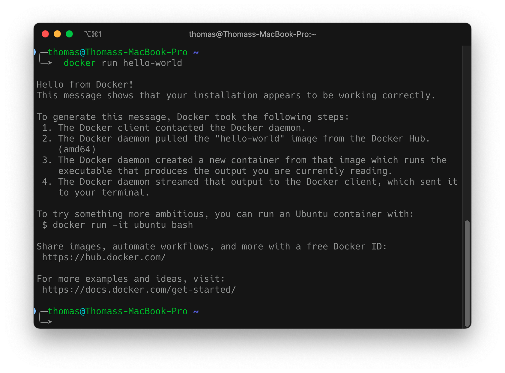

Puis, nous lançons un conteneur `nginx` en arrière plan, pour vérifier son bon lancement par les 2 commandes suivantes:

```shell
$ docker run --name nginx -d nginx

$ docker ps
```


**Note: ** Nginx n'étant pas le seul conteneur déjà en cours d'exécution.

Nous stoppons le conteneur par la commande suivante:

```shell
$ docker stop 99dd575196e4
```


Nous pouvons voir les différentes images présentes sur notre appareil par la commande suivante:

```shell
$ docker images
```


# Orchestration des Conteneurs

**Définition:** L'orchestration des conteneurs est une méthode automatisée et évolutive pour gérer et déployer des conteneurs. Elle facilite la gestion efficace des applications conteneurisées, offrant un équilibrage des charges, une gestion de stockage, une mise à l'échelle des applications, et des mises à jour.

### Kubernetes

- **Origine:** Développé par Google en 2014, Kubernetes est une plateforme open-source pour l'orchestration de conteneurs.
- **Architecture:** Comprend un ensemble de binaires compilés statiquement, écrits en Go, permettant une conteneurisation et un déploiement faciles sans dépendance d'OS.

#### Composants Principaux

- **ETCD:** Base de données distribuée clé/valeur stockant l'état du cluster.
- **KUBE-APISERVER:** Interface de gestion centrale, interagissant via REST API ou `kubectl`.
- **KUBE-SCHEDULER:** Attribue des ressources basées sur des règles de planification.
- **KUBE-PROXY:** Gère la publication des services et le routage des paquets vers les conteneurs.
- **KUBE-CONTROLLER-MANAGER:** Boucle de contrôle surveillant et ajustant l'état du cluster.
- **KUBELET:** Interface entre le serveur d'API et le runtime des conteneurs sur les nodes.

### Technologies Complémentaires

- **CRI-O:** Runtime de conteneurs permettant l'orchestration sans dépendance à Docker.
- **CLOUD-CONTROLLER:** Intègre Kubernetes avec les fournisseurs de services cloud.

### Ressources Kubernetes

- **Namespaces:** Isolent des groupes de ressources au sein d'un cluster.
- **Pods:** Plus petite unité de déploiement contenant un ou plusieurs conteneurs.
- **Deployments:** Gèrent le déploiement et la mise à jour des applications.
- **StatefulSets:** Déploient des applications nécessitant un stockage persistant.
- **Jobs & CronJobs:** Gèrent l'exécution de tâches une fois ou selon un calendrier.

### Réseau et Sécurité

- **Network Plugins (CNI):** Assurent la connectivité réseau entre les pods.
- **Ingress:** Expose des services HTTP/S à l'extérieur du cluster via des règles de routage.
- **Service Mesh:** Gère la communication entre microservices avec des fonctionnalités avancées.
- **Volumes:** Unités de stockage de données pour les pods.
- **Security:** Gestion des accès via RBAC, secrets pour stocker des données sensibles.

### Supervision et Log

- Importance de la collecte des métriques, visualisation via des outils comme Grafana, configuration d'alertes, et analyse des logs pour un monitoring efficace.

## Pods : Unités Fondamentales d'Exécution

Un **Pod** est la plus petite unité déployable créée et gérée par Kubernetes. Chaque Pod est conçu pour exécuter un ensemble spécifique de conteneurs.

#### Exemple de Définition de Pod

```yaml
apiVersion: v1
kind: Pod
metadata:
  name: mon-pod
spec:
  containers:
  - name: mon-container
    image: nginx:1.17
    ports:
    - containerPort: 80
```

Cet exemple définit un Pod nommé `mon-pod`, contenant un conteneur basé sur l'image `nginx:1.17`, exposant le port `80`.

### Réseau : Communication et Exposition

Kubernetes utilise des **Services** et des **Ingress** pour gérer l'accès aux applications dans les Pods.

#### Service

Un **Service** définit une politique d'accès abstraite pour accéder aux Pods, permettant la communication interne et externe.

##### Exemple de Service

```yaml
apiVersion: v1
kind: Service
metadata:
  name: mon-service
spec:
  selector:
    app: mon-app
  ports:
    - protocol: TCP
      port: 80
      targetPort: 9376
```

Ce Service expose les Pods marqués avec `app: mon-app` sur le port `80`, redirigeant le trafic vers le `targetPort` `9376` des Pods.

#### Ingress

**Ingress** gère l'accès externe au cluster, fournissant des règles de routage HTTP/S.

##### Exemple de Configuration Ingress

```yaml
yamlCopy code
apiVersion: networking.k8s.io/v1
kind: Ingress
metadata:
  name: exemple-ingress
spec:
  rules:
  - host: www.exemple.com
    http:
      paths:
      - path: /
        pathType: Prefix
        backend:
          service:
            name: mon-service
            port:
              number: 80
```

Cet Ingress route le trafic pour `www.exemple.com` vers `mon-service` au port `80`.

### Réseau : Network Policies

**Network Policies** spécifient comment les groupes de Pods peuvent communiquer entre eux et avec d'autres réseaux.

#### Exemple de Network Policy

```yaml
apiVersion: networking.k8s.io/v1
kind: NetworkPolicy
metadata:
  name: policy-exemple
spec:
  podSelector:
    matchLabels:
      app: mon-app
  policyTypes:
  - Ingress
  - Egress
  ingress:
  - from:
    - ipBlock:
        cidr: 172.17.0.0/16
    ports:
    - protocol: TCP
      port: 80
```

Cette politique permet aux Pods avec le label `app: mon-app` de recevoir du trafic TCP sur le port `80` uniquement de l'intérieur du CIDR `172.17.0.0/16`.

# Gestion des Ressources dans Kubernetes

**Demandes et Limites**: Kubernetes permet de spécifier des ressources minimales (`requests`) et maximales (`limits`) pour les conteneurs. Ces paramètres sont cruciaux pour le bon fonctionnement et la planification efficace des conteneurs sur les nœuds.

### Exemple de Configuration des Demandes et Limites

```yaml
apiVersion: v1
kind: Pod
metadata:
  name: mon-pod
spec:
  containers:
  - name: nginx
    image: nginx
    resources:
      requests:
        memory: "64Mi"
        cpu: "250m"
      limits:
        memory: "128Mi"
        cpu: "500m"
```

Dans cet exemple, le conteneur demande au minimum 64 MiB de mémoire et 0.25 CPU et est limité à 128 MiB de mémoire et 0.5 CPU.

**RAM et CPU**: Les configurations de RAM (`memory`) et de CPU (`cpu`) aident Kubernetes à allouer les ressources nécessaires et à éviter la surcharge des nœuds.

### Gestion Avancée des Ressources

**LimitRange**: Un `LimitRange` permet de définir des politiques minimales et maximales pour les ressources utilisées par les pods dans un namespace, empêchant ainsi l'utilisation excessive des ressources d'un nœud.

#### Exemple de LimitRange

```yaml
apiVersion: v1
kind: LimitRange
metadata:
  name: limit-range
spec:
  limits:
  - default:
      memory: "512Mi"
      cpu: "1"
    defaultRequest:
      memory: "256Mi"
      cpu: "0.5"
    type: Container
```

Ce `LimitRange` définit des demandes par défaut et des limites pour les conteneurs dans un namespace.

**ResourceQuota**: Les `ResourceQuotas` permettent de limiter la consommation totale de ressources par namespace, ce qui est utile pour gérer efficacement les ressources dans un environnement multi-utilisateur.

#### Exemple de ResourceQuota

```yaml
apiVersion: v1
kind: ResourceQuota
metadata:
  name: quota
spec:
  hard:
    requests.cpu: "4"
    requests.memory: 2Gi
    limits.cpu: "10"
    limits.memory: 10Gi
```

Ce `ResourceQuota` impose des quotas stricts sur les ressources demandées et les limites pour tout le namespace.

# Autoscaling

**Horizontal Pod Autoscaler (HPA)**: Le HPA permet d'ajuster automatiquement le nombre de répliques d'un déploiement en fonction de l'utilisation réelle des ressources par rapport aux cibles définies.

#### Exemple d'HPA

```yaml
apiVersion: autoscaling/v2beta2
kind: HorizontalPodAutoscaler
metadata:
  name: hpa-example
spec:
  scaleTargetRef:
    apiVersion: apps/v1
    kind: Deployment
    name: my-deployment
  minReplicas: 1
  maxReplicas: 10
  metrics:
  - type: Resource
    resource:
      name: cpu
      target:
        type: Utilization
        averageUtilization: 80
```

Cet HPA ajuste le nombre de répliques du déploiement `my-deployment` pour maintenir l'utilisation moyenne du CPU autour de 80%.

**Vertical Pod Autoscaler (VPA)**: Le VPA ajuste les demandes de ressources et les limites des conteneurs dans un pod en fonction de l'utilisation pour optimiser l'utilisation des ressources.

#### Exemple de VPA

```yaml
apiVersion: "autoscaling.k8s.io/v1"
kind: VerticalPodAutoscaler
metadata:
  name: vpa-example
spec:
  targetRef:
    apiVersion: "apps/v1"
    kind: Deployment
    name: my-deployment
  updatePolicy:
    updateMode: "Auto"
```

Ce VPA ajustera automatiquement les demandes et les limites des conteneurs dans le déploiement `my-deployment` en fonction de leur utilisation réelle.

# Scheduling des Pods

**NodeSelector**: `NodeSelector` est une fonctionnalité de Kubernetes qui permet de planifier des pods sur des nœuds spécifiques en fonction des labels. C'est un des moyens les plus simples pour contrôler le placement des pods.

#### Exemple de NodeSelector

```yaml
apiVersion: v1
kind: Pod
metadata:
  name: mon-pod
spec:
  containers:
  - name: nginx
    image: nginx
  nodeSelector:
    disque: ssd
```

Ce Pod sera planifié sur un nœud qui a le label `disque=ssd`.

**Affinités et Anti-affinités**: Les affinités et anti-affinités permettent une planification plus avancée et flexible par rapport à `NodeSelector`. Elles permettent de spécifier des règles qui incluent des préférences et des exigences.

#### Exemple d'Affinité de Node

```yaml
apiVersion: v1
kind: Pod
metadata:
  name: avec-affinite
spec:
  containers:
  - name: nginx
    image: nginx
  affinity:
    nodeAffinity:
      requiredDuringSchedulingIgnoredDuringExecution:
        nodeSelectorTerms:
        - matchExpressions:
          - key: disque
            operator: In
            values:
            - ssd
```

Ce Pod nécessite un nœud avec le label `disque=ssd` pour être planifié.

**Taints et Tolerances**: Les taints et tolerances travaillent ensemble pour s'assurer que les pods ne sont pas planifiés sur des nœuds inappropriés. Les taints repoussent les pods qui n'ont pas de tolérances correspondantes.

#### Exemple de Taints et Tolerances

```yaml
# Sur un nœud
kubectl taint nodes node1 key=value:NoSchedule

# Dans la définition du Pod
apiVersion: v1
kind: Pod
metadata:
  name: tolere-taint
spec:
  containers:
  - name: nginx
    image: nginx
  tolerations:
  - key: "key"
    operator: "Equal"
    value: "value"
    effect: "NoSchedule"
```

Le Pod `tolere-taint` sera capable de tourner sur le nœud `node1` malgré le taint appliqué.

**Pod Topology Spread Constraints**: Ces contraintes permettent de contrôler la dispersion des pods à travers le cluster en fonction de la topologie.

#### Exemple de Pod Topology Spread Constraints

```yaml
apiVersion: apps/v1
kind: Deployment
metadata:
  name: my-deployment
spec:
  replicas: 4
  selector:
    matchLabels:
      app: myapp
  template:
    metadata:
      labels:
        app: myapp
    spec:
      containers:
      - name: nginx
        image: nginx
      topologySpreadConstraints:
      - maxSkew: 1
        topologyKey: "kubernetes.io/hostname"
        whenUnsatisfiable: ScheduleAnyway
        labelSelector:
          matchLabels:
            app: myapp
```

Ce déploiement essaie de maintenir les pods aussi équilibrés que possible entre les nœuds du cluster.

# Sécurité et Contrôle d'Accès dans Kubernetes

**RBAC (Role-Based Access Control)**: RBAC est un mécanisme puissant dans Kubernetes qui gère l'accès aux ressources basé sur les rôles des utilisateurs dans un cluster.

#### Exemple de RBAC

```yaml
# Création d'un Role
apiVersion: rbac.authorization.k8s.io/v1
kind: Role
metadata:
  namespace: default
  name: pod-reader
rules:
- apiGroups: [""]
  resources: ["pods"]
  verbs: ["get", "watch", "list"]

# Création d'un RoleBinding
apiVersion: rbac.authorization.k8s.io/v1
kind: RoleBinding
metadata:
  name: read-pods
  namespace: default
subjects:
- kind: User
  name: "jane"  # Nom de l'utilisateur
  apiGroup: rbac.authorization.k8s.io
roleRef:
  kind: Role
  name: pod-reader
  apiGroup: rbac.authorization.k8s.io
```

Ce RBAC configuration autorise l'utilisateur `jane` à lire les pods dans le namespace `default`.

**Service Accounts**: Les comptes de service sont des identités pour les processus qui s'exécutent dans un pod, permettant aux applications de communiquer avec l'API Kubernetes.

#### Exemple de Service Account

```yaml
apiVersion: v1
kind: ServiceAccount
metadata:
  name: my-service-account
  namespace: default
```

Ce ServiceAccount peut être utilisé pour donner des permissions spécifiques à un pod.

**Pod Security Policies (PSP)**: Les politiques de sécurité des pods (PSP) sont un moyen de contrôler les paramètres de sécurité sensibles et de forcer les meilleures pratiques.

#### Exemple de Pod Security Policy

```yaml
apiVersion: policy/v1beta1
kind: PodSecurityPolicy
metadata:
  name: example
spec:
  privileged: false  # Interdit l'exécution de pods privilégiés
  seLinux:
    rule: RunAsAny
  supplementalGroups:
    rule: RunAsAny
  runAsUser:
    rule: MustRunAsNonRoot
  fsGroup:
    rule: RunAsAny
  volumes:
  - '*'
```

Cette PSP empêche l'exécution de pods en mode privilégié et force l'exécution en tant qu'utilisateur non root.

**Network Policies**: Les politiques de réseau permettent de contrôler le flux de trafic entre les pods et les différents segments du réseau au sein d'un cluster Kubernetes.

#### Exemple de Network Policy

```yaml
apiVersion: networking.k8s.io/v1
kind: NetworkPolicy
metadata:
  name: db-network-policy
  namespace: default
spec:
  podSelector:
    matchLabels:
      role: db
  policyTypes:
  - Ingress
  ingress:
  - from:
    - podSelector:
        matchLabels:
          role: frontend
    ports:
    - protocol: TCP
      port: 3306
```

Cette politique autorise uniquement les pods avec le label `role: frontend` à accéder aux pods avec le label `role: db` sur le port `3306`.

# Monitoring et Logging dans Kubernetes

Le monitoring et le logging sont essentiels pour maintenir la santé et la performance des applications et de l'infrastructure dans un cluster Kubernetes.

**Collecte des Métriques**: La collecte des métriques est essentielle pour observer l'état et la performance du cluster. Des outils comme Prometheus sont souvent utilisés pour cette tâche.

#### Exemple de configuration pour Prometheus

```yaml
apiVersion: v1
kind: Service
metadata:
  name: prometheus
  labels:
    app: prometheus
spec:
  type: NodePort
  ports:
    - port: 9090
      nodePort: 30090
  selector:
    app: prometheus
```

Ce Service expose Prometheus sur le port `30090` du nœud où il s'exécute, permettant l'accès via l'IP du nœud.

**Visualisation des Métriques**: Grafana est couramment utilisé pour visualiser les métriques collectées par Prometheus.

#### Exemple de déploiement Grafana

```yaml
apiVersion: apps/v1
kind: Deployment
metadata:
  name: grafana
  labels:
    app: grafana
spec:
  replicas: 1
  selector:
    matchLabels:
      app: grafana
  template:
    metadata:
      labels:
        app: grafana
    spec:
      containers:
      - name: grafana
        image: grafana/grafana
        ports:
        - containerPort: 3000
```

Ce déploiement crée un pod Grafana qui est accessible via le port `3000`.

**Alertes et Notifications**: Configurer des alertes pour être notifié en cas de conditions anormales est crucial pour une gestion proactive.

#### Exemple de configuration d'alertes avec Prometheus

```yaml
apiVersion: monitoring.coreos.com/v1
kind: PrometheusRule
metadata:
  name: example-alert
  labels:
    prometheus: example
spec:
  groups:
  - name: example.rules
    rules:
    - alert: HighMemoryUsage
      expr: process_memory_bytes > 100000000
      for: 10m
      labels:
        severity: page
      annotations:
        summary: High Memory Usage
```

Cette règle configure une alerte pour tout processus consommant plus de 100MB de mémoire pendant plus de 10 minutes.

**Surveillance des Logs**: L'utilisation de stacks comme ELK (Elasticsearch, Logstash, Kibana) ou EFK (Elasticsearch, Fluentd, Kibana) est standard pour la gestion des logs.

#### Exemple de configuration Elasticsearch

```yaml
apiVersion: apps/v1
kind: Deployment
metadata:
  name: elasticsearch
  labels:
    app: elasticsearch
spec:
  replicas: 1
  selector:
    matchLabels:
      app: elasticsearch
  template:
    metadata:
      labels:
        app: elasticsearch
    spec:
      containers:
      - name: elasticsearch
        image: docker.elastic.co/elasticsearch/elasticsearch:7.9.3
        ports:
        - containerPort: 9200
```

Ce déploiement crée un pod Elasticsearch accessible via le port `9200`.

# GitOps : Principes et Implémentation

**GitOps** est une approche pour la gestion de l'infrastructure et des configurations d'applications basée sur Git comme unique source de vérité. Cela permet l'automatisation, la reproductibilité, la transparence et la traçabilité pour la gestion des déploiements et des opérations.

#### Principe Fondamental de GitOps

GitOps utilise Git pour gérer les configurations d'infrastructure et les déployer automatiquement à l'aide d'outils d'orchestration comme Kubernetes, souvent par des agents dans le cluster qui observent le dépôt Git pour les changements.

#### Exemple de Workflow GitOps

1. **Stockage de Configurations**: Toutes les configurations de déploiement et d'infrastructure sont stockées dans un dépôt Git.
2. **Déclenchement de Mise à Jour**: Les mises à jour sont appliquées au dépôt Git via des commits.
3. **Détection Automatique**: Un outil dans le cluster, comme Argo CD ou Flux, détecte les changements dans le dépôt Git.
4. **Synchronisation et Application**: L'outil synchronise automatiquement les changements dans le cluster.

### Outils GitOps pour Kubernetes

**Flux**: Flux est un outil GitOps qui synchronise automatiquement l'état d'un dépôt Git avec un cluster Kubernetes.

#### Exemple de Configuration avec Flux

```bash
# Installation de Flux dans le cluster Kubernetes
curl -s https://toolkit.fluxcd.io/install.sh | sudo bash

# Initialisation de Flux sur un dépôt Git
flux bootstrap github \
  --owner=<github-user> \
  --repository=<repo-name> \
  --branch=main \
  --path=./clusters/my-cluster \
  --personal
```

Cet exemple montre comment installer Flux dans un cluster Kubernetes et l'initialiser pour qu'il observe les changements dans un dépôt Git spécifique.

**Argo CD**: Un autre outil GitOps qui fournit une interface utilisateur visuelle, ainsi qu'une automatisation pour la synchronisation des états.

#### Exemple de Configuration avec Argo CD

```bash
# Installation d'Argo CD
kubectl create namespace argocd
kubectl apply -n argocd -f https://raw.githubusercontent.com/argoproj/argo-cd/stable/manifests/install.yaml

# Accès à l'interface utilisateur d'Argo CD
kubectl port-forward svc/argocd-server -n argocd 8080:443
```

Ce script installe Argo CD dans un cluster Kubernetes et redirige le port pour accéder à l'interface utilisateur via localhost sur le port 8080.

### Avantages de GitOps

1. **Automatisation**: Automatisation complète du déploiement et de la maintenance.
2. **Traçabilité**: Chaque changement est enregistré dans Git.
3. **Rétablissement Rapide**: Facilité de reprise après incident grâce à la reproductibilité des environnements.
4. **Sécurité Améliorée**: Moins d'interventions manuelles et de risques d'erreurs humaines.

# Fiche Pratique des Commandes `kubectl`

**`kubectl`** est l'outil en ligne de commande pour interagir avec le cluster Kubernetes. Il permet aux administrateurs et aux développeurs de gérer et de déployer des applications sur Kubernetes.

#### Généralités

- **Obtenir de l'aide**:

  ```bash
  kubectl help
  ```

- **Configurer le contexte d'utilisation**:

  ```
  kubectl config use-context <context-name>
  ```

- **Lister tous les resources disponibles**:

  ```
  kubectl api-resources
  ```

#### Gestion des Ressources

- **Lancer un déploiement**:

  ```
  kubectl create deployment <name> --image=<image>
  ```

- **Obtenir des pods**:

  ```
  kubectl get pods
  ```

- **Détails d'un pod spécifique**:

  ```
  kubectl describe pod <pod-name>
  ```

- **Exécuter une commande dans un pod existant**:

  ```
  kubectl exec -it <pod-name> -- <command>
  ```

- **Supprimer un pod**:

  ```
  kubectl delete pod <pod-name>
  ```

#### Gestion de Configuration

- **Créer une ressource à partir d'un fichier YAML**:

  ```
  kubectl apply -f <filename>.yaml
  ```

- **Supprimer une ressource à partir d'un fichier YAML**:

  ```
  kubectl delete -f <filename>.yaml
  ```

- **Obtenir la configuration actuelle des ressources**:

  ```
  kubectl get deployment <name> -o yaml
  ```

#### Mise à l'échelle et Mises à jour

- **Mettre à l'échelle un déploiement**:

  ```
  kubectl scale deployment <deployment-name> --replicas=<num>
  ```

- **Mettre à jour l'image d'un déploiement**:

  ```
  kubectl set image deployment/<deployment-name> <container-name>=<new-image>
  ```

- **Vérifier le rollout status d'un déploiement**:

  ```
  kubectl rollout status deployment/<deployment-name>
  ```

- **Annuler une mise à jour**:

  ```
  kubectl rollout undo deployment/<deployment-name>
  ```

#### Visualisation et Monitoring

- **Lister les ressources avec des labels spécifiques**:

  ```
  kubectl get pods --show-labels
  ```

- **Afficher les logs d'un pod**:

  ```
  kubectl logs <pod-name>
  ```

- **Afficher les ressources utilisées par les pods**:

  ```
  kubectl top pod
  ```

# TP02 - Orchestration et conteneurs

TP effectué par `Vincent LAGOGUÉ`, `Tom THIOULOUSE`, `Alexis PLESSIAS`, `David TEJEDA` et `Thomas PEUGNET`.

# Installation

Nous commençons par effectuer l'installation de Kubernetes par le gestionnaire de paquet `Homebrew` (macos) à l'aide de ces commandes.

```bash
# Minikube
$ brew install minikube

# Kubectl
$ curl -LO "https://dl.k8s.io/release/$(curl -L -s https://dl.k8s.io/release/stable.txt)/bin/darwin/amd64/kubectl"

# Ajout de l'alias
echo "alias k='kubect'" >> ~/.zshrc

# Installation de kubecolor
$ brew install hidetatz/tap/kubecolor
```


# Premiers pas

Lancement de minikube avec la commande `minikube start`.


La commande `minikube status` donne le résultat suivant.

```bash
╭─thomas@Mac-mini-de-Thomas.local ~/GitHub/learn-k8s  ‹main*›
╰─➤  minikube status                                                 14 ↵
minikube
type: Control Plane
host: Running
kubelet: Running
apiserver: Running
kubeconfig: Configured
```

La commande `kubectl cluster-info` donne le résultat suivant.

```
╭─thomas@Mac-mini-de-Thomas.local ~/GitHub/learn-k8s  ‹main*›
╰─➤  kubectl cluster-info
Kubernetes control plane is running at https://127.0.0.1:32769
CoreDNS is running at https://127.0.0.1:32769/api/v1/namespaces/kube-system/services/kube-dns:dns/proxy

To further debug and diagnose cluster problems, use 'kubectl cluster-info dump'.
```

Activation du dashboard avec les commandes suivantes: `minikube addons enable dashboard` et `minikube addons enable metrics-server`.

On peut accéder au dashboard avec la commande `minikube dashboard`.

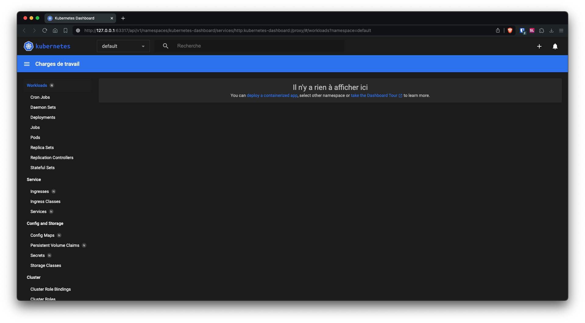

Nous pouvons voir la liste des nodes présents ici.

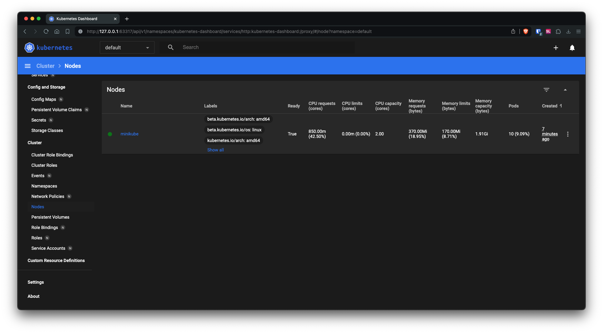

Nous pouvons voir la liste des namespaces présents.

Nous avons donc :

- 1 node: `minikube`
- 5 namespaces

# Objets Kubernetes

La commande `k get nodes` donne le résultat suivant:


Nous voyons donc un seul et unique `node` dans notre cluster. C'est normal, nous n'avons pas encore créé de services ou déployé quelque chose.

La commande `k get namespaces` donne le résultat suivant:


Nous avons donc bel et bien 5 namespaces, comme nous l'avions constaté sur le navigateur.

La commande `k describe ns/default` nous donne le résultat suivant:

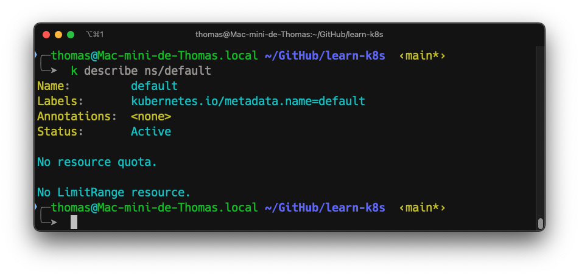

Il n'y a pas de `quota` ni de `LimitRange`. Nous avons cependant le label `kubernetes.io/metadata.name=default`.

Pour obtenir la définition de notre namespace `default` en yaml, nous utilisons la commande suivante: `k get ns/default -o yaml`

Nous obtenons le résultat suivant :

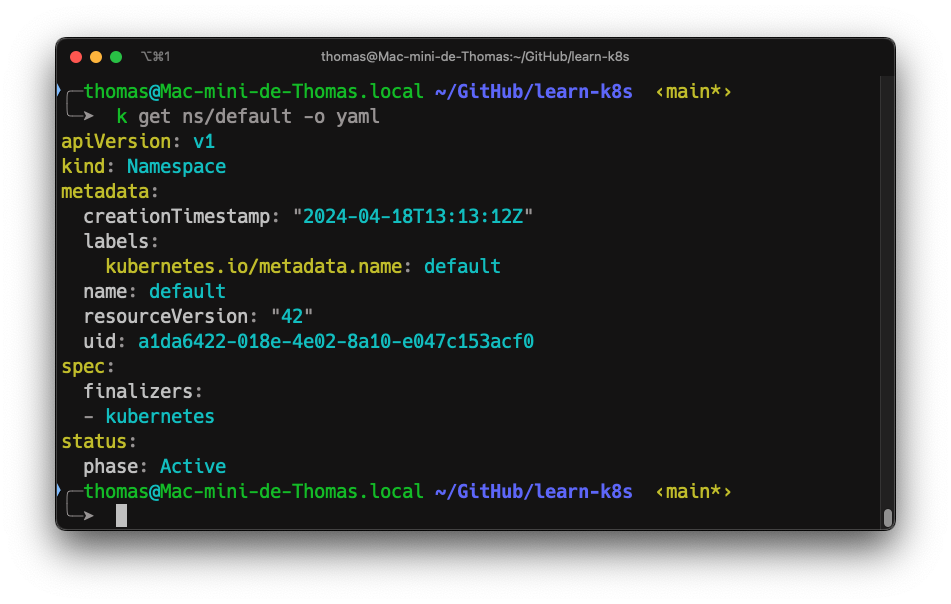

Nous créons ensuite notre namespace `tp2` à l'aide de la commande suivante:

```
╭─thomas@Mac-mini-de-Thomas.local ~/GitHub/learn-k8s  ‹main*›
╰─➤  k create ns tp2
namespace/tp2 created
```

Pour le supprimer, nous utilisons la commande suivante:

```
╭─thomas@Mac-mini-de-Thomas.local ~/GitHub/learn-k8s  ‹main*›
╰─➤  k delete ns tp2
namespace "tp2" deleted
```

# Pod `nginx`

Nous créons notre namespace `tp2` à l'aide de la commande suivante:

```
╭─thomas@Mac-mini-de-Thomas.local ~/GitHub/learn-k8s  ‹main*›
╰─➤  k create ns tp2
namespace/tp2 created
```

Puis, nous créons un fichier `pod.yaml` qui aura le contenu suivant:

```yaml
apiVersion: v1
kind: Pod
metadata:
  name: nginx
  labels:
    app: nginx
spec:
  containers:
  - name: nginx
    image: nginx
    ports:
    - containerPort: 80
```

Etant donné que nous évoluons maintenant exclusivement dans le namespace `tp2`, nous mettons automatiquement toutes nos futures commandes `kubectl` dans ce namespace à l'aide de la commande suivante.

```bash
$ k config set-context --current --namespace=default
```

Nous appliquons maintenant notre `fichier.yaml` à l'aide de la commande `k apply -f pod.yaml`.

Nous obtenons le résultat suivant:

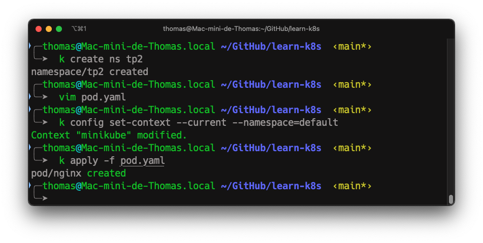

Pour vérifier le bon lancement de notre pod, nous utilisons la commande `k get pods`:


Pour obtenir davantage  d'informations sur nos pods, et en particulier notre pod `nginx`, nous utilisons la commande `k describe pod`:

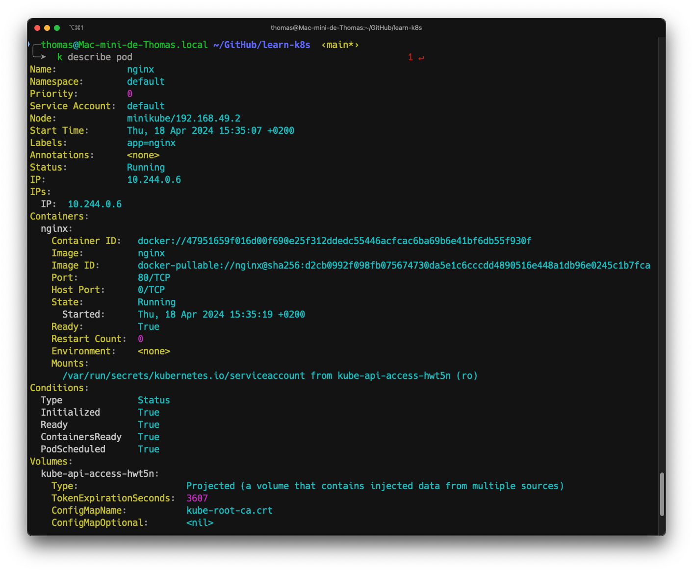

Nous avons donc un pod `nginx` en status `Running` et ayant en ContainerID (pour nginx) `docker://47951659f016d00f690e25f312ddedc55446acfcac6ba69b6e41bf6db55f930f` et l'adresse IP `10.244.0.6`.

Nous pouvons attacher un shell à notre conteneur à l'aide de la commande `k exec pod/nginx -it -- bash`.


Il y a 3 processus `nginx`. Avoir un conteneur minimaliste permet d'avoir des pods moins demandeur en performance.

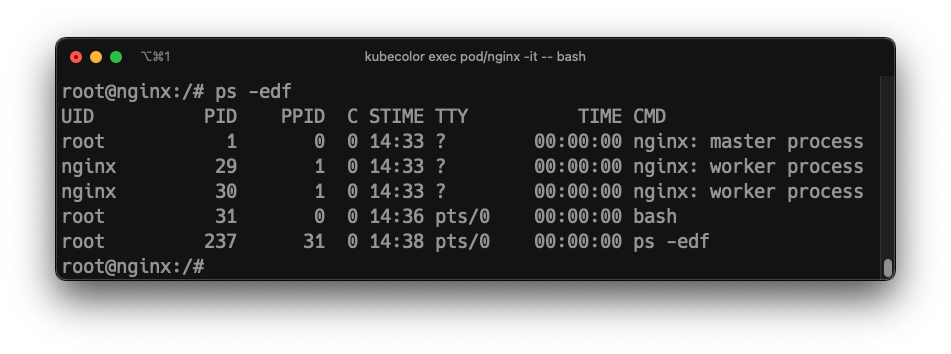

Nous supprimons notre pod créé par notre `fichier.yaml` à l'aide de la commande `k delete -f pod.yaml`

# Déploiement

Nous créons un fichier `deployment.yaml` qui aura le contenu suivant:

```yaml
apiVersion: apps/v1
kind: Deployment
metadata:
  name: nginx-deployment
spec:
  selector:
    matchLabels:
      app: nginx
  replicas: 2
  template:
    metadata:
      labels:
        app: nginx
    spec:
      containers:
      - name: nginx
        image: nginx
        ports:
        - containerPort: 80
        resources:
          limits:
            memory: 512Mi
            cpu: "1"
          requests:
            memory: 256Mi
            cpu: "0.2"
```

Nous appliquons ce déploiement à notre cluster à l'aide de la commande `k apply -f deployment.yaml`. Ce fichier nous indique qu'il y aura 2 pods de créés. Le retour de la commande nous indique le nom de notre déploiement.

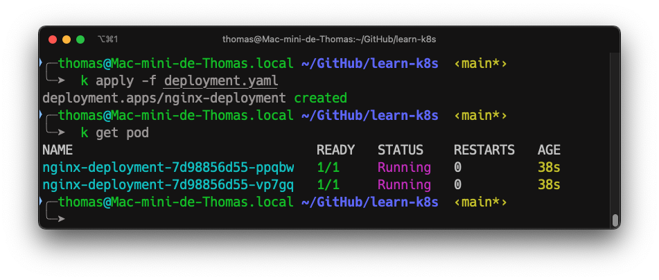

Pour vérifier le status de de notre déploiement, nous obtenons le résultat suivant:

```
╭─thomas@Mac-mini-de-Thomas.local ~/GitHub/learn-k8s  ‹main*›
╰─➤  k rollout status deployment.apps/nginx-deployment
deployment "nginx-deployment" successfully rolled out
```

L'état de notre déploiement est `successfully rolled out`.

Nous obtenons la liste de replicaset à l'aide de la commande `k get rs`. Nous constatons que nous avons un replicaset nommé `nginx-deployment-7d98856d55`.

Pour avoir davantage d'informations sur notre déploiement, nous utilisons la commande `k describe deployment` et obtenons le résultat suivant :


Nous modifions donc notre fichier `deployment.yaml` pour mettre le nombre de replicas à 10.

```yaml
apiVersion: apps/v1
kind: Deployment
metadata:
  name: nginx-deployment
spec:
  selector:
    matchLabels:
      app: nginx
  replicas: 10
  template:
    metadata:
      labels:
        app: nginx
    spec:
      containers:
      - name: nginx
        image: nginx
        ports:
        - containerPort: 80
        resources:
          limits:
            memory: 512Mi
            cpu: "1"
          requests:
            memory: 256Mi
            cpu: "0.2"
```

Nous obtenons la liste des pods déployés à l'aide de la commande `k get pod`, qui nous donne le résultat suivant:

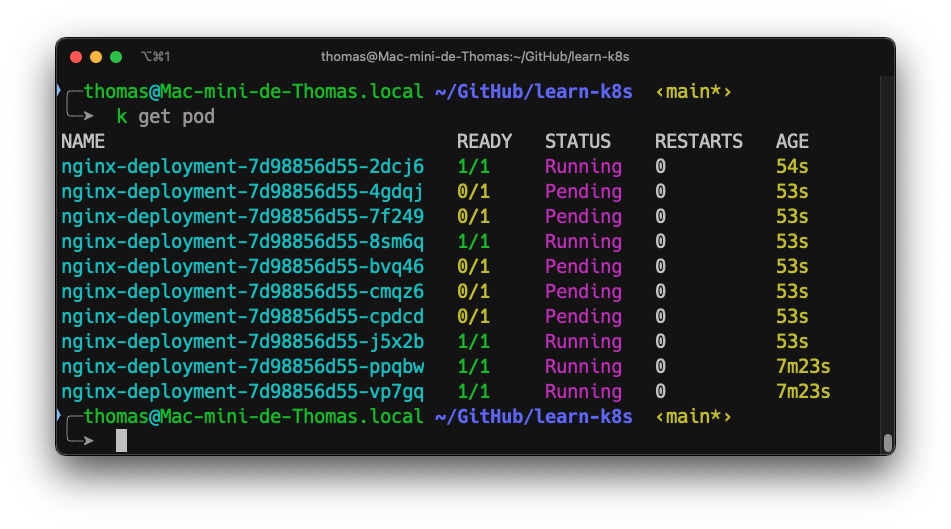

En consultant le dashboard, nous constatons que seuls 5 des 10 pods ont été démarrés.

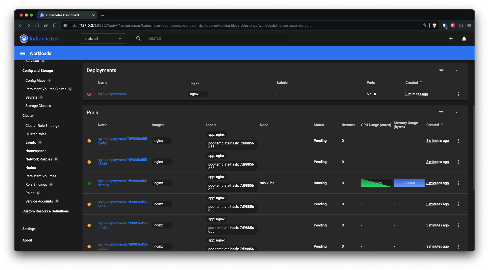

Les autres n'ont pas été déployés car le CPU n'est pas suffisant.

Pour supprimer notre déploiement, nous utilisons la commande `k delete -f deployment.yaml`.

# Créer un service interne

Nous créons un fichier `service.yaml` qui aura le contenu suivant:

```yaml
apiVersion: v1
kind: Service
metadata:
  name: nginx
spec:
  selector:
    app: nginx
  ports:
    - protocol: TCP
      port: 80
      targetPort: 80
```

Nous appliquons notre service par la commande `k apply -f service.yaml`.

```
╭─thomas@Mac-mini-de-Thomas.local ~/GitHub/learn-k8s  ‹main*›
╰─➤  k apply -f service.yaml
service/nginx created
```

Nous pouvons lister nos différents services à l'aide de la commande `k get svc`, qui nous donne le résultat suivant:

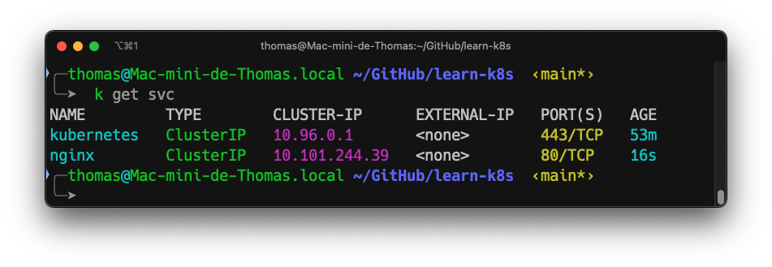

Pour obtenir davantage d'informations sur notre service, nous utilisons la commande `k describe service/nginx`.

Nous pouvons donc constater que l'adresse IP est `10.101.244.39`.

Nous configurons du port forwarding entre `8080` et `80` à l'aide de la commande `k port-forward svc/nginx 8080:80`.


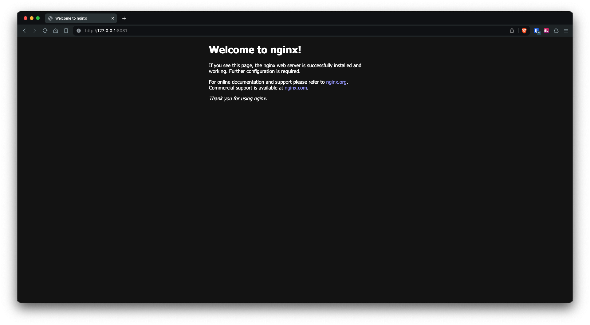

# Loadbalancer

Nous exécutons la commande `minikube tunnel` dans un terminal séparé.

Nous créons un service de loadbalancing avec le contenu suivant:

`lb.yaml`:

```yaml
apiVersion: v1
kind: Service
metadata:
  name: nginx
spec:
  type: LoadBalancer
  selector:
		app: nginx
  ports:
    - protocol: TCP
      port: 8081
      targetPort: 80
```

**Note:** Nous utilisons le port 8081 car le 8080 est déjà utilisé par un autre service externe à ce TP.

Nous exécutons ensuite la commande `k get svc` et récupérons l'adresse IP de notre LB.


Nous voyons donc notre adresse IP `127.0.0.1:8081` en External IP.

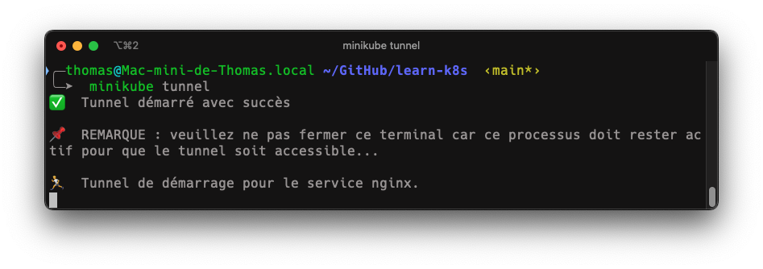

Puis, nous exécutons un `curl http://127.0.0.1:8081` et obtenons le résultat suivant : 


### Ingress

Nous ajoutons le support pour ingress avec la commande suivante:

```shell
$ minikube addons enable ingress
```

Puis, nous pouvons constater que notre namespace est bien créé avec nos différents objets grâce à la commande suivante:

```shell
$ k get all -n ingress-nginx
```

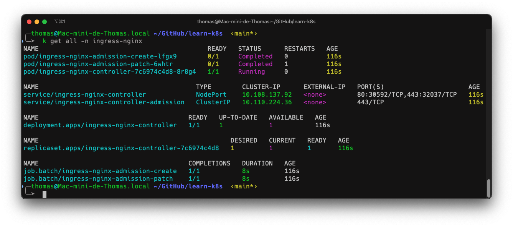

Puis, nous créons un fichier `ingress.yaml` ayant le contenu suivant:

```yaml
apiVersion: networking.k8s.io/v1
kind: Ingress
metadata:
  name: nginx
  annotations:
    nginx.ingress.kubernetes.io/rewrite-target: /$1
spec:
  rules:
    - host: nginx.info
      http: 
        paths:
          - path: /
            pathType: Prefix
            backend:
              service:
                name: nginx
                port:
                  number: 8081
```

Puis, après avoir `k apply -f ingress.yaml`, nous pouvons vérifier notre ingress s'est bien lancée:


Nous ajoutons donc une entrée dans notre `/etc/hosts` :

```
192.168.49.2            nginx.info
```

Après de multiples tentatives, nous ne parvenons pas à obtenir un `curl` satisfaisant (aucune réponse du serveur) sur l'url `http://nginx.info`. Il semblerait que le problème vienne de `minikube`, qui n'ajoute pas la route sur la machine hôte.

## Ressources Quota

Nous ajoutons un fichier `resource_quota.yaml` ayant le contenu suivant

```yaml
apiVersion: v1
kind: ResourceQuota
metadata:
  name: my-resource-quota
spec:
  hard:
    limits.memory: "2Gi"
    limits.cpu: "2"
```

Nous l'appliquons avec `k apply -f resource_quota.yaml`.

Puis nous modifions notre `deployment.yaml` pour avoir le contenu suivant:

```yaml
apiVersion: apps/v1
kind: Deployment
metadata:
  name: nginx-deployment
spec:
  selector:
    matchLabels:
      app: nginx
  replicas: 2
  template:
    metadata:
      labels:
        app: nginx
    spec:
      containers:
      - name: nginx
        image: nginx
        ports:
        - containerPort: 80
        resources:
          limits:
            memory: 512Mi
            cpu: "0.75"
          requests:
            memory: 256Mi
            cpu: "0.2"
```

Que nous applyons avec `k apply -f deployment.yaml`.

Nous pouvons constater que notre resource quota s'est bien déployée:

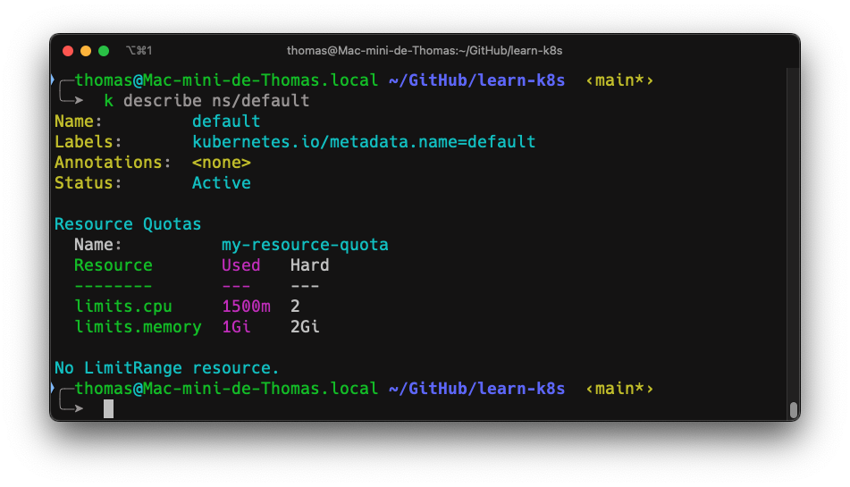

Puis, nous appliquons notre LimitRange qui a le contenu suivant:

```yaml
apiVersion: v1
kind: LimitRange
metadata:
  name: cpu-resource-constraint
spec:
  limits:
    - default:
        cpu: 500m
      defaultRequest:
        cpu: 500m
      max:
        cpu: 1
      min:
        cpu: 100m
      type: Container
```

Puis `k apply -f limit_range.yaml`.

Ensuite, nous récupérons les informations détaillées du namespace avec `k describe ns/tp2`.

[BrokenFileError: image-20240517061500789: file not found]

Nous pouvons bien voir la limit range bien en place.

Nous créons maintenant un Pod sans limite de ressources dans `pod_new.yaml`:

```yaml
apiVersion: v1
kind: Pod
metadata:
  name: nginx
  labels:
    app: nginx

spec:
  containers:
  - name: nginx
    image: nginx
    ports:
    - containerPort: 80
```

Nous tapons ensuite la commande `k describe pod/nginx` et pouvons constater ceci au niveau des limites en CPU.

[BrokenFileError: image-20240517063000456: file not found]

Nous finissons par supprimer le pod et le limit range avec les commandes suivantes:

```shell
$ k delete pod/nginx

$ k delete l
```

### HPA

Nous créons un nouveau fichier `hpadeployment.yaml` ayant le contenu suivant:

```yaml
apiVersion: apps/v1
kind: Deployment
metadata:
  name: php-apache
spec:
  selector:
    matchLabels:
      run: php-apache
  template:
    metadata:
      labels:
        run: php-apache
    spec:
      containers:
        - name: php-apache
      image: registry.k8s.io/hpa-example
      ports:
        - containerPort: 80
      resources:
        limits:
          cpu: 500m
        requests:
          cpu: 200m
      apiVersion: v1
      kind: Service
      metadata:
        name: php-apache
        labels:
          run: php-apache
      spec:
        ports:
          - port: 80
        selector:
          run: php-apache
```

Puis, nous faisons `k apply -f hpadeployment.yaml`.

Ensuite, nous créons notre autoscale avec la commande suivante:

```shell
$ k autoscale hpadeployment php-apache --cpu-percent=50 --min=1 --max=10
```

Puis, nous augmentons la charge dans un autre terminal avec la commande suivante:

```shell
$ k run -i --tty load-generator --rm --image=busybox:1.28 --restart=Never -- /bin/sh -c "while sleep0.01; do wget -q -O - http://php-apache; donek run -i --tty load-generator --rm --image=busybox:1.28 --restart=Never -- /bin/sh -c "while sleep0.01; do wget -q -O - http://php-apache; done""
```

Pour suivre l'hpa nous utilisons `k get hpa php-apache –watch`.

[BrokenFileError: image-20240517064500123: file not found]

Nous pouvons en effet constater que, au bout de quelques instants, nous avons une augmentation du nombre de replicas créés.

[BrokenFileError: image-20240517070000890: file not found]

Nous arrêtons de genérer la charge en killant notre autre terminal, et pouvons en effet constater que le nombre de réplicas a bien réduit.

[BrokenFileError: image-20240517073000567: file not found]

## CronJob

Nous créons un fichier `cron.yaml` ayant le contenu suivant:

```yaml
apiVersion: batch/v1
kind: CronJob
metadata:
  name: hello

spec:
  schedule: "* * * * *"
  jobTemplate:
    spec:
      template:
        spec:
          containers:
            - name: hello
              image: busybox
              imagePullPolicy: IfNotPresent
              command:
                - /bin/sh
                - -c
                - date; echo Hello from the Kubernetes cluster
          restartPolicy: OnFailure
```

Nous pouvons voir la liste des cronjobs à l'aide de la commande `k get cj`, ainsi que la liste des jobs avec `k get jobs`.

[BrokenFileError: image-20240517080000134: file not found]

Nous regardons les logs de notre CronJob à  l'aide la commande `k logs cronjobs.batch/hello` et observons le résultat suivant:

[BrokenFileError: image-20240517081500912: file not found]

## Storage

Nous créons un volume d'1Go persistant avec le fichier `volume.yaml` ayant le contenu suivant:

```yaml
kind: PersistentVolumeClaim
apiVersion: v1
metadata:
  name: my-pvc-claim

spec:
  accessModes:
    - ReadWriteOnce
  resources:
    requests:
      storage: 1Gi
```

Nous exécutons ensuite les commandes `k get pvc` et `k get pv`  et obtenons le résultat suivant:

[BrokenFileError: image-20240517082500789: file not found]

Nous créons maintenant un nouveau Pod, dans un fichier `storage_pod.yaml`  ayant le contenu suivant:

```yaml
kind: Pod
apiVersion: v1
metadata:
  name: task-my-pod
spec:
  volumes:
    - name: my-pv-claim
      persistentVolumeClaim:
        claimName: my-pv-claim
  containers:
    - name: nginx
      image: nginx
      ports:
        - containerPort: 80
      volumeMounts:
        - mountPath: "/usr/share/nginx/html"
          name: my-pv-claim
```

Nous appliquons le pod avec un `k apply -f storage_pod.yaml` puis nous rentrons dans le pod avec la commande suivante:

```shell
$ k exec pod/task-pv-pod -it -- bash
```

Nous nous plaçons dans `usr/share/nginx/html`.

Le retour de notre `curl http://127.0.0.1/test.html` est le suivant:

[BrokenFileError: image-20240517082751023: file not found]

Puis, nous supprimons notre pod avec `k delete pod task-pv-pod`, nous le recréons avec `k apply -f storage_pod.yaml`, nous replaçons dans le conteneur et re-effectuons notre `curl`.

[BrokenFileError: image-2024051708371351: file not found]

## Control Plane

- Question sur les composants du control plane

  - Nous obtenons les composants à l'aide de la commande suivante:

    `kubectl get pods -n kube-system`. Les composants visibles sont déployés comme des pods.


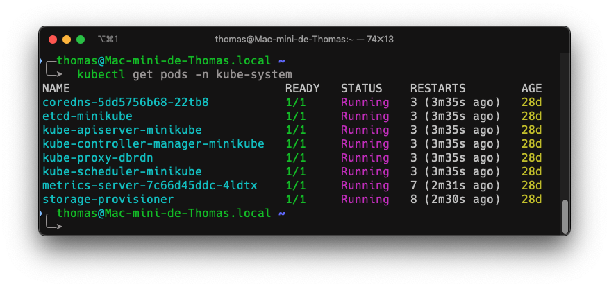

Nous créons un serviceaccount à l'aide de la commande `kubectl create serviceaccount my-service-account -n tp2`.

Nous créons un `role.yaml` ayant le contenu suivant:

```yaml
apiVersion: rbac.authorization.k8s.io/v1
kind: Role
metadata:
  name: my-role
  namespace: tp2
rules:
- apiGroups: [""]
  resources: ["pods"]
  verbs: ["get", "list", "watch"]
- apiGroups: [""]
  resources: ["services"]
  verbs: ["get", "list", "create", "update"]
- apiGroups: [""]
  resources: ["deployments"]
  verbs: ["get", "list", "create", "update"]
- apiGroups: [""]
  resources: ["secrets"]
  verbs: ["get", "list"]
```

Nous l'appliquons à l'aide de la commande `kubectl apply -f role.yaml`.

Puis, nous créons un `role_binding.yaml` ayant le contenu suivant:

```yaml
apiVersion: rbac.authorization.k8s.io/v1
kind: RoleBinding
metadata:
  name: my-role-binding
  namespace: tp2
subjects:
- kind: ServiceAccount
  name: my-service-account
  namespace: tp2 # default was previously here
roleRef:
  kind: Role
  name: my-role
  apiGroup: rbac.authorization.k8s.io
```

Nous appliquons ce role binding à l'aide de la commande `kubectl apply -f role-binding.yaml`.

### Questions

- **Vérification des droits du ServiceAccount :**

  ```shell
  $ kubectl auth can-i get pods --as=system:serviceaccount:tp2:my-service-account -n tp2
  ```

  Nous pouvons constater que tout est configuré correctement.


- Nous lançons la commande suivante:

  ```shell
  $ kubectl auth can-i get pods --as=system:serviceaccount:tp2:my-service-account -n default
  ```

  Nous avons `no` comme réponse, ce qui est parfaitement logique: Le RoleBinding n'accorde les droits que dans le namespace `tp2`, et non dans le `default`.

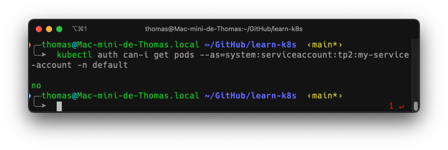

- Nous lançons la commande suivante:

  ```shell
  $ kubectl auth can-i get svc --as=system:serviceaccount:tp2:my-service-account -n tp2
  ```

  Nous avons `yes` en réponse, car le serviceAccount a bien les droits pour les services dans le namespace `tp2`.


- Nous lançons la commande suivante:

  ```shell
  $ kubectl auth can-i get secrets --as=system:serviceaccount:tp2:my-service-account -n default
  ```

  Nous avons bien `no` comme réponse, car le ServiceAccount n'a pas de droits suir les secrets dans le namespace `default`, comme mentionné précédemment.


# Projet

Ce projet a été effectué par  `Vincent LAGOGUÉ`, `Tom THIOULOUSE`, `Alexis PLESSIAS`, `David TEJEDA` et `Thomas PEUGNET`.

## Prérequis

Nous commençons par récupérer l'ensemble des informations nécessaires à notre connexion aws. Nous installons `aws cli` sur notre machine cliente, et ajoutons notre fichier `.aws/credentials`.

La commande `aws sts get-caller-identity` retourne bel et bien un résultat cohérent.

Nous créons un fichier nommé `cluster-config.yaml` ayant le contenu suivant:

```yaml
apiVersion: eksctl.io/v1alpha5
kind: ClusterConfig

metadata:
  name: tp3-cluster
  region: us-east-1

nodeGroups:
  - name: ng
    instanceType: t3a.medium
    desiredCapacity: 1
    volumeSize: 80
    iam:
      instanceRoleARN: arn:aws:iam::<aws_account_id>:role/LabRole

iam:
  serviceRoleARN: arn:aws:iam::<aws_account_id>:role/LabRole
```

Puis, nous utilisons cette commande `eskctl` :

```shell
$ eksctl create cluster -f cluster-config.yaml
```

Et finalement obtenons le résultat suivant:

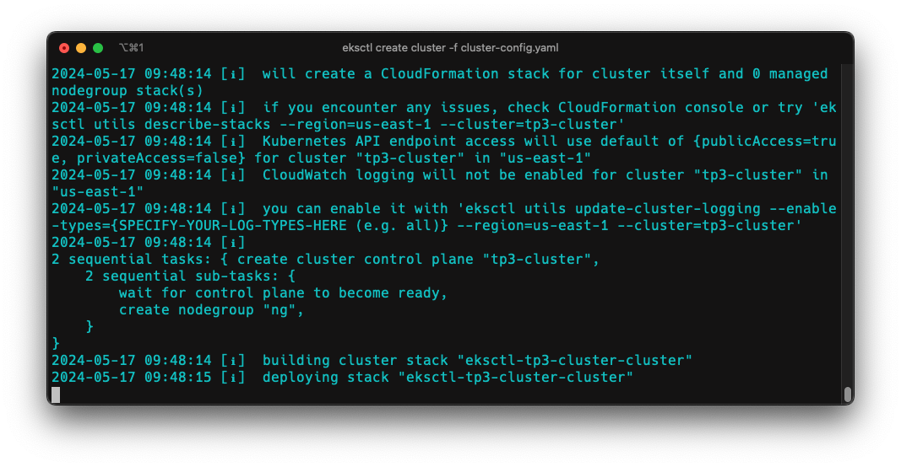

Nous ajoutons le repository nextcloud à l'aide de la commande `helm repo add nextcloud https://nextcloud.github.io/helm`.

Puis, nous créons un namespace pour `Nextcloud` avec `kubectl create namespace nextcloud`.

Nous faisons les modifications suivantes sur notre fichier de configuraiton `values.yaml`:

```yaml
redis:
  enabled: true
  master:
   persistence:
    enabled: false
  replica:
   persistence:
    enabled: false
    
externalDatabase:
  enabled: false
internalDatabase:
  enabled: true
  name: nextcloud
```

Enfin, nous effectuons l'installations à l'aide de la commande suivante:

```shell
$ helm install nextcloud nextcloud/nextcloud -f values.yaml -n nextcloud
```

Nous récupérons le mot de passe de connexion du compte via cette commande : 

```shell
$ kubectl get secret --namespace nextcloud nextcloud -o jsonpath="{.data.nextcloud-password}" | base64 --decode # nous retourne le pwd par défaut: changeme
```

Nous vérifions que nos pods sont bien lancés:


Puis, nous effectuons un port forwarding vers le port 8080 à l'aide de la commande suivante:

```shell
$ k port-forward svc/nextcloud 8081:8080 -n nextcloud
```

Nous nous connectons ensuite sur `http://localhost:8081` et pouvons constater que nous tombons sur l'interface de connexion de Nextcloud.


Pour nous connecter, nous utilisons donc les identifiants `admin:changeme`, et obtenons le résultat suivant.


Nous finissons par désinstaller notre release Helm:

```shell
$ helm uninstall nextcloud -n nextcloud
> release "nextcloud" uninstalled
```

## Flux

Nous installons Flux à l'aide de la commande `brew install flux`.

Puis, après avoir exporté notre token GitHub, nous exécutons la commande suivante:

```shell
$ flux bootstrap github --owner=Hydrocarbure-H --repository=learn-k8s --path=/tp3 --personal --private=false
```

**Note**: Si le lab a été restart, ne pas oublier de mettre à jour les credentials AWS. Ils changent à chaque restart du lab.

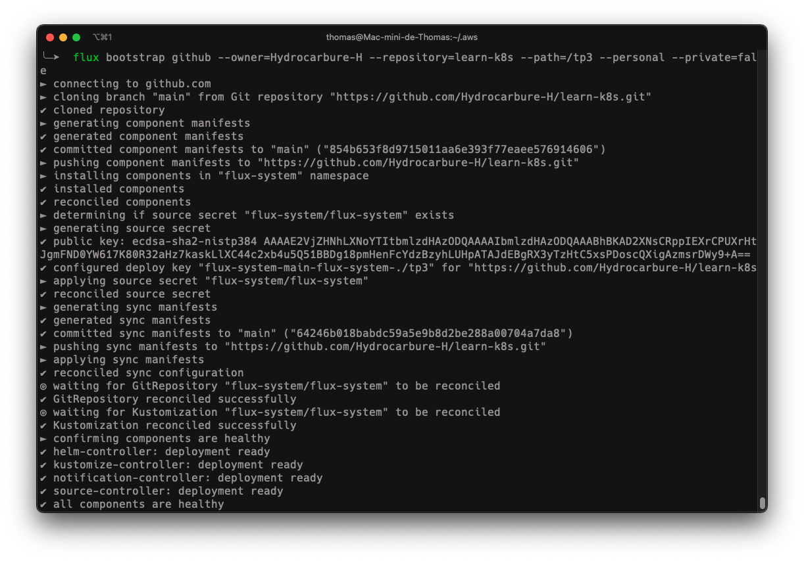

Nous exécutons `flux check` pour vérifier que tout est bon.

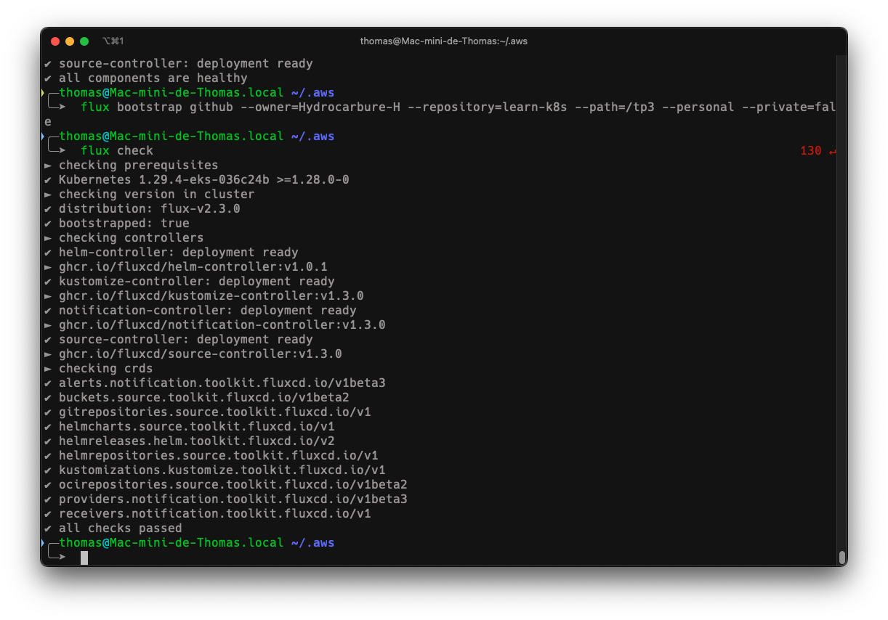

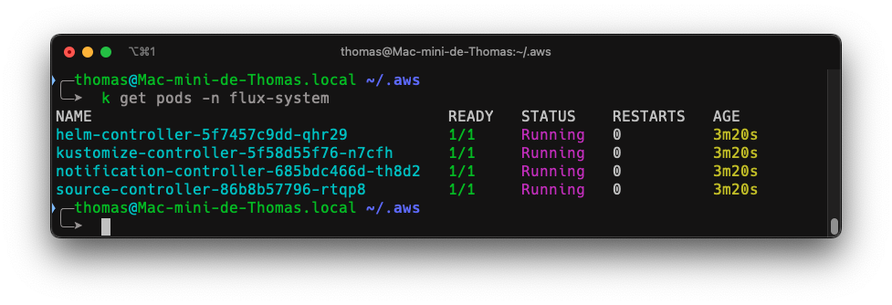

Puis, nous effectuons les 2 commandes suivantes:

```shell
$ cd tp03 # pwd = GitHub/learn-k8s/tp03

$ flux create source helm ww-gitops \                                        1 ↵
--url=oci://ghcr.io/weaveworks/charts \
--export > weave-gitops-source.yaml

$ flux create helmrelease ww-gitops \
--source=HelmRepository/ww-gitops \
--chart=weave-gitops \
--values=weave-gitops-values.yaml \
--export > weave-gitops-helmrelease.yaml
```

Nous appliquons maintenant nos fichiers avec la commande suivante:

```shell
$  k apply -f weave-gitops-source.yaml

$ k apply -f weave-gitops-helmrelease.yaml
```

Puis, avec `k get pods -n flux-system`, nous pouvons apercevoir le résultat cohérent suivant:


Nous faisons ensuite un port forwarding `9001:9001` avec la commande :

```shell
$ k port-forward pod/ww-gitops-weave-gitops-6fc66d8597-pjdrr 9001:9001 -n flux-system
```

Nous pouvons maintenant nous connecter sur `http://localhost:9001`.


Nous nous connectons avec `admin:admin`.

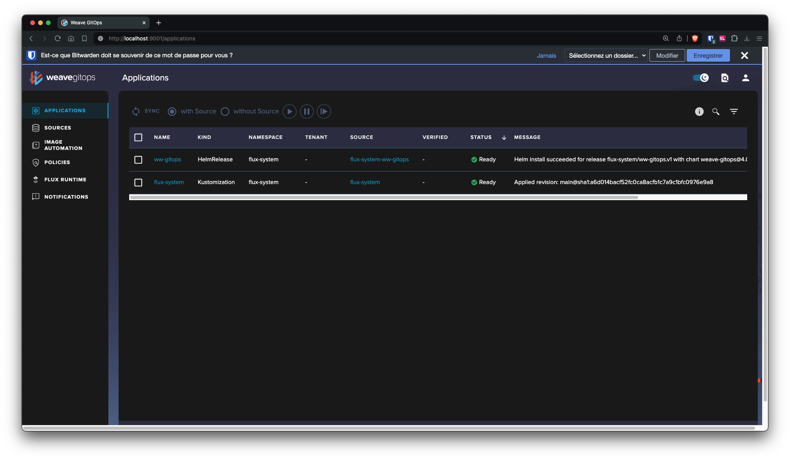
