# Supervision des réseaux et QoS

# Défis

- **Gestion des configurations**
  - **Objectif :** Maintien de l'intégrité des configurations réseau
  - **Outils :** Systèmes de gestion de configuration (`Configuration Management Systems`)
  - **Actions :** Suivi des modifications, sauvegarde des configurations, restauration
- **Gestion des performances**
  - **Objectif :** Optimisation de la vitesse et de l'efficacité du réseau
  - **Métriques :** Latence, débit, utilisation de la bande passante
  - **Outils :** Analyseurs de protocoles, logiciels de surveillance de performance
- **Gestion de la compatibilité**
  - **Objectif :** Assurer l'interopérabilité des dispositifs et applications
  - **Défis :** Diversité des appareils, standards variés
  - **Stratégies :** Tests de compatibilité, mise à jour régulière des systèmes
- **Gestion de la sécurité**
  - **Objectif :** Protection des données et de l'infrastructure réseau
  - **Composants :** Pare-feu, systèmes de détection d'intrusion (`Intrusion Detection Systems`)
  - **Pratiques :** Authentification forte, chiffrement, mise à jour de sécurité
- **Gestion des pannes**
  - **Objectif :** Réduction du temps d'arrêt, reprise rapide après une panne
  - **Approches :** Redondance, monitoring continu, plans de reprise d'activité
  - **Outils :** Logiciels de diagnostic, tests de stress sur le réseau

# SNMP

## Introduction

> *Le `Simple Network Management Protocol` (SNMP) est un protocole standard pour la supervision et la gestion de dispositifs sur des réseaux IP. - ChatGPT*

- **Fonctionnement de SNMP**
  - **Communication :** Utilise UDP pour transmettre des données, port 161
  - **Composants :**
    - **Agent SNMP :** Résident sur les dispositifs à surveiller
    - **Gestionnaire SNMP :** Collecte les informations des agents

- **Versions de SNMP**
  - **SNMPv1 :** Version initiale, sécurité limitée
  - **SNMPv2 :** Améliorations des performances, quelques améliorations de sécurité
  - **SNMPv3 :** Sécurité renforcée, authentification et chiffrement

- **Opérations SNMP**
  - **GET :** Demande d'informations de l'agent
  - **SET :** Modification de la configuration par le gestionnaire
  - **TRAP :** Notification d'événements non sollicitée par l'agent

- **MIB (`Management Information Base`)**
  - **Définition :** Base de données de gestion, définit les objets gérables
  - **Structure :** Hiérarchique, avec des identifiants uniques (OID)

- **Utilisation**
  - **Surveillance :** Suivi de l'état des dispositifs, performance, erreurs
  - **Configuration :** Gestion à distance des paramètres réseau

- **Sécurité et SNMP**
  - **Enjeux :** Vulnérabilités dans les versions antérieures (SNMPv1 et SNMPv2)
  - **SNMPv3 :** Meilleure option pour une gestion sécurisée du réseau

## Communauté

> *Une "communauté SNMP" est un concept clé dans la configuration et la gestion de la sécurité du protocole SNMP, surtout dans les versions antérieures (SNMPv1 et SNMPv2c). - ChatGPT*

#### Définition et fonctionnement

- **Communauté SNMP :** Groupe de dispositifs et de gestionnaires SNMP partageant les mêmes paramètres de sécurité

- **Fonctionnement**
  - **Identifiant :** Chaque communauté est identifiée par un nom de communauté (string)
  - **Contrôle d'accès :** Le nom de communauté sert de mot de passe simple pour l'accès
- **Rôles**
  - **Lecture (`Read-Only`) :** Accès en lecture seule aux MIB des dispositifs
  - **Écriture (`Read-Write`) :** Permet modifications des configurations via SNMP
- **Sécurité**
  - **Faible sécurité :** Les noms de communauté sont transmis en clair
  - **Risque :** Interception et utilisation non autorisée
- **Versions de SNMP**
  - **SNMPv1 et SNMPv2c :** Utilisent largement les communautés
  - **SNMPv3 :** Introduit des mécanismes de sécurité améliorés, remplaçant les communautés par une authentification et un chiffrement plus robustes

## Echange de messages

1. `get-request`
   - **Fonction :** Demande d'une information d'administration spécifique.
   - **Usage :** Le gestionnaire SNMP (`Manager`) envoie cette requête à l'agent SNMP sur un dispositif pour obtenir la valeur d'un objet spécifique de la MIB.

2. `get-next-request`
   - **Fonction :** Demande de l'information suivante dans la MIB.
   - **Usage :** Utilisé pour parcourir séquentiellement les objets dans les tableaux de la MIB.

3. `get-response`
   - **Fonction :** Réponse de l'agent aux requêtes `get-request` ou `get-next-request`.
   - **Usage :** L'agent SNMP envoie ce message en réponse aux requêtes, fournissant les valeurs demandées.

4. `set-request`
   - **Fonction :** Permet de modifier la valeur d'un objet administré dans la MIB.
   - **Usage :** Utilisé par le gestionnaire SNMP pour changer la configuration ou le comportement d'un dispositif réseau.

5. `trap`
   - **Fonction :** Notification d'événements par l'agent.
   - **Usage :** L'agent SNMP envoie de manière proactive un message `trap` pour informer le gestionnaire d'un événement ou d'une modification d'état important(e).

Dans un scénario SNMP typique, le **gestionnaire SNMP** (Manager) initie les requêtes (`get-request`, `get-next-request`, `set-request`) vers l'**agent SNMP** sur un dispositif. L'agent répond avec un message `get-response` pour les requêtes reçues ou envoie un message `trap` en cas d'événements particuliers. Cela permet une gestion et une surveillance efficaces des dispositifs de réseau.

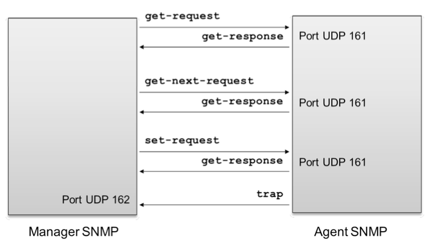

## Versions


- **SNMPv1 :** Basique, axé sur la fonctionnalité avec une sécurité minimale.
- **SNMPv2 :** Améliore les capacités sans aborder les lacunes de sécurité de SNMPv1.
- **SNMPv3 :** Révision majeure axée sur la sécurité tout en conservant les fonctionnalités existantes.

## PDUs

| Type de PDU          | Description                                                  | Versions SNMP concernées |
| -------------------- | ------------------------------------------------------------ | ------------------------ |
| `GetRequest-PDU`     | Requête pour obtenir la valeur d'une ou plusieurs variables spécifiées dans la MIB. | SNMPv1, SNMPv2, SNMPv3   |
| `GetNextRequest-PDU` | Requête pour découvrir les valeurs de la prochaine variable dans la MIB, permettant le parcours MIB. | SNMPv1, SNMPv2, SNMPv3   |
| `GetBulkRequest-PDU` | Requête pour récupérer de grandes quantités de données, en demandant plusieurs variables à la fois. | SNMPv2, SNMPv3           |
| `GetResponse-PDU`    | Réponse de l'agent avec les valeurs demandées ou une indication d'erreur pour les requêtes reçues. | SNMPv1, SNMPv2, SNMPv3   |
| `SetRequest-PDU`     | Requête pour modifier la valeur d'une ou plusieurs variables dans la MIB. | SNMPv1, SNMPv2, SNMPv3   |
| `Report-PDU`         | Utilisé par l'agent ou le gestionnaire pour signaler des erreurs dans le traitement des PDUs SNMPv3. | SNMPv3                   |
| `SNMPv2-Trap-PDU`    | Notification d'événement non sollicitée par l'agent pour signaler des conditions exceptionnelles. | SNMPv2, SNMPv3           |

## Trapping vs Polling

> *Le "trapping" et le "polling" sont deux mécanismes de surveillance dans SNMP qui diffèrent par leur approche de la communication entre les dispositifs de réseau et le gestionnaire SNMP. - ChatGPT*

### Trapping SNMP

- **Initiative :** Agent vers Gestionnaire
- **Mécanisme :** Asynchrone
- **Fonction :** Notification automatique d'événements spécifiques
- **Utilisation :** Idéal pour les alertes immédiates
- **Charge réseau :** Réduite, envoie seulement lors d'événements
- **Réactivité :** Élevée, car instantanée

### Polling SNMP

- **Initiative :** Gestionnaire vers Agent
- **Mécanisme :** Synchrone
- **Fonction :** Interrogation périodique de l'état des variables de la MIB
- **Utilisation :** Convient pour la surveillance continue
- **Charge réseau :** Potentiellement élevée, due à l'interrogation fréquente
- **Réactivité :** Variable, dépend de la fréquence du polling

### Différences Clés

- **Proactivité :** Le trapping est proactif, le polling est réactif.
- **Efficacité :** Le trapping est généralement plus efficace en termes de bande passante.
- **Fiabilité :** Le polling est souvent considéré comme plus fiable car il ne dépend pas de l'initiative de l'agent pour communiquer des problèmes.
- **Complexité :** Le trapping peut être plus complexe à configurer correctement pour s'assurer que tous les événements pertinents sont capturés.
- **Temps réel :** Le trapping fournit des informations en temps réel, tandis que le polling pourrait manquer des événements entre les intervalles d'interrogation.

# MIBs

> *Les MIBs (`Management Information Bases`) sont essentielles pour le protocole SNMP, car elles définissent les objets pouvant être gérés sur le réseau. - ChatGPT*

## Introduction

- **Structure :** Ensemble structuré d'informations
- **Format :** Standardisé pour la gestion de réseau
- **Hiérarchie :** Organisées de manière arborescente


### Composants

- **Objets :** Variables représentant l'état d'un dispositif
- **Identifiants :** Unique pour chaque objet (`Object Identifiers` - OIDs)

### Utilisation

- **Surveillance :** Suivi des performances et de la santé du réseau
- **Configuration :** Modification des paramètres réseau
- **Diagnostic :** Identification des problèmes

- **RFC :** Documents décrivant les MIBs standardisées

### Versions SNMP

- **SNMPv1/v2 :** Utilisation de MIBs avec une structure similaire
- **SNMPv3 :** Ajoute des capacités de sécurité mais n'altère pas fondamentalement la structure des MIBs

Les MIBs sont cruciales pour que les gestionnaires SNMP interagissent efficacement avec les dispositifs de réseau, permettant une gestion centralisée et rationalisée des ressources réseau.

## OIDs

> *Les `Object Identifiers` (OIDs) sont des identifiants uniques utilisés dans les MIBs pour référencer spécifiquement chaque objet gérable dans un dispositif de réseau. - ChatGPT*

**Relation MIB - OID :** Une MIB est un document ou un fichier qui comprend de nombreux OIDs.

### Caractéristiques

- **Globalement Uniques :** Structure hiérarchique garantit l'unicité mondiale (variant pour chaque constructeur sur une partie définie).
- **Organisation :** Représentés comme une suite de nombres séparés par des points.

### Fonction

- **Référencement :** Permettent de pointer vers une information spécifique dans la MIB.
- **Interactions SNMP :** Utilisés pour les requêtes SNMP `Get`, `Set`, `Trap`.

### Structure

- **Racine :** Commence toujours par le nœud de la racine (1 pour ISO, 3 pour OID de jointure).
- **Niveaux :** Représentent des organisations, des standards, et des sous-éléments.
- **Extensibilité :** Les fabricants peuvent définir des OIDs spécifiques pour leurs produits.

#### Racine des 4 principaux constructeurs

| Fabricant | OID Racine du Fabricant | Description                                                  |
| --------- | ----------------------- | ------------------------------------------------------------ |
| Cisco     | 1.3.6.1.4.1.9           | OID racine pour les produits Cisco. Utilisé pour identifier les équipements Cisco et leurs spécificités dans la MIB. |
| Juniper   | 1.3.6.1.4.1.2636        | OID racine pour les produits Juniper.                        |
| Huawei    | 1.3.6.1.4.1.2011        | OID racine pour les produits Huawei.                         |
| Arista    | 1.3.6.1.4.1.30065       | OID racine pour les produits Arista.                         |

#### Utilisation de l'OID Root ou non ?

Certaines informations sont accessibles sur tous les équipements avec un OID identique, peu importe le constructeur. C'est le cas, par exemple, de `sysName`.

Cependant, pour certaines fonctions plus spécifiques aux constructeurs, on utilisera une OID racine avant de placer l'OID indiquée dans la MIB du constructeur.

Pour cela, vous utiliseriez un OID qui commence par l'OID racine de Cisco (1.3.6.1.4.1.9), suivi par la séquence spécifique pour l'utilisation de la CPU. Un OID typique pour cela pourrait ressembler à `1.3.6.1.4.1.9.x.x.x`, où "x.x.x" représente la séquence spécifique pour l'objet CPU dans l'arborescence MIB de Cisco.

### Exemples

| OID               | Nom d'objet MIB | Description                                               | Exemple de réponse       |
| ----------------- | --------------- | --------------------------------------------------------- | ------------------------ |
| 1.3.6.1.2.1.1.1.0 | `sysDescr`      | Description textuelle du dispositif.                      | "Cisco Router, IOS 15.1" |
| 1.3.6.1.2.1.1.3.0 | `sysUpTime`     | Temps écoulé depuis le dernier redémarrage du dispositif. | "120:00:00.00"           |
| 1.3.6.1.2.1.1.5.0 | `sysName`       | Nom de l'hôte du dispositif.                              | "router-office-001"      |

Ces OIDs permettent aux gestionnaires SNMP de collecter des informations et de gérer les dispositifs de réseau de manière standardisée.


## SMI

> *Le SMI (`Structure of Management Information`) est un composant clé dans SNMP, fournissant un cadre pour définir les données de gestion de manière standardisée. Il spécifie la syntaxe et la structure des données de gestion contenues dans les MIBs (Management Information Bases). Le SMI détermine comment les objets sont définis, formatés et organisés dans les MIBs, y compris les types de données, les unités de mesure, et la hiérarchie des informations. - ChatGPT*

### Types de réponses 

1. **Objets Primitifs** : Ce sont les types de données de base comme INTEGER, OCTET STRING, et OBJECT IDENTIFIER.
2. **Objets Construits** : Ces types incluent des structures plus complexes comme SEQUENCE, qui regroupe plusieurs objets.
3. **Objets Supplémentaires** : SNMP SMIv2 a introduit de nouveaux types, comme Counter32, Gauge32, et TimeTicks, pour une représentation plus précise des données.

### Encodate TLV (Type, Length, Value)

> *L'encodage TLV (Type, Length, Value) est une méthode utilisée pour structurer les données dans différents formats de communication, y compris dans certains aspects du protocole SNMP. - ChatGPT* 

Dans TLV, chaque unité de données est divisée en trois composants :

1. **Type** : Identifie le type de données ou de l'information contenue.
2. **Length** : Spécifie la longueur des données en octets.
3. **Value** : Contient les données elles-mêmes.

Cet encodage permet une interprétation flexible et structurée des données transmises, facilitant leur traitement par différents systèmes.

#### Exemple avec l'OID 1.3.6.1.2.1.200

1. **Type** : Détermine que c'est un OID.
2. **Length** : Calcule la longueur totale de l'OID une fois encodé.
3. **Value** : Encode l'OID en une série d'octets. L'encodage OID suit une règle spécifique où les deux premiers nombres sont combinés (1*40 + 3 = 43), et les nombres suivants sont encodés en utilisant la règle des 7 bits où chaque octet représente 7 bits de données, et le bit de poids fort est utilisé comme bit de continuation.

Par exemple, l'OID `1.3.6.1.2.1.200` serait encodé comme suit :
- Les premiers deux nombres (1 et 3) sont combinés en un seul octet : 43.
- Chaque nombre suivant est converti en une série d'octets, si nécessaire, en utilisant la règle des 7 bits.

# Rendus des TPs

# Supervision - Rendu TP01

TP effectué par `Thomas PEUGNET`.

## Introduction

Préparation des VMs.

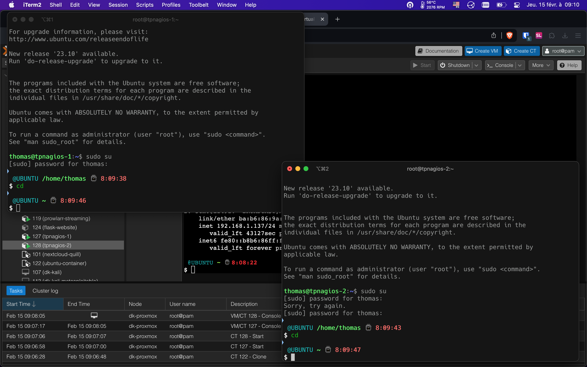

## Script d'installation

Voici le script d'installation commenté.

```shell
#!/bin/bash

# Check if script is run as root, exit if not
if [ ! $UID -eq 0 ]
then
echo "Script must be run as root"
exit 1
fi

# Add nagios user and nagcmd group
useradd nagios
groupadd nagcmd

# Add nagios and www-data users to nagcmd group
usermod -a -G nagcmd nagios
usermod -a -G nagcmd www-data

# Create temporary directory and navigate to it
TMP_DIR=$(mktemp -d)
cd $TMP_DIR

# Download Nagios core software
wget http://prdownloads.sourceforge.net/sourceforge/nagios/nagios-4.1.1.tar.gz

# Extract Nagios package
tar xvzf nagios-4.1.1.tar.gz
cd nagios-4.1.1

# Configure and compile Nagios core
./configure --with-command-group=nagcmd
make all

# Install Nagios, init script, config files, and command mode
make install
make install-init
make install-config
make install-commandmode

# Install Nagios web configuration for Apache
make install-webconf

# Create admin user for Nagios web interface
htpasswd -c /usr/local/nagios/etc/htpasswd.users nagiosadmin

# Reload Apache to apply changes
/etc/init.d/apache2 reload

cd $TMP_DIR

# Download Nagios plugins
wget http://www.nagiosplugins.org/download/nagios-plugins-2.1.1.tar.gz

# Extract plugins package
tar xvzf nagios-plugins-2.1.1.tar.gz
cd nagios-plugins-2.1.1

# Configure and compile Nagios
./configure --with-nagios-user=nagios --with-nagios-group=nagios
make
make install
```

## Installation de Nagios

Ayant rencontré de nombreux problèmes lors de l'installation du script, nous avons utilisé `docker` pour faire tourner notre instance.

Nous avons donc créé les différents dossiers nécessaires au fonctionnement de Nagios.

```shell
$ tree nagios

nagios
|-- custom-plugins
|-- etc
|-- var

3 directories, 0 files
```

Puis nous avons lancé notre image `docker` avec un ensemble de paramètres.

```shell
$ docker run --name nagios  \
  -v /root/nagios/etc/:/opt/nagios/etc/ \
  -v /root/nagios/var:/opt/nagios/var/ \
  -v /root/nagios/custom-plugins:/opt/Custom-Nagios-Plugins \
  -p 0.0.0.0:8080:80 \
  manios/nagios:latest
```

Une fois que l'instance est lancée, nous nous rendons sur notre navigateur à `http://192.168.1.28:8080`, étant l'adresse de notre conteneur `proxmox`.


Visiblement, ça fonctionne correctement.

## Machine supervisée par défaut

La machine supervisée par défaut est `localhost`, à savoir le serveur sur lequel tourne l'instance de Nagios.

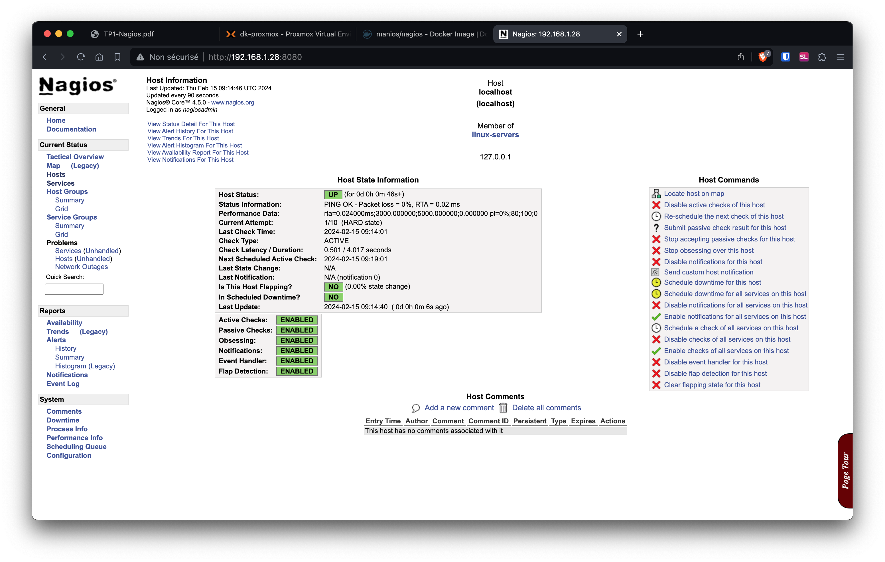

## Ajout de la supervision d'un serveur `ftp`

Nous ajoutons le fichier de configuration pour monitorer notre serveur `ftp`, avec `192.168.1.137` l'adresse de notre second conteneur Proxmox.

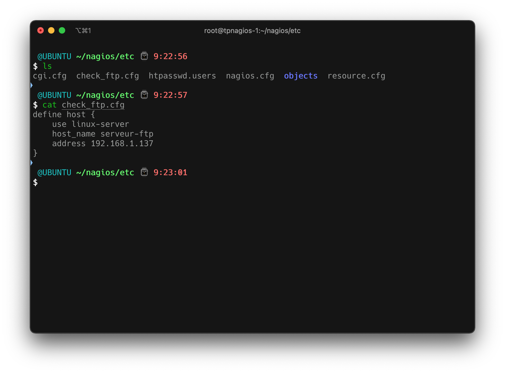

Après avoir déplacé le fichier dans le dossier `objects`, puis renommé en `ftp.cfg`, nous modifions le fichier de configuration `nagios.cfg` en ajoutant notre fichier de configuration.


Après avoir relancé le service, nous obtenons le résultat suivant.

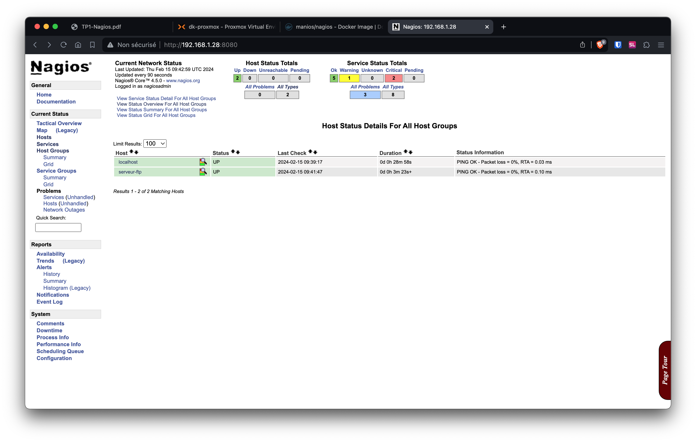

Nous pouvons constater que notre hôte  `serveur-ftp`  est bien détecté et en status `UP`.

## Assignation du service `check_ftp`

Nous modifions maintenant notre fichier `ftp.cfg`  pour ajouter l'assignation du service `check_ftp`.

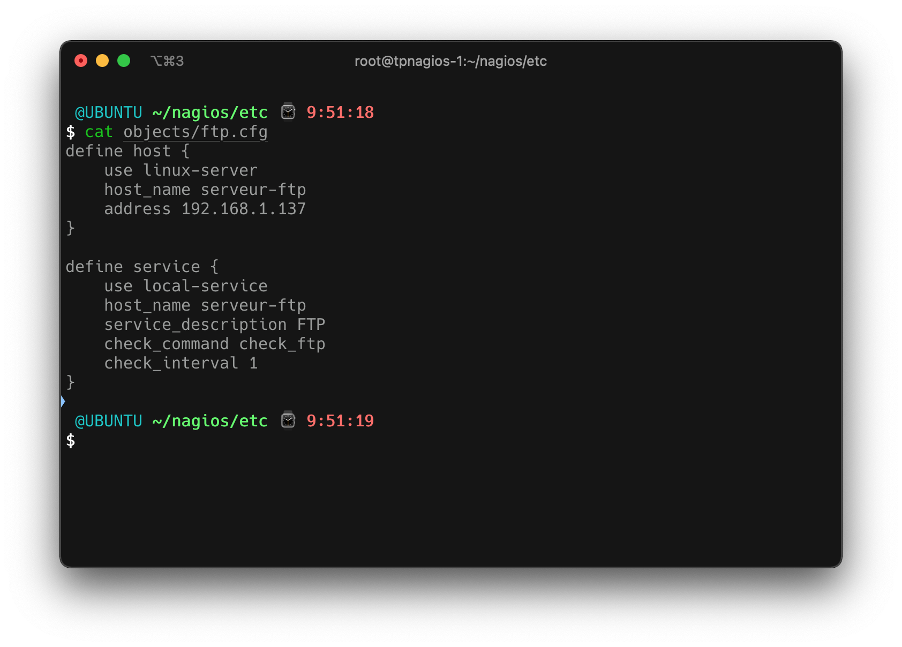

Après avoir relancé notre instance Nagios, nous constatons que le service est passé du status `pending` au status `up`.


A noter que nous pouvons observer certains services en `CRITICAL`. Ceci est lié à l'utilisation d'une image `docker` n'ayant pas toutes les permissions ou les ports ouverts requis.

## Notifications

Création des utilisateurs et des groupes pour obtenir des notifications.

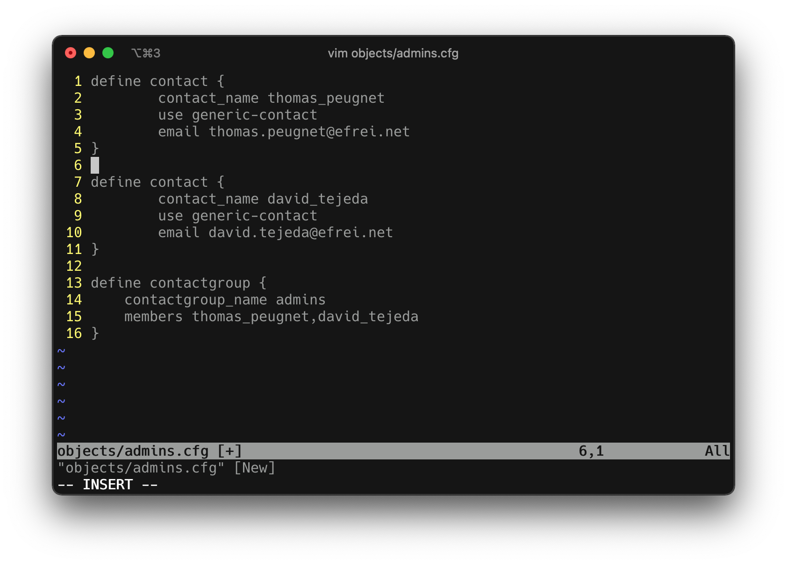

On modifie maintenant notre fichier de configuration `nagios.cfg` pour intégrer le nouveau fichier `admins.cfg`

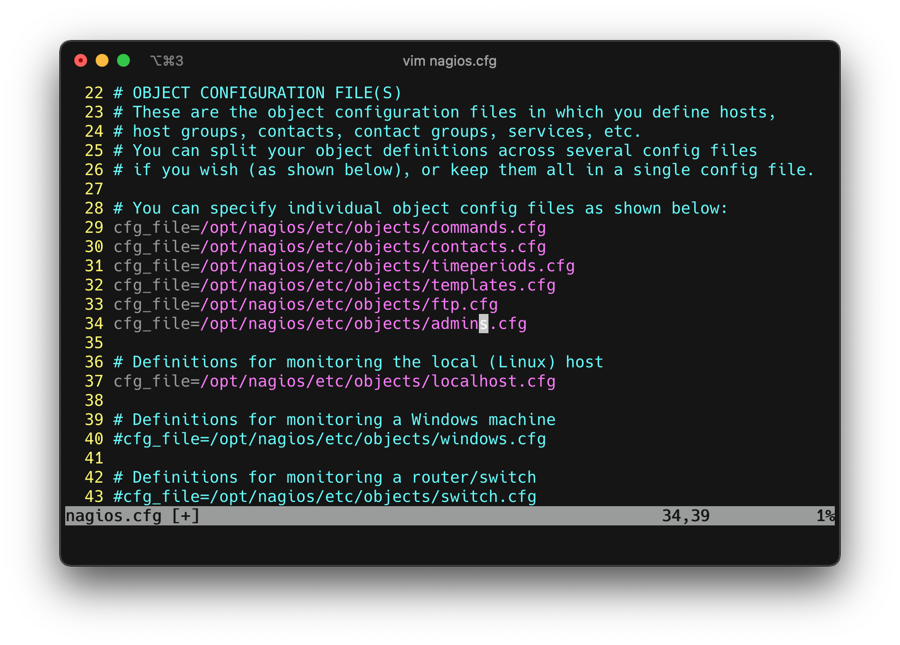

## Arrêt du service `proftpd`

Après avoir arrêté le service `proftpd` sur le conteneur distant, nous constatons au bout de 90 secondes, que le service est passé en `CRITICAL`. Peu de temps après, nous voyons une nouvelle entrée dans la page Notifications.

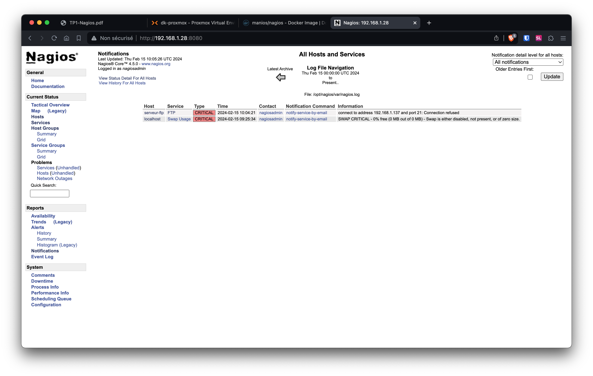

En cliquant sur le le contact, nous trouvons la page suivante, indiquant que notre fichier de configuration avec les nouveaux contacts a bien été pris en compte.

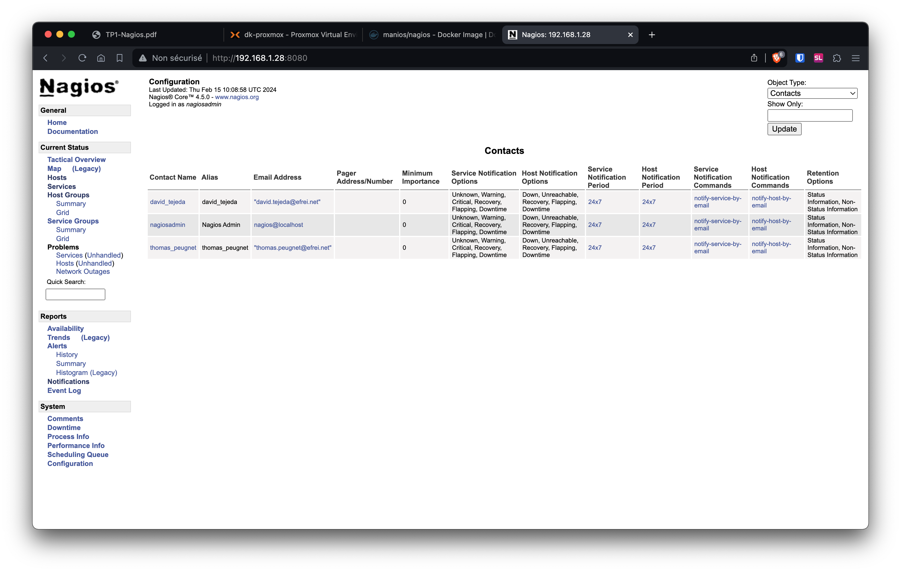

Nous pouvons remarquer que, pour le moment, nous n'avons pas reçu de mail.

## Supervision Avancée

Nous créons le script custom suivant.

```shell
#!/bin/bash

# Check args
if [ "$#" -ne 3 ]; then
    echo "Usage: $0 <IP address> <warning threshold in ms> <critical threshold in ms>"
    exit 3
fi

IP=$1
WARNING_THRESHOLD=$2
CRITICAL_THRESHOLD=$3

# 10 pings to the host
OUTPUT=$(ping -c 10 $IP)
if [ $? -ne 0 ]; then
    echo "Ping failed, unable to reach host"
    exit 3
fi

# Regexp for getting the output
JITTER=$(echo $OUTPUT | grep -oP '\d+.\d+/+\d+.\d+/+\d+.\d+/+\d+.\d+' | awk -F'/' '{print $4}')
JITTER_ROUNDED=$(echo $JITTER | awk '{print int($1)}')

# Comparer la gigue aux seuils et définir le code de retour
if [ $JITTER_ROUNDED -le $WARNING_THRESHOLD ]; then
    echo "OK - Jitter = ${JITTER_ROUNDED} ms"
    exit 0
elif [ $JITTER_ROUNDED -le $CRITICAL_THRESHOLD ]; then
    echo "Warning - Jitter = ${JITTER_ROUNDED} ms"
    exit 1
else
    echo "Critical - Jitter = ${JITTER_ROUNDED} ms"
    exit 2
fi
```

Nous créons donc un nouveau `check_jitter.sh` dans le dossier `/opt/Custom-Nagios-Plugins/`, et y ajoutons le contenu de notre script. Nous ajoutons les permissions d'exécution avec la commande `chmod +x check_jitter.sh`.

Ensuite, nous ajoutons à notre fichier `commands.cfg` la définition de la commande `check_jitter`.

```
define command {
	command_name check_jitter
	command_line /opt/Custom-Nagios-Plugins/check_jitter.sh $HOSTADDRESS$ $ARG1$ $ARG2$
}
```

Enfin, nous créons une nouvelle assignation de service `check_jitter` à notre serveur FTP.

```
define service {
    use local-service
    host_name serveur-ftp
    service_description Jitter
    check_command check_jitter
    check_interval 1
    notifications_enabled 1
    first_notification_delay 0
    notification_interval 0
}
```

Notre fichier `ftp.cfg` est donc le suivant.

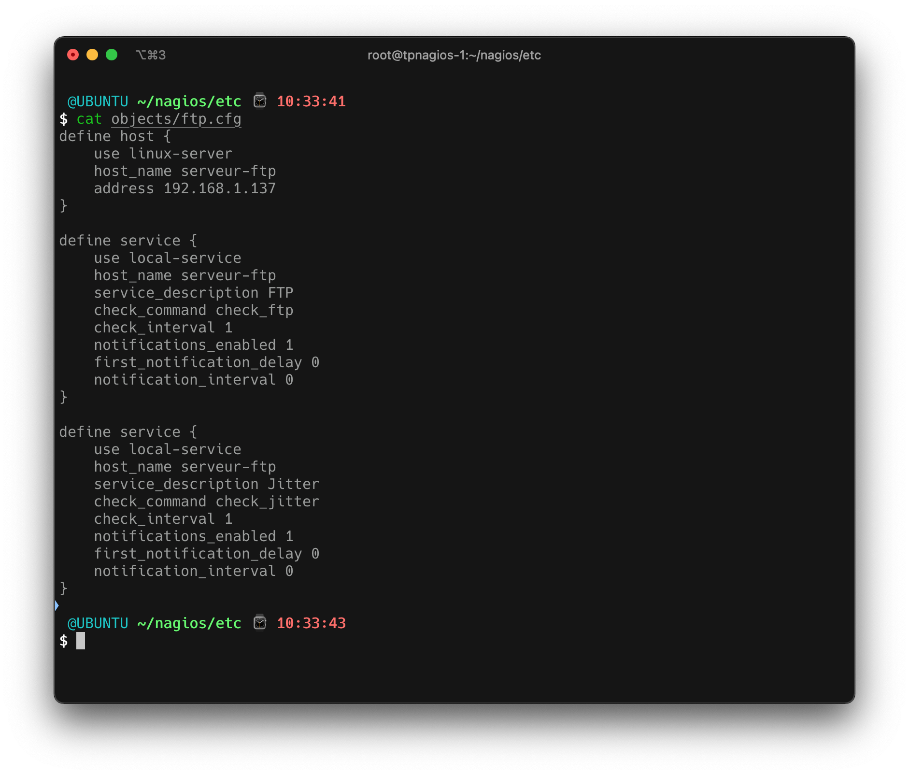

Nous allons vérifier que l'assignation au service fonctionne correctement depuis la WebUI.

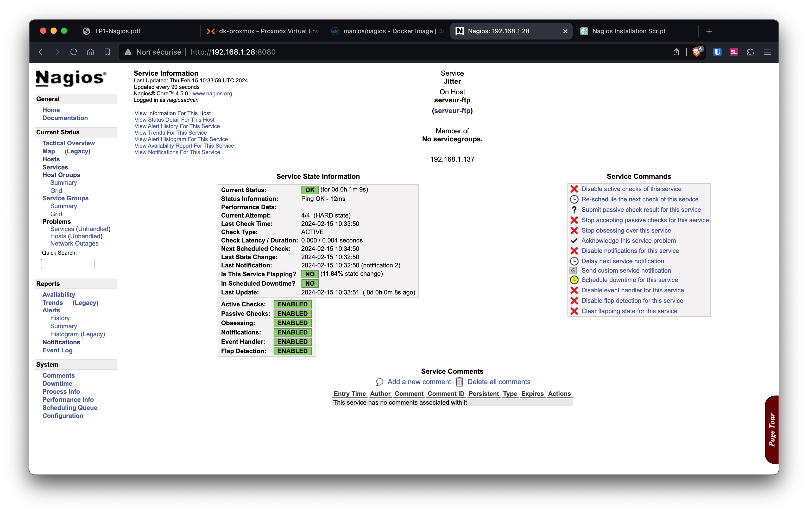

Visiblement, le ping fonctionne correctement. En éteignant le conteneur du serveur FTP, nous obtenons le résultat suivant.

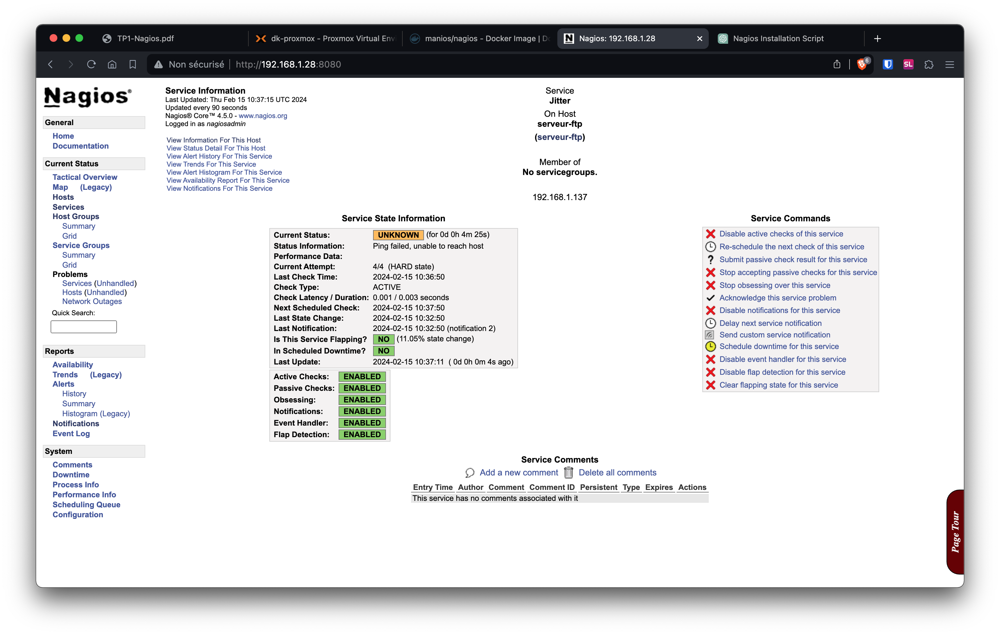

