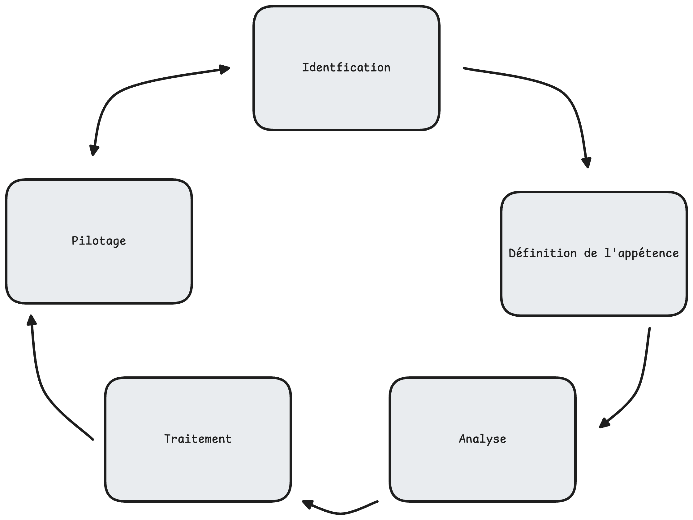
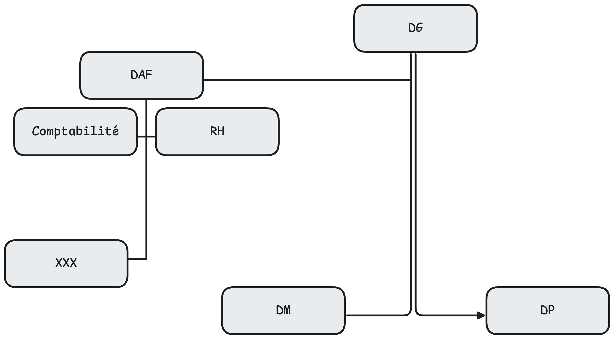

# Audit et normes ISO

Notes de cours par `Thomas Peugnet`.

# Introduction

Rien de spécifiquement intéressant.

# Audit et gestion des risques

Divisé en trois principales caractéristiques:

- Evaluation
- Indépendance
- Pistes d'amélioration

## Bénéfices attendus

Meilleure maîtrise et anticipation des enjeux du numérique.

Audits possibles:

-  Risques application

- projets

- Infrastructure 

La gestion des risques peut servir à :

## Décomposition des risques

- Risque **brut**: Valeur initiale du risque (si on ne fait rien)
- Risque **résiduel**: Le risque brut $-$​ actions de maîtrise en place
- Risque **cible**: Le risque résiduel $-$ plan d'actions de maîtrise à venir

**Processus de fonctionnement**

1. Identifier
2. Evaluer
3. Traiter
4. Suivre

### **Les différents types de risques**

- Stratégie digitale non adaptée
- Technologies inadaptées
- Résilience de toutes les couches (infra, applicative..)
- Sous-traitance
- Localisation des donnnées
- Données à caractère personnel
- Choix techniques du prestataires
- Interventions à distance
- Hébergement mutualisé
- Développements internes

#### Risques liés à la sous-traitance

- Prix du contrat initialement plus faible en faisant appel à l'extérieur, puis le coût du contrat augmente au fur-et-à-mesure, mais au moment où ça devient trop cher, il n'y a plus de personnes qui ont les connaissances en interne.

### Cadre de référence

1. Adapté aux métiers
2. Prendre en compte les pratiques
3. …

## RGPD - Cheat Sheet

*La cheat sheet qui suit a été générée par ChatGPT.*

------

### **1️⃣ Principes clés**

1. **Licéité, loyauté, transparence** : Collecte légale, claire, et justifiée.
2. **Limitation des finalités** : Objectifs spécifiques et légitimes.
3. **Minimisation des données** : Collecter uniquement le nécessaire.
4. **Exactitude** : Données à jour.
5. **Limitation de conservation** : Conserver uniquement selon les finalités.
6. **Intégrité et confidentialité** : Sécuriser contre pertes ou accès non autorisés.

------

### **2️⃣ Droits des personnes**

- **Accès** : Consulter ses données.
- **Rectification** : Corriger des erreurs.
- **Effacement** : Supprimer sous conditions.
- **Limitation** : Restreindre temporairement l’usage.
- **Portabilité** : Transférer les données.
- **Opposition** : Refuser certains traitements (ex. marketing).
- **Profilage** : Contester les décisions automatisées.

------

### **3️⃣ Bases légales**

- **Consentement** : Libre et révocable.
- **Contrat** : Nécessaire à l’exécution d’un service.
- **Obligation légale** : Imposée par la loi.
- **Intérêt vital** : Protection de la vie.
- **Mission publique** : Tâche d’intérêt général.
- **Intérêts légitimes** : Balance avec les droits individuels.

------

### **4️⃣ Obligations des entreprises**

1. **Registre des traitements** : Décrire les données, usages, et durées.
2. **Analyse d’impact** : Évaluer les risques (PIA).
3. **Information claire** : Politique de confidentialité.
4. **Signalement des violations** : À la CNIL sous 72 h.
5. **DPO** : Obligatoire pour certaines organisations (ex. autorités publiques).

------

### **5️⃣ Sanctions**

- Amendes : Jusqu’à 20 M€ ou 4 % du CA.
- Actions en justice : Par les personnes concernées.

------

### **6️⃣ Consentement**

- **Actif** : Pas de cases pré-cochées.
- **Révocable** : Retrait possible à tout moment.
- **Traçabilité** : Garder une preuve de l’accord.

------

### **7️⃣ CNIL**

- Autorité de contrôle en France.
- [www.cnil.fr](https://www.cnil.fr/).

# Cas pratiques

## Organigrammes

### Cas 1

### Cas 2

### Cas 3

## Questions

**Question 1:** Proposez un intitulé adapté pour nommer la fonction informatique dans chacune des organisations décrites. Les fonctions informatiques sont nommées XXX dans les organigrammes qui suivent.

Premier Cas: SI $\rightarrow$ RSI

Second Cas: PSI  $\rightarrow$​ DSI (directeur)

Troisième Cas: DSIN $\rightarrow$ DSI (directeur)

| Missions                                                     | Cas 1 (RSI)                                         | Cas 2 (DSI)                     | Cas 3 DSIN)                                   |
| ------------------------------------------------------------ | --------------------------------------------------- | ------------------------------- | --------------------------------------------- |
| Accompagner la veille technologique                          | ❌                                                   | 🤷‍♂️ - Optionnel, non obligatoire | ✅                                             |
| Accompagner ou réaliser les projets de l'organsation         | ❌ - Infrastructure uniquement, pas de développement | ✅                               | ✅                                             |
| Accompagner les utilisateurs                                 | ❌                                                   | ✅                               | ✅                                             |
| Assurer la continuité de fonctionnement et de qualité des services et des applis | ✅                                                   | ✅                               | ✅                                             |
| Assurer l'alignement stragégique du SI sur la stratégie globale des métiers | ❌                                                   | 🤷‍♂️ - Non précisé                | ✅ - Veille technologique, stratégie proactive |

# COSO ERM & ISO 31000

*La cheat sheet qui suit a été générée par ChatGPT.*

------

### **1️⃣ Qu’est-ce que c’est ?**

- **COSO ERM** : Cadre pour intégrer la gestion des risques dans la stratégie globale d’une organisation.
- **ISO 31000** : Norme généraliste pour identifier, évaluer et traiter les risques.

------

### **2️⃣ Objectifs communs**

- Identifier, évaluer et gérer les risques pour atteindre les **objectifs stratégiques** (opérationnels, reporting, conformité).
- Faciliter la **prise de décision** en intégrant les risques.
- Améliorer la **résilience** et la **création de valeur**.

------

### **3️⃣ Principes et étapes clés**

#### **COSO ERM : 5 Composantes**

1. **Gouvernance et culture** : Définir les rôles et intégrer le risque dans la culture.
2. **Stratégie et objectifs** : Aligner la gestion des risques avec la stratégie.
3. **Identification et évaluation** : Cartographier et hiérarchiser les risques.
4. **Réponse aux risques** : Agir (éviter, réduire, transférer, accepter).
5. **Revue et amélioration** : Surveiller et ajuster en continu.

#### **ISO 31000 : Processus en 6 Étapes**

1. **Contexte** : Comprendre l’environnement interne/externe.
2. **Identification** : Recenser les risques.
3. **Analyse** : Probabilité + impact.
4. **Évaluation** : Prioriser les risques.
5. **Traitement** : Choisir une réponse (éviter, réduire, partager, accepter).
6. **Suivi** : Mesurer l’efficacité et ajuster.

------

### **4️⃣ Réponses aux risques (Approche commune)**

- **Éviter** : Supprimer l’activité risquée.
- **Réduire** : Contrôles ou actions d’atténuation.
- **Transférer** : Assurances, sous-traitance.
- **Accepter** : Tolérer les risques résiduels.

------

### **5️⃣ Comparaison rapide**

| **Aspect**    | **COSO ERM**                  | **ISO 31000**                   |
| ------------- | ----------------------------- | ------------------------------- |
| **Focus**     | Alignement avec la stratégie  | Norme adaptable, multi-secteurs |
| **Structure** | 5 composantes                 | 6 étapes + 8 principes          |
| **Approche**  | Vue stratégique et financière | Vue systématique et holistique  |

------

### **6️⃣ Utilisation**

1. **COSO ERM** : Grandes entreprises cherchant à aligner gestion des risques et stratégie.
2. **ISO 31000** : Toutes organisations voulant une norme flexible pour leur gestion des risques.