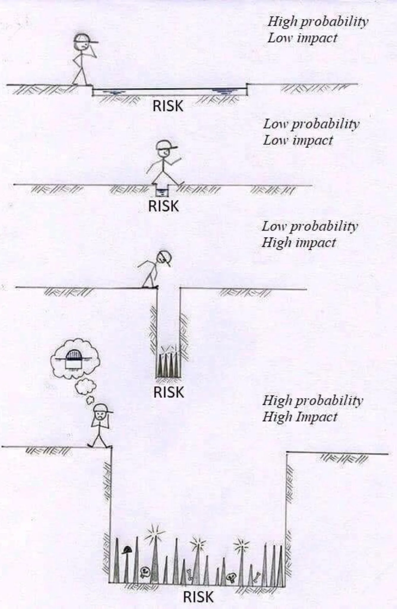

# Audit et normes ISO

Notes de cours par `Thomas Peugnet`.

# Introduction

Rien de spécifiquement intéressant.

# Audit et gestion des risques

Divisé en trois principales caractéristiques:

- Evaluation
- Indépendance
- Pistes d'amélioration

## Bénéfices attendus

Meilleure maîtrise et anticipation des enjeux du numérique.

Audits possibles:

-  Risques application

- projets

- Infrastructure 

La gestion des risques peut servir à :

## Décomposition des risques

- Risque **brut**: Valeur initiale du risque (si on ne fait rien)
- Risque **résiduel**: Le risque brut $-$​ actions de maîtrise en place
- Risque **cible**: Le risque résiduel $-$ plan d'actions de maîtrise à venir

**Processus de fonctionnement**

1. Identifier
2. Evaluer
3. Traiter
4. Suivre

### **Les différents types de risques**

- Stratégie digitale non adaptée
- Technologies inadaptées
- Résilience de toutes les couches (infra, applicative..)
- Sous-traitance
- Localisation des donnnées
- Données à caractère personnel
- Choix techniques du prestataires
- Interventions à distance
- Hébergement mutualisé
- Développements internes

#### Risques liés à la sous-traitance

- Prix du contrat initialement plus faible en faisant appel à l'extérieur, puis le coût du contrat augmente au fur-et-à-mesure, mais au moment où ça devient trop cher, il n'y a plus de personnes qui ont les connaissances en interne.

### Cadre de référence

1. Adapté aux métiers
2. Prendre en compte les pratiques
3. …

## RGPD - Cheat Sheet

### 1️⃣ **Principes fondamentaux**

1. **Licéité, loyauté, transparence**
   - Collecter les données avec une base légale (ex. consentement, contrat).
   - Informer clairement les personnes concernées.
2. **Limitation des finalités**
   - Ne collecter les données que pour des objectifs spécifiques, explicites et légitimes.
3. **Minimisation des données**
   - Collecter uniquement les données strictement nécessaires.
4. **Exactitude**
   - Veiller à ce que les données soient exactes et à jour.
5. **Limitation de la conservation**
   - Conserver les données uniquement pour la durée nécessaire aux finalités.
6. **Intégrité et confidentialité**
   - Protéger les données contre les pertes, accès non autorisés, ou fuites.

------

### 2️⃣ **Droits des personnes**

1. **Droit d’accès**
   - Permettre à une personne de consulter ses données.
2. **Droit de rectification**
   - Corriger ou compléter les données inexactes.
3. **Droit à l’effacement ("droit à l’oubli")**
   - Supprimer les données dans certains cas (ex. retrait du consentement).
4. **Droit à la limitation**
   - Geler l’utilisation des données sous certaines conditions.
5. **Droit à la portabilité**
   - Transmettre les données à un autre prestataire sur demande.
6. **Droit d’opposition**
   - Refuser l’utilisation des données, notamment pour du marketing direct.
7. **Droit de ne pas être soumis à une décision automatisée**
   - Inclut le droit de contester un profilage.

------

### 3️⃣ **Bases légales pour le traitement des données**

- **Consentement** : Libre, éclairé, spécifique et révocable.
- **Contrat** : Nécessaire à l’exécution d’un contrat.
- **Obligation légale** : Respect d’une obligation juridique.
- **Intérêt vital** : Protection de la vie d’une personne.
- **Mission d’intérêt public** : Nécessaire à une tâche d’intérêt général.
- **Intérêts légitimes** : Intérêt du responsable de traitement (sauf si les droits des personnes priment).

------

### 4️⃣ **Obligations des entreprises**

1. **Tenir un registre des traitements**
   - Document détaillant les traitements (type de données, finalités, conservation, etc.).
2. **Effectuer une analyse d’impact (PIA)**
   - Obligatoire si un traitement présente un risque élevé pour les droits des personnes.
3. **Informer les utilisateurs**
   - Via une politique de confidentialité ou des mentions légales claires.
4. **Gérer les violations de données**
   - Notifier la CNIL dans les 72 heures si un incident de sécurité impacte les données.
5. **Nommer un DPO (Data Protection Officer)**
   - Obligatoire pour certaines organisations (ex. autorités publiques, grandes entreprises).

------

### 5️⃣ **Sanctions en cas de non-conformité**

- **Amende administrative** : Jusqu’à 20 millions d’euros ou 4 % du chiffre d’affaires annuel mondial.
- **Actions en justice** : Par les personnes concernées pour dommages subis.

------

### 6️⃣ **Focus sur le consentement**

- Doit être **actif** : Pas de cases pré-cochées.
- Peut être retiré **à tout moment**.
- Vérifiable : Garder une trace de l’accord.

------

### 7️⃣ **CNIL (France)**

- Organisme national en charge de l’application du RGPD.
- Site : [www.cnil.fr](https://www.cnil.fr/)

