# Sécurité Cloud

# Rendu TP01

## Préparation

Nous commençons par installer AWS CLI avec les commandes suivantes:


Nous poursuivons avec les étapes d'inscription à l'offre gratuite de AWS.


Nous activons la MFA depuis les recommandations de la section IAM. Nous configurons notre application Google Authenticator.


## Gestion des utilisateurs avec IAM

Nous créons un utilisateur `test-user-1`.

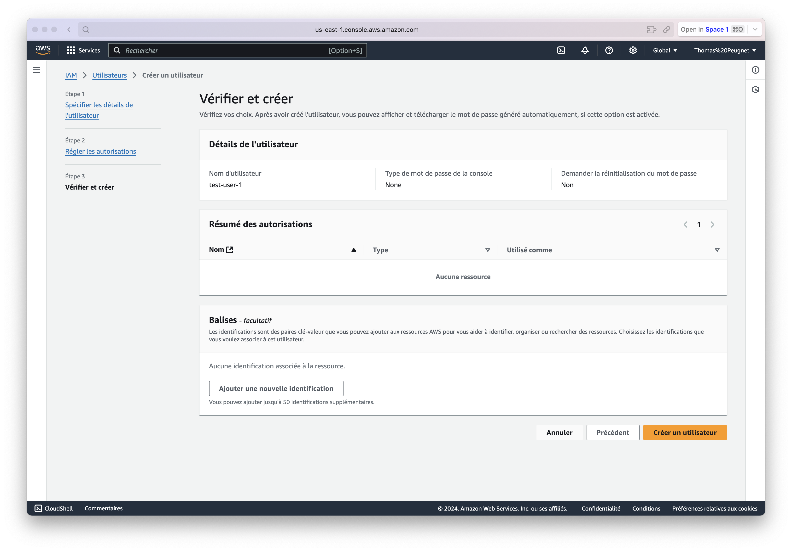

Nous activons l'accès à la console.

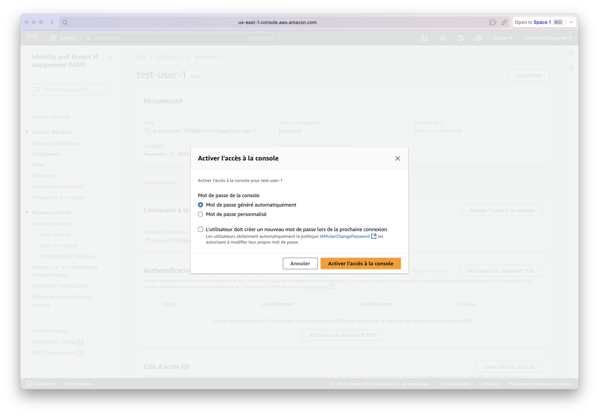

On effectue une connexion sur le lien de connexion fourni lors de l'activation de l'accès console.

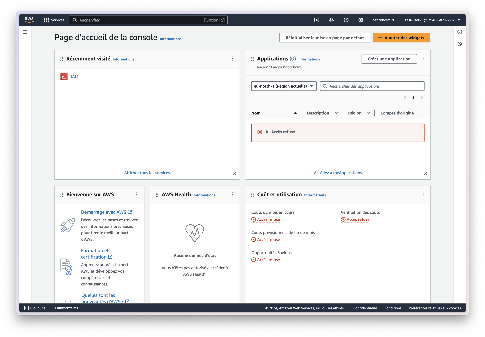

On se deconnecte du compte `test-user-1`, on se reconnecte avec le compte `root` et on ajoute une politique d'autorisation pour l'utilisateur `test-user-1`.

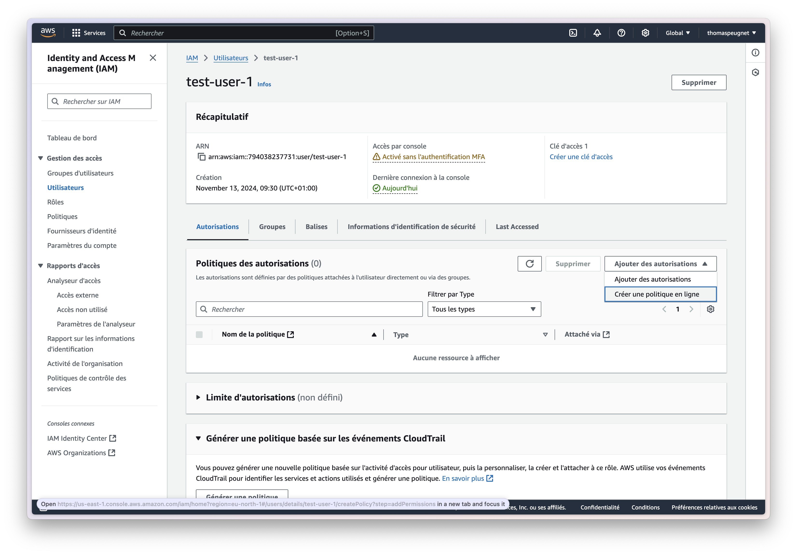

On ajoute le code indiqué dans le sujet du TP, donnant donc le JSON complet suivant:

```json
{
	"Version": "2012-10-17",
	"Statement": [
		{
            "Sid": "s3fullaccess",
            "Effect": "Allow",
            "Action": "s3:*",
            "Resource": "*"
        }
	]
}	
```

Nous créons notre politique `S3FullAccess`.

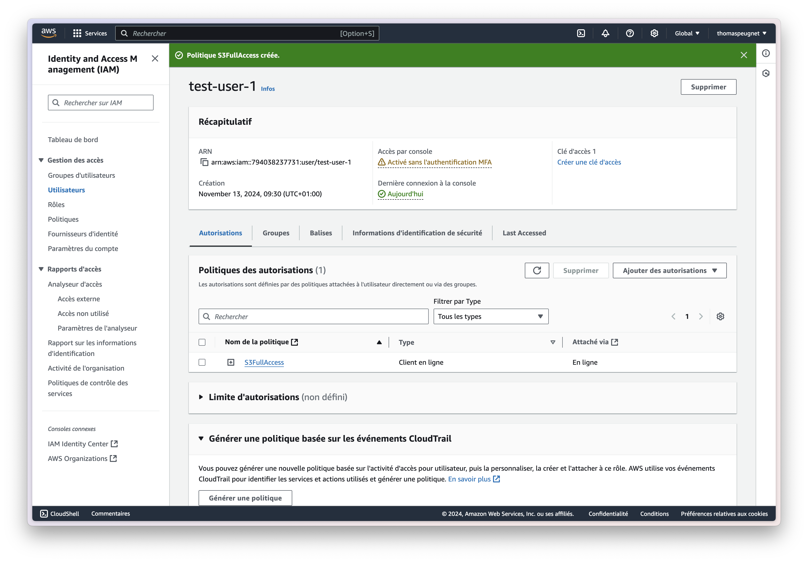

Nous nous connectons ensuite au service IAM Policy Simulator grâce à l'URL https://policysim.aws.amazon.com/home/index.jsp.

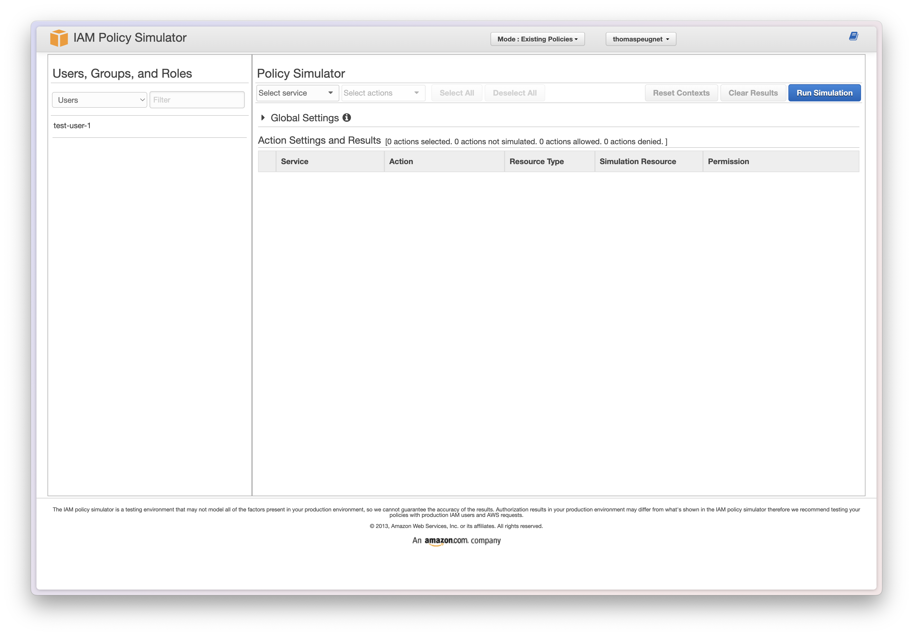

Après avoir sélectionné notre utilisateur et les 160 actions possibles sur `AmazonS3`, nous avons bien le résultat suivant:

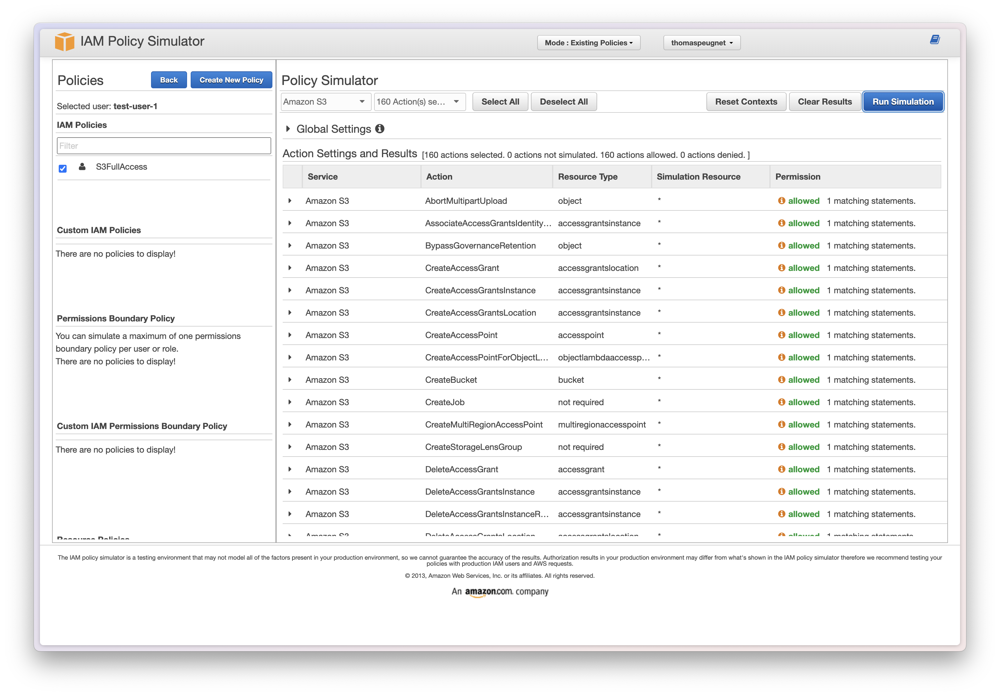

Nous ajoutons ensuite la politique d'autorisation `AmazonEC2ReadOnlyAccess` à l'utilisateur `test-user-1`.


Nous pouvons constater que notre utilisateur a bien une nouvelle politique d'autorisation.


Nous retournons ensuite sur le IAM Policy Simulator et testons les politiques avec notre utilisateur `test-user-1` et `Amazon EC2`.


Nous finissons ce TP en supprimant notre utilisateur `test-user-1`.


Nous constatons que notre politique `S3FullAccess` a bien été supprimée.

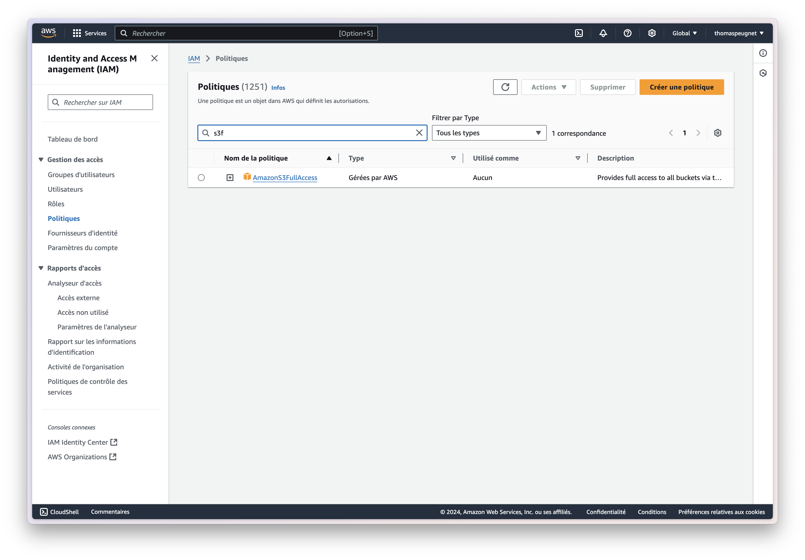

# Rendu TP02

Ce TP a été réalisé par `Thomas PEUGNET`.

## Sécurisation du compte AWS

Nous configurons une Alert Preference.

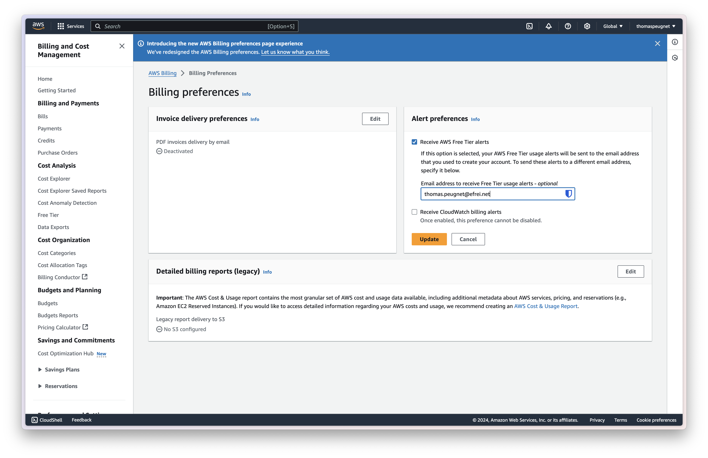

Nous mettons à jour la politique par défaut.


Nous créons un budget mensuel de 5$.


Nous activons l'accès des utilisateurs IAM aux informations de facturation.


Nous ajoutons un groupe **facturation** et nous le rattachons aux permissions `Billing`.


Nous créons un utilisateur `Mathias` et le mettons dans le groupe **facturation**.


Nous activons l'accès console pour notre utilisateur.


Nous créons un utilisatateur `thomaspeu`, l'attachons à la politique `AdminAccess` et lui activons son accès console.


Nous activons l'utilisation de la MFA pour cet utilisateur et nous reconnectons avec ce dernier.

Nous pouvons constater que nous avons bien toutes les permissions nécessaires.


Nous créons un alias `thomas-peugnet` pour notre compte AWS et nous reconnectons.


Nous créons le groupe `Admin` et y ajoutons notre utilisateur.


Nous créons maintenant une politique pour rester dans le Free Tier qui aura le JSON suivant. Son objectif est d'interdire le lancement des VM si elles ne sont pas dans la région de Paris.

```json
{
	"Version": "2012-10-17",
	"Statement": [
                    {
                        "Effect": "Deny",
                        "Action": "ec2:RunInstances", 
                        "Resource": "*",
                        "Condition": {
                            "StringNotEquals": { 
                                "aws:RequestedRegion": "eu-west-3"
                            }
                        }
                    }
	]
}
```


Nous attachons cette nouvelle politique `allow-only-paris-region` à notre groupe `Admin`.

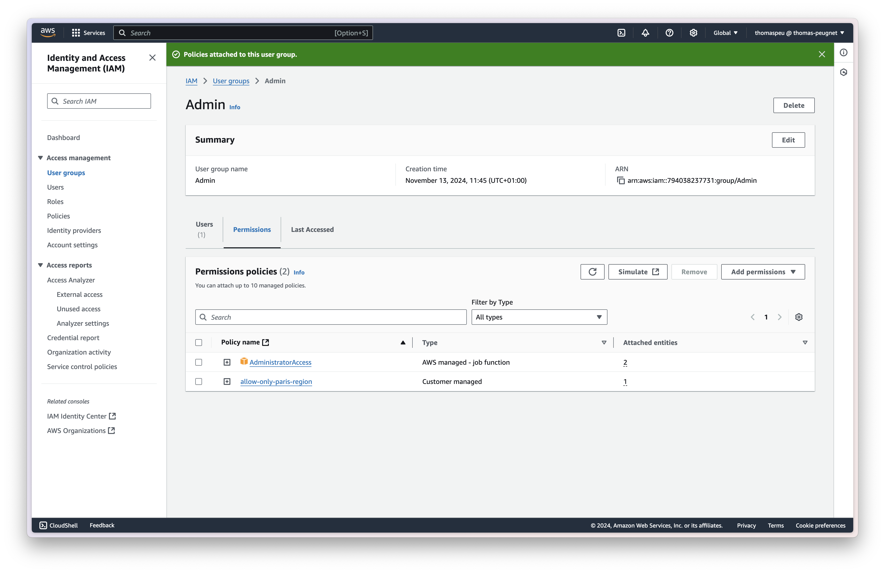

Nous testons de lancer une instance `t2.micro` hors de France (Frankfurt).


Comme prévu, nous avons un message d'erreur.

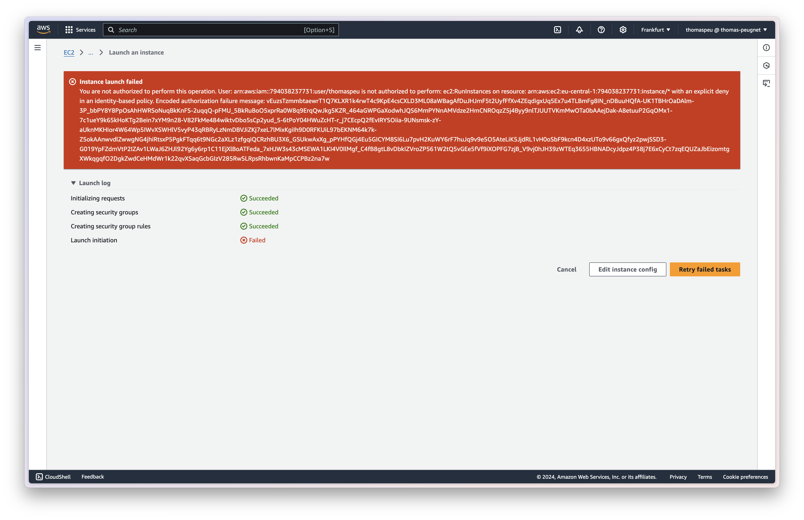


Nous créons ensuite la politique `allow-only-t2-micro` ayant pour objectif d'interdire le lancement de VM différentes du type `t2.micro`. Cette politique aura le JSON suivant:

```json
{
	"Version": "2012-10-17",
	"Statement": [
                    {
                        "Effect": "Deny",
                        "Action": "ec2:RunInstances", 
                        "Resource": "*",
                        "Condition": {
                            "StringNotEquals": { 
                                "ec2:InstanceType": "t2.micro"                            
                            }
                        }
                    }
	]
}
```

Nous associons cette nouvelle politique à notre groupe `Admin`.


Nous testons notre politique avec le lancement d'une instance t2.micro en se situant dans la région Paris.


Nous obtenons, comme prévu, un message d'erreur.


Nous allons maintenant gérer les autorisations AWS en nous basans sur les attributs.

Nous créons une Politique `EC2limitedAccess` avec le JSON suivant:

```json
{
   "Version":"2012-10-17",
   "Statement":[
      {
         "Effect":"Allow",
         "Action":[
            "ec2:DescribeInstances",
            "ec2:DescribeImages",
            "ec2:DescribeTags"
         ],
         "Resource":"*"
      },
      {
         "Effect":"Allow",
         "Action":[
            "ec2:RebootInstances",
            "ec2:StartInstances",
            "ec2:StopInstances"
         ],
         "Resource":"*",
         "Condition":{
            "StringEquals":{
               "aws:PrincipalTag/Department":"EC2Admins",
               "ec2:ResourceTag/Environment":"Production"
            }
         }
      }
   ]
}
```

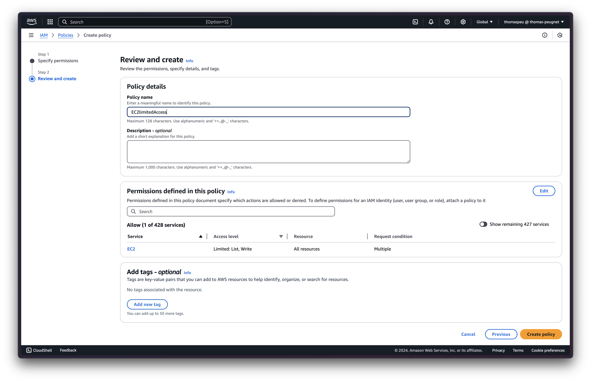

Nous créons ensuite un utilisateur nommé `testABAC` auquel nous assignons la politique `EC2limitedAccess`. Nous assignons également les tags suivant:

- `key` = Department
- `value` = EC2Admins


Nous lançons ensuite nos 2 instances EC2 avec les tags `Environment:Production` et `Environment:Development`.


Nous nous reconnectons avec l'utilisateur `testABAC` et constatons que nous pouvons bien redémarrer l'instance de Production mais pas celle de Developpement.


