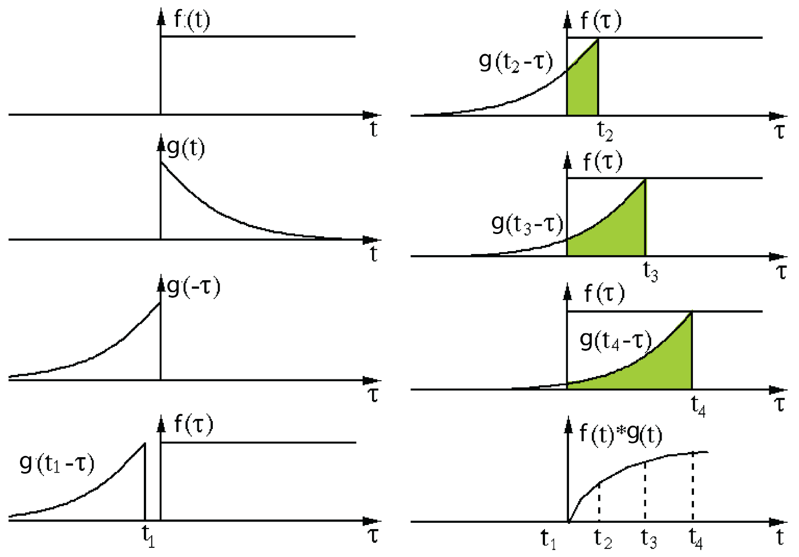
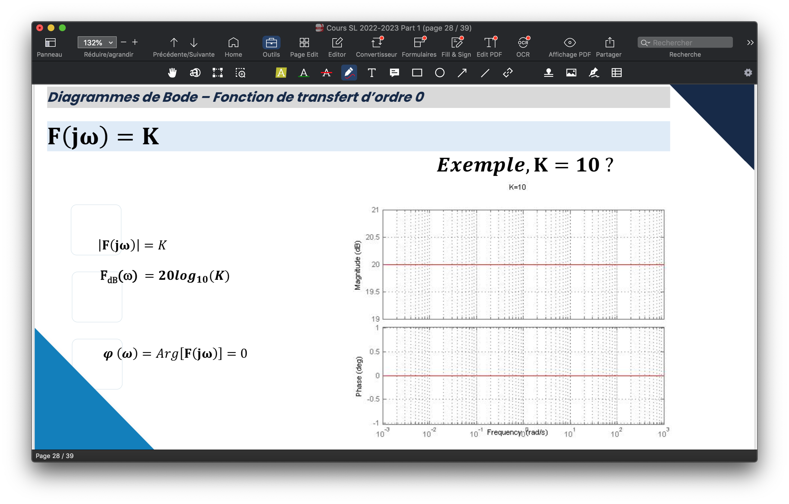
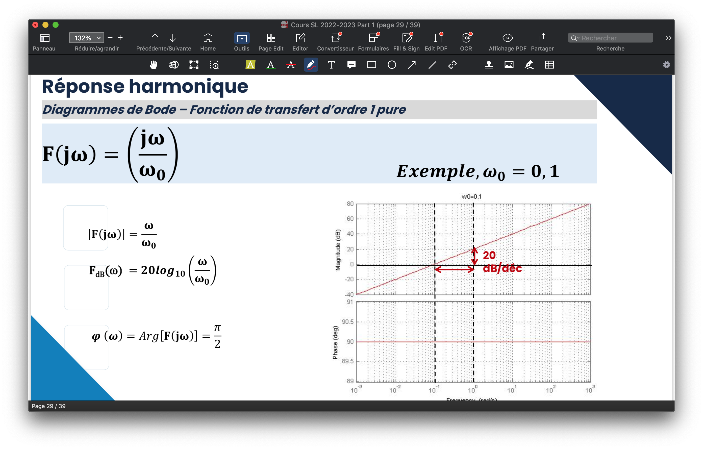
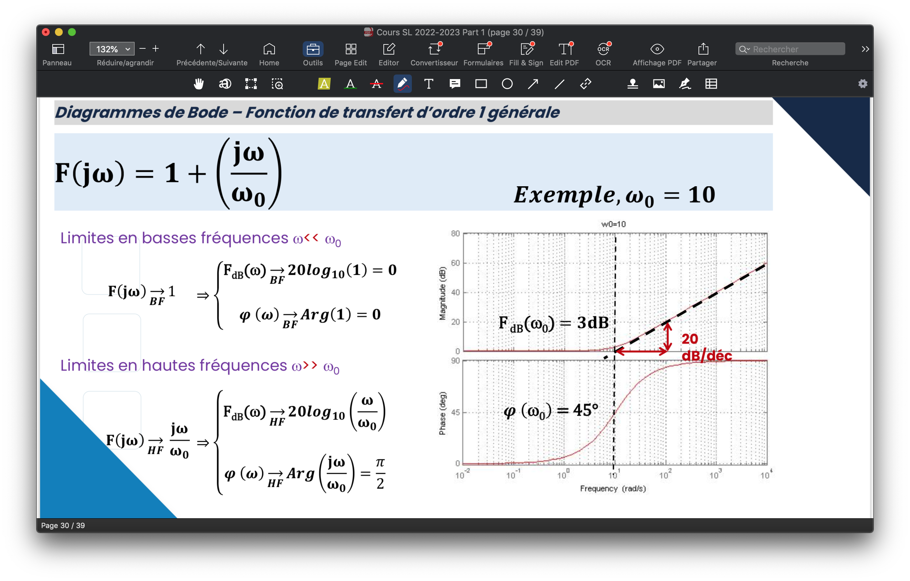
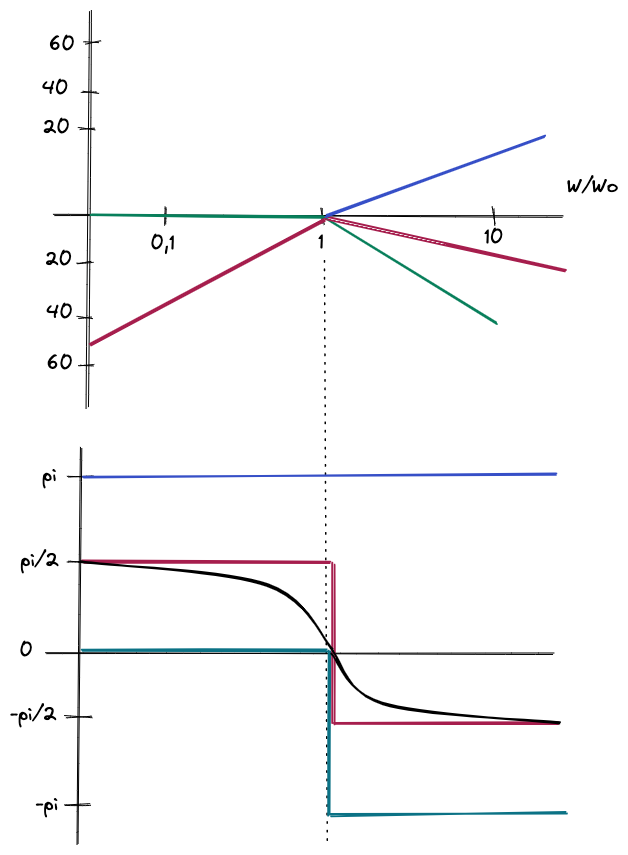
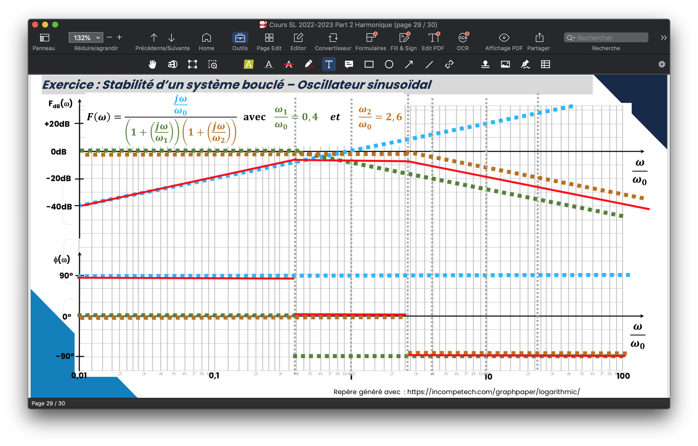
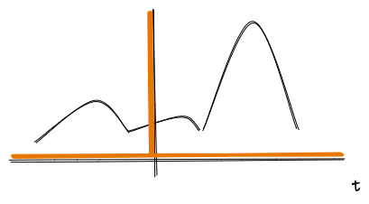

# Systèmes linéaires et invariant dans le temps

Notes de cours par `Thomas Peugnet`.

# Introduction

Nous pouvons représenter une fonction d'une force de la manière suivante.
$y(t)=a\times x(t-\tau) = a \times x(t) \times \delta(t-\tau)$

## Définitions

**Invariance dans le temps :** Un système lin;eaire est dit ==invariant== si la réponse du signal a un signal $e(t)$ différé d'un temps $\tau$ est la même réponse $s(t)$ du système mais différé de $\tau$ .
<u>Contre-exemple :</u>
*Débit de propergols --> Fusée  --> Accélération*

**SLIT** : 

- Ses entrées-sorties obéissent à un système d'équations différentielles linéaires.

- Les réponses margniales à différentes entrées se superposent (principe de superposition).
- Lorsque l'entrée est constante, la réponse est aussi constante lorsque le régime permanent est établi.
- Lorsque l'entrée est sinusoidalem la sortie est aussi sinusoidale et de même fréquence, mais dont l'amplitude et la phase peuvent être différentes.
- Il est entièrement défini par sa réponse impulsionnelle.

### Principe de superposition

### Réponse à une impulsion

Soit $r(t)$  la réponse à une impulsion.

- Modélisation de la réponse en temps ==discret==
  - $s(t)=r(t)\times e(t)=\Sigma e(k).r(t-k) = \Sigma r(k).e(t-k)$
- Modélisation de la réponse en temps ==continu==
  - $s(t)=r(t) \times e(t)=\int r(\tau).e(t-\tau).d\tau = \int e(\tau).r(t-\tau).d\tau$

On a donc $r(t)$ qui définit complètement la réponse du système $\forall$ l'info d'entrée $e(t)$.

## Propriétés

## Produit de convolution

- Commutativité
  - $y \times x = x \times y$
- Associativité
  - $(x \times y) \times z = x \times (y \times z)$
- Linéarité
  - $(a(t) + \lambda .b(t)) \times x(t) = a(t) \times x(t) + \lambda .b(t) \times x(t)$

<u>Périodicité</u> : $m(t)$, motif $T$-périodique

<u>Élément neutre</u> : $x(t) \times \delta (t) = x(t)$, et donc $x(t) \times \delta(t-\theta) = x(t-\theta)$

<u>Dérivation</u> : $\frac{d}{dt} \times (x(t) \times y(t))$

# Réponse harmonique

## Fonction de transfert

On a $e(t) = E_m \sin n\omega t$  et $S_m sin(\omega t + \phi)$

Notre fonction de transfert : $F = \frac{S}{E} = \frac{S_m \times e^{jn\omega t} \times e^{i \phi}}{E_m \times e^{jn\omega t}} = \frac{S_m}{E_m}\times e^{j\phi}$

Nous avons donc le module et l'argument, dépendant tous les deux de la fréquence.

Représentations graphiques de $|F|$ et $\arg(F)$ : Diagramme de **Bode**.

### Fonctions de transfert d'ordre $0$ et $1$

Dans le cas de **l'ordre 0**, nous avons un gain constant pour $\forall \omega$. On obtient $s(t) = K.e(t)$.

Dans le cas de **l'ordre 1**, nous prenons un dérivateur ou intégrateur pur. Si on dérive $E$, on trouve $ \frac{E_me^{j\omega t}}{dt}=j \omega \times E_m \times e^{j \omega t} = j_\omega E$

$s(t) = \tau \times \frac{d e(t)}{dt}$, ce qui nous donne $F(\omega) = j \tau \omega = j \times (\frac{\omega}{\omega_0})$

Toujours dans le cadre de **l'ordre 1**, mais de façon plus **générale**, on trouve 
$s(t) = \tau . \frac{de(t)}{dt} + e(t) = (1 + \tau j \omega) \times E(\omega)$.

$F = \frac{1}{j\omega \tau + 1} = \frac{1}{1 + \frac{j\omega}{\omega_0}}$ est donc un premier ordre.

$F(\omega) = (1 + \tau j \omega) = 1 + j\times (\frac{\omega}{\omega_0})$

## Diagramme de Bode

$F(j \omega) = K.(\frac{j\omega}{\omega_0})^\alpha \times (1 + \frac{j\omega}{\omega_1})^\beta \times (1 + 2m \times \frac{j_\omega}{\omega_2} + (\frac{j\omega}{\omega_2})^2)^\gamma$

### Plans de Bode

Représentations graphiques de $|F(\omega)|_{dB}$ et de  $\arg(F(j\omega))$ en fonction de $\omega$.

- Ordre 0

- Ordre 1 pure

- Ordre 1 général

### Exercice

#### Partie 1

#### Partie 2

*Soit un système linéaire dont l'entrée et la sortie sont reliées par* $50.s(t) + \frac{d s(t)}{dt} = 25.\frac{de(t)}{dt}$, *déterminer sa fonction de transfert en r\egime permanent sinusoïdal.*

$F(\omega) = \frac{S(\omega)}{E(\omega)} = ?$

### Exercice

Entrée : $e(t) = E_M.\cos \omega t$

- $F_{dB}(10rd/s) = -3dB)$ graphiquement
- $\Phi (10rd/s)=45º$

Or, on a $F_{dB}(\omega) = 20 \log_{10}(\frac{S_M}{E_M}(\omega))$

À $10rd/s$, on a $\frac{S_M}{E_M} = 10$ et donc $(\frac{F_{dB}}{20}) = 10^{-\frac{3}{20}} = 0,7 = \frac{1}{\sqrt{2}}$.

En effet, $10 rd/s$ implique une fréquence de coupure à $-3dB$.

### Fonction de transfert du 2e ordre

$F(j\omega) = 1 + 2m \frac{j\omega}{\omega_0} + (\frac{j\omega}{\omega_0})^2$ avec $m \geq 0$

#### Pour $m = 1$

$F(j\omega) = 1 + 2m \frac{j\omega}{\omega_0} + (\frac{j\omega}{\omega_0})^2$ avec $m = 1$

- $F(j\omega)) = (1 + \frac{j\omega}{\omega_0})^2$

Nous avons dnc des limites en hautes et basses fréquences.

##### Basses fréquences

$$
F(j\omega) \rightarrow 1 =\left \{
\begin{array}{r c l}
      F_{dB}(\omega) \rightarrow 20\log_{10}(1)=0 \\
      \phi(\omega) \rightarrow Arg(1) = 0 \\
\end{array}
\right .
$$

##### Hautes fréquences

$$
F(j\omega) \rightarrow (\frac{\omega}{\omega_0})^2 =\left \{
\begin{array}{r c l}
      F_{dB}(\omega) \rightarrow 40\log_{10}(\frac{\omega}{\omega_0})\\
      \phi(\omega) \rightarrow Arg(\frac{j\omega}{\omega_0}) = \pi \\
\end{array}
\right .
$$

#### Pour $m > 1$

$F(j\omega) = 1 + 2m \frac{j\omega}{\omega_0} + (\frac{j\omega}{\omega_0})^2$ avec $m > 1$

- $F(j\omega)) = (1 + \frac{j\omega}{\omega_1}) . (1 + \frac{j\omega}{\omega_2})$
- Ce qui finit par nous donner $\omega_1 \times \omega_0 = \omega_0^2$ et $\omega_1 + \omega_0 = 2m\times \omega_0$
- $log(\omega_0)=\frac{1}{2}(log(\omega_1) + log(\omega_2))$

Nous avons donc des limites en hautes et basses fréquences.

##### Basses fréquences

$$
F(j\omega) \rightarrow 1 =\left \{
\begin{array}{r c l}
      F_{dB}(\omega) \rightarrow 20\log_{10}(1)=0 \\
      \phi(\omega) \rightarrow Arg(1) = 0 \\
\end{array}
\right .
$$

##### Hautes fréquences

$$
F(j\omega) \rightarrow (\frac{\omega}{\omega_0})^2 =\left \{
\begin{array}{r c l}
      F_{dB}(\omega) \rightarrow 40\log_{10}(\frac{\omega}{\omega_0})\\
      \phi(\omega) \rightarrow Arg(\frac{j\omega}{\omega_0}) = \pi \\
\end{array}
\right .
$$

### Exercice

Soit un système linéaire dont la fonction de transfert en régime sinusoïdal permanent est donnée par :

$F(j\omega) = \frac{\frac{j\omega}{10}}{1 + \frac{j\omega}{1000} + (\frac{j\omega}{10})^2}$

### Réponse harmonique

On considère un système linéaire de premier ordre de gain statique A et de fréquence de coupure $f_c$ dont la fonction de transfert est donnée par :

- $F(f)=\frac{A}{1 + j\frac{f}{f_c}}$

La fonction de transfert $R = E-K.S$ or, $S=F.R$, donc $S = F.(E-K.S) \Rightarrow S.(1+k.F)=F.E$

D'où nous trouvons la fonction de transfert du système bouclé :

- $G = \frac{S}{E}=\frac{F}{1 + K.F}$
- $G(f) = \frac{A}{1 + A.K}. \frac{1}{1 + j\frac{f}{(1 + A.K).f_c}}$

### Exercice

Soit un amplificateur de gain statique A compris entre 100 et 300, et d'une fréquence de coupure de 10Hz.

Déterminer les caractéristiques du système bouclé avec $K=\frac{1}{10}$.

- *Avons-nous un gain statique ?*
- *Quelle est la bande passante ?*

Notre gain statique est donné par $\frac{A}{1 + AK} \approx \frac{A}{AK} \approx \frac{1}{K} = 10$.

Notre coupure est donc $(1 + AK)f_c > 10f_c \approx 100Hz$.

Ce qui nous donne $G = \frac{S}{E} = \frac{F}{1+KF}$.

## Problème - Stabilité d'un système bouclé

### Exercice

$F(\omega) = \frac{\frac{j\omega}{\omega_0}}{(1+\frac{j\omega}{\omega_1})(1+\frac{j\omega}{\omega_2})}$, avec $\frac{\omega_1}{\omega_0}=0,4$ et $\frac{\omega_2}{\omega_0}=2,6$

## Réponse temporelle

### Générlisation aux régimes quelconques

#### Transformée de Laplace

$x(t)$ définie $\forall t \in ]-\infty, +\infty[$

- $x(t) \longrightarrow_{TF} X(f) = \int x(t).e^{-2j\pi f t}dt$

$x(t)$ définie $\forall t \in [0, +\infty[$

- $x(t) \longrightarrow_{TL} X(p) = \int_0^{+\infty} x(t).e^{-pt}dt$

**Dérivation :**

- $x(t) \rightarrow_{TL} X(p)$
- $y(t)=\frac{dx(t)}{dt} \rightarrow_{TL}Y(p)=\int_0^\infty \frac{dx(t)}{dt}e^{-p.t}dt$, ce qui, avec une IPP nous donne : 
  - $pX(p)-x(0)$, avec $x(0)$ la conditition initiale sur $x(G)$

**Intégration :**

- $y((t) = \int_0 x(t)dt$, $Y(p) = \frac{1}{p}X(p)$

**Retard :**

- $TL(x(t-\Theta)) = e^{-p^\theta}X(p)$

**Modulation :**

- $Y(p)=TL(x(t)e^{-at})=X(p+a)$

**Périodicité** :
To be announced... Issues with Markdown editor...!

**Théorème de la valeur initiale/finale :**
On suppose connaitre $X(p)=TL(x(t))$, alors $\lim x(t) = ?$, quand $x \rightarrow \infty,0$ ?

Soit $y(t)=\frac{dx(t)}{dt} \Rightarrow Y(p)=pX(p) - x(0)$.
Or, $Y(p)=\int_0^\infty y(t)e^{-pt}dt$, donc $\lim_{p\rightarrow \infty} Y(p)=0$
On obtient donc : $\lim_{t \rightarrow 0}(x(t) = \lim_{p\rightarrow \infty} pX(p)$ (Valeur initiale)

De plus, $Y(p) = \int_0^{\infty} y(t)e^{-pt}dt$.
Donc, on obtient $\lim_{t \rightarrow \infty} x(t)= \lim_{p \rightarrow 0} pX(p)$ (Valeur finale)

**Changement d'échelle :**
- $x(t) \rightarrow_{TL} X(p) = \int_0^\infty x(t) e^{-p^t}dt$
- $TL(x(\lambda t)) = \int_0^\infty x(\lambda t).e^{-pt}dt = \frac{1}{\lambda} \times \frac{P}{\lambda}$

### Transformée de LaPlace et convolution
- $e(t) -\longrightarrow $ réponse impulsionnelle $M(t) \longrightarrow \Delta(t) = e(t) \times r(t)$.
- $S(p) = E(p).R(p)$
Donc nous avons $R(p) = \frac{S(p)}{E(p)}$.

## Transformées de LaPlace usuelles

- $TL(\delta(t)) = \int_0^\infty \delta(t)e^{-pt}dt =\int_{-\infty}^{+\infty} \delta(t).e^0dt = 1$

- $TL(\delta(t-\theta)) = \int_0^\infty \delta(t-\theta)e^{-pt}dt =e^{-p\Theta}$

- $TL(\delta(h(t))) = \int_0^\infty h(t).e^{-pt}dt =\int_0^\infty e^{-pt}dt = \frac{1}{p}TL(\delta(t))$

# Généralités